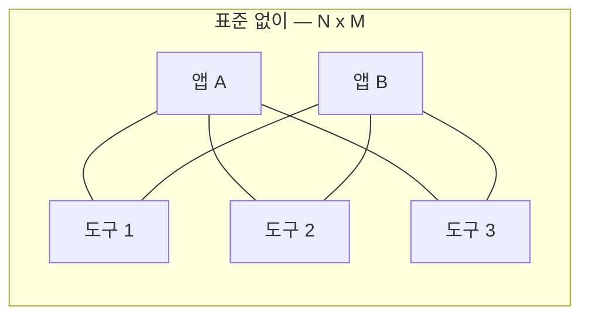
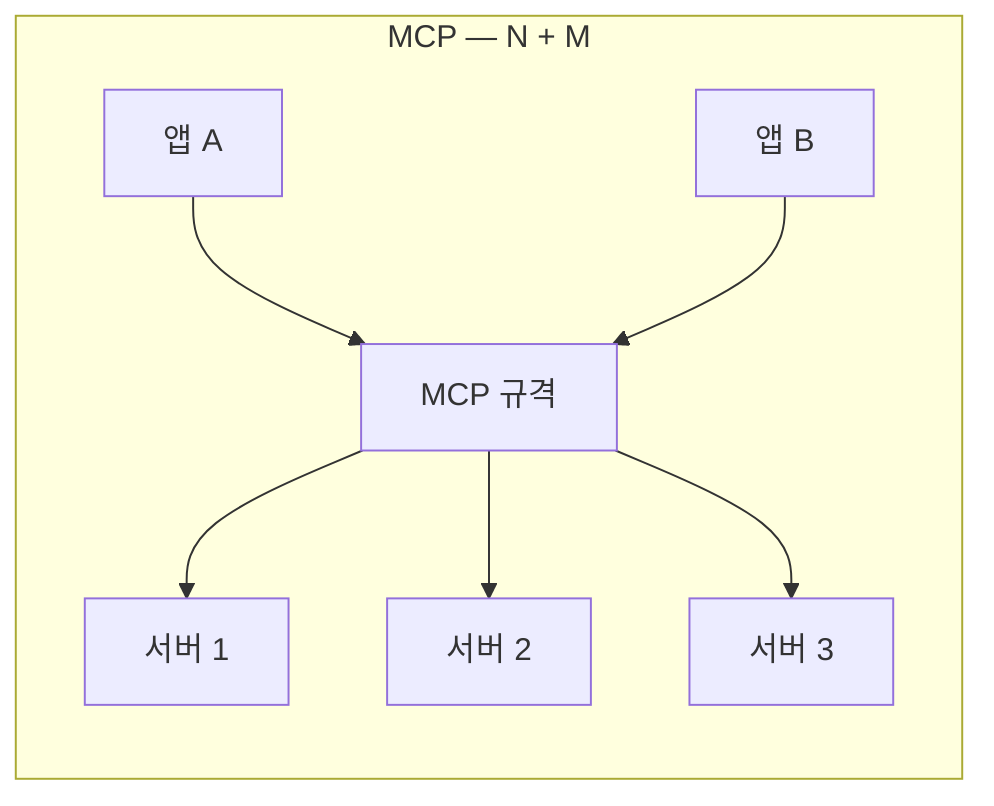

# 9.2 MCP 기능이 들어간 에이전트 서비스

> **공식 문서** — [Model Context Protocol](https://modelcontextprotocol.io/)

> **여기까지** — MCP가 **도구를 별도 서버로 뺀 것**이라는 걸 알았습니다([9.1절](09-01_MCP%EB%9E%80.md)).
> **이 절의 질문** — **왜 굳이 표준이 필요하지?** 그리고 남의 서버를 써도 안전한가?
> **다 읽으면** — 표준의 값어치와 **가져다 쓸 때 확인할 것**을 알게 됩니다.

[9.1절](09-01_MCP%EB%9E%80.md)에서 MCP가 무엇인지 봤습니다. 이 절은 **그래서 실제로 어디에 쓰이고 있는가**를 봅니다. 개념만으로는 왜 표준이 필요한지 잘 안 와닿기 때문입니다.

## 9.2.1 MCP 기능 탑재 에이전트 서비스

### 어떤 종류의 프로그램이 호스트가 되나

[9.1.2절](09-01_MCP%EB%9E%80.md)의 3계층에서 **호스트**는 사용자와 마주하는 프로그램이었습니다. 실제로 이런 것들입니다.

| 종류 | 예 | MCP로 무엇을 하나 |
| :--- | :--- | :--- |
| **AI 채팅 앱** | Claude Desktop 등 | 내 파일·캘린더·DB에 접근 |
| **코딩 도구** | AI 기능이 있는 IDE·CLI | 저장소·터미널·이슈 트래커 연동 |
| **직접 만든 에이전트** | **이 장의 예제** | 원하는 서버를 골라 연결 |

**공통점은 "LLM은 있는데 내 데이터에 손이 안 닿는다"** 는 상황입니다. [1.1절](../ch01_llm-decision/01-01_AI%20%EC%97%90%EC%9D%B4%EC%A0%84%ED%8A%B8%EC%9D%98%20%EB%91%90%EB%87%8C%2C%20%EA%B1%B0%EB%8C%80%20%EC%96%B8%EC%96%B4%20%EB%AA%A8%EB%8D%B8%EC%9D%98%20%EC%9D%B4%ED%95%B4.md)에서 말한 **"눈과 손이 없는 전문가"** 문제입니다. MCP는 그 손을 **표준 규격으로** 달아 줍니다.

### 왜 표준이어야 하는가 — N×M 문제

도구가 표준 없이 만들어지면 이런 일이 생깁니다.



앱이 N개, 도구가 M개면 **연동 코드가 N×M개** 필요합니다. 도구 하나를 새로 만들면 모든 앱이 각자 붙여야 합니다.



**규격을 하나 두면 N+M으로 줄어듭니다.** 도구를 만드는 사람은 규격에 맞춰 한 번만 만들고, 앱은 규격만 지원하면 모든 도구를 씁니다.

> **이건 새로운 발상이 아닙니다.** USB, 전기 콘센트, HTTP가 전부 같은 문제를 같은 방식으로 풀었습니다. MCP는 그걸 **LLM 도구 연동**에 적용한 것입니다.

## 9.2.2 MCP 서버 마켓플레이스

### 남이 만든 서버를 가져다 씁니다

MCP가 표준이므로 **서버를 공개하고 공유하는 생태계**가 생겼습니다. 파일 시스템·깃허브·데이터베이스·검색 서비스 등 다양한 서버가 공개돼 있습니다.

이 장 예제도 **남이 만든 서버를 씁니다.**

```python
"tavily": {
    "url": f"https://mcp.tavily.com/mcp/?tavilyApiKey={TAVILY_API_KEY}",
    "transport": "streamable_http",
},
```

[9.5절](09-05_%EB%9E%AD%EA%B7%B8%EB%9E%98%ED%94%84%EC%97%90%EC%84%9C%20MCP%20%EA%B8%B0%EB%B0%98%20%EB%A9%80%ED%8B%B0%20%EC%97%90%EC%9D%B4%EC%A0%84%ED%8A%B8%20%EA%B5%AC%ED%98%84%ED%95%98%EA%B8%B0.md)의 코드입니다. **Tavily가 운영하는 MCP 서버에 URL로 붙습니다.** [6.2절](../ch06_single-agent/06-02_%EC%9B%B9%20%EA%B2%80%EC%83%89%20%EC%97%90%EC%9D%B4%EC%A0%84%ED%8A%B8%20%EB%A7%8C%EB%93%A4%EA%B8%B0.md)에서는 `langchain-tavily` 패키지를 설치했는데, 이번엔 **패키지 설치 없이 주소만으로** 씁니다.

| | `langchain-tavily` (6.2절) | Tavily MCP 서버 (9.5절) |
| :--- | :--- | :--- |
| 설치 | 파이썬 패키지 | **없음** |
| 결합 | 랭체인 전용 | **어떤 호스트든** |
| 업데이트 | 패키지 재설치 | 서버 쪽에서 처리 |
| 필요한 것 | API 키 | API 키 + URL |

### 가져다 쓸 때 반드시 확인할 것

편리한 만큼 위험합니다. **MCP 서버는 내 컴퓨터나 데이터에 접근합니다.**

> **`stdio` 서버는 내 PC에서 코드를 실행합니다.** 클라이언트가 `command`와 `args`로 지정한 프로그램을 그대로 띄웁니다([9.1.2절](09-01_MCP%EB%9E%80.md)). 출처를 모르는 서버를 연결하는 것은 **모르는 실행 파일을 받아서 돌리는 것과 같습니다.**
>
> **원격 서버는 보낸 데이터를 그쪽이 보게 됩니다.** 사내 문서를 요약시키면 그 내용이 서버 운영자에게 전달됩니다.

확인할 것은 셋입니다.

| 확인 | 왜 |
| :--- | :--- |
| **누가 만들었나** | 공식 제공자인지, 개인 프로젝트인지 |
| **어떤 권한이 필요한가** | 파일 읽기만인지 쓰기까지인지 |
| **무엇을 밖으로 보내는가** | 원격 서버면 데이터가 나감 |

**직접 만든 서버라면 이 걱정이 없습니다.** [9.3절](09-03_MCP%20%EC%84%9C%EB%B2%84%20%EA%B5%AC%EC%B6%95%ED%95%98%EA%B8%B0.md)부터 직접 만들어 보는 이유이기도 합니다.

### 도구를 많이 붙이면 생기는 문제는 그대로입니다

마켓플레이스에서 서버를 여러 개 붙이면 도구가 금방 수십 개가 됩니다. 그런데 [2.2절](../ch02_core-elements/02-02_%EC%97%90%EC%9D%B4%EC%A0%84%ED%8A%B8%EC%9D%98%20%EC%99%B8%EB%B6%80%20%EC%A7%80%EC%8B%9D%20%ED%99%9C%EC%9A%A9%20-%20%EB%8F%84%EA%B5%AC%20%ED%98%B8%EC%B6%9C.md)에서 본 문제가 그대로 따라옵니다.

- 도구 명세가 **매 요청마다 프롬프트에 실려 갑니다**
- 비슷한 도구가 많으면 **모델이 헷갈립니다**

**MCP는 연동을 쉽게 해 줄 뿐 이 문제를 풀어 주지 않습니다.** [9.5절](09-05_%EB%9E%AD%EA%B7%B8%EB%9E%98%ED%94%84%EC%97%90%EC%84%9C%20MCP%20%EA%B8%B0%EB%B0%98%20%EB%A9%80%ED%8B%B0%20%EC%97%90%EC%9D%B4%EC%A0%84%ED%8A%B8%20%EA%B5%AC%ED%98%84%ED%95%98%EA%B8%B0.md)에서 **서버별로 에이전트를 나누는** 방식으로 대응하는데, 이는 [3.2절](../ch03_architecture/03-02_%EB%A9%80%ED%8B%B0%20%EC%97%90%EC%9D%B4%EC%A0%84%ED%8A%B8.md)에서 배운 "도구를 나눠 갖는다"와 같은 해법입니다.

## 요약 및 비유

**앱 스토어**입니다. 규격이 있으니 누구나 만들어 올릴 수 있고 누구나 받아 쓸 수 있습니다. 대신 **설치 전에 만든 사람과 요구 권한을 봐야** 합니다.

| 개념 | 앱 스토어 비유 | 기술적 의미 |
| :--- | :--- | :--- |
| **MCP 표준** | 앱 규격 | 연동 프로토콜 |
| **N×M 문제** | 기기마다 앱을 새로 만들기 | 앱 수 × 도구 수 |
| **N+M** | 규격 하나에 맞추면 끝 | 표준의 값어치 |
| **마켓플레이스** | 앱 스토어 | 공개된 MCP 서버들 |
| **원격 서버** | 클라우드 앱 | `streamable_http` |
| **stdio 서버** | 기기에 설치되는 앱 | 내 PC에서 실행 |
| **권한 확인** | 앱 권한 목록 | 파일 읽기·쓰기 범위 |
| **데이터 유출** | 클라우드로 올라가는 자료 | 원격 서버로 전송됨 |
| **도구 과다** | 앱을 너무 많이 깔면 느려짐 | 컨텍스트·선택 정확도 |

## 결론

* MCP가 푸는 것은 **N×M 문제**입니다. 앱 N개와 도구 M개를 각각 잇는 대신, 규격 하나로 **N+M**으로 줄입니다.
* 호스트는 AI 채팅 앱·코딩 도구·직접 만든 에이전트 등입니다. 공통 상황은 **"LLM은 있는데 내 데이터에 손이 안 닿는다"** 입니다.
* 마켓플레이스에서 **남이 만든 서버를 주소만으로** 쓸 수 있습니다. 9.5절의 Tavily 서버가 그 예입니다.
* **`stdio` 서버는 내 PC에서 코드를 실행합니다.** 출처를 모르는 서버를 붙이는 건 모르는 실행 파일을 돌리는 것과 같습니다.
* **원격 서버에는 데이터가 나갑니다.** 사내 자료를 다룰 때 특히 주의해야 합니다.
* 확인할 것은 **누가 만들었나 · 어떤 권한이 필요한가 · 무엇을 밖으로 보내는가** 셋입니다.
* **MCP는 연동을 쉽게 할 뿐 도구 과다 문제를 풀어 주지 않습니다.** 그 대응은 9.5절의 에이전트 분리입니다.

---

## 다음 절로

남의 서버를 쓰려면 **믿을 수 있는지** 따져야 합니다. 그런데 **내가 직접 만들면** 그 걱정이 없죠.

그리고 만들어 봐야 **안에서 무슨 일이 일어나는지** 압니다. 직접 만들어 봅시다. → **[9.3절](09-03_MCP%20%EC%84%9C%EB%B2%84%20%EA%B5%AC%EC%B6%95%ED%95%98%EA%B8%B0.md)**

---

[⬅ 9.1](09-01_MCP%EB%9E%80.md) · [Chapter 09](README.md) · [9.3 ➡](09-03_MCP%20%EC%84%9C%EB%B2%84%20%EA%B5%AC%EC%B6%95%ED%95%98%EA%B8%B0.md)
