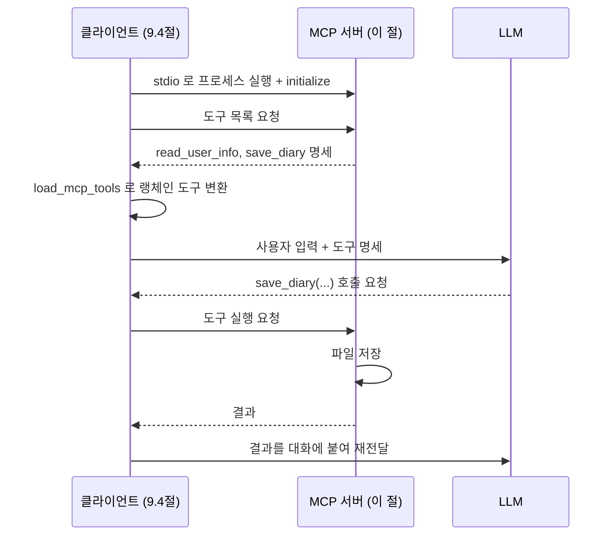

# 9.3 MCP 서버 구축하기

> **저자 예제** — [`examples/mcp_agent/server.py`](examples/mcp_agent/server.py) · [`examples/mcp_agent/my_info.txt`](examples/mcp_agent/my_info.txt)
> **공식 문서** — [MCP Python SDK](https://py.sdk.modelcontextprotocol.io/) — **v1 섹션** · [langchain-mcp-adapters](https://github.com/langchain-ai/langchain-mcp-adapters)

> **여기까지** — MCP가 왜 필요한지, 남의 서버를 쓸 때 뭘 봐야 하는지까지 왔습니다([9.2절](09-02_MCP%20%EA%B8%B0%EB%8A%A5%EC%9D%B4%20%EB%93%A4%EC%96%B4%EA%B0%84%20%EC%97%90%EC%9D%B4%EC%A0%84%ED%8A%B8%20%EC%84%9C%EB%B9%84%EC%8A%A4.md)).
> **이 절의 질문** — **내가 직접 서버를 만들려면?**
> **다 읽으면** — [6.3절](../ch06_single-agent/06-03_%EC%BD%94%EB%94%A9%20%EC%97%90%EC%9D%B4%EC%A0%84%ED%8A%B8%20%EB%A7%8C%EB%93%A4%EA%B8%B0.md)의 `@tool` 이 `@mcp.tool()` 로 거의 그대로 옮겨진다는 걸 보게 됩니다.

만들 것은 **일기 쓰기 도우미**입니다. 사용자와 대화하다가 끝날 때 그날 이야기를 일기로 저장합니다.

## 9.3.1 Langchain-MCP-Adapters 기반 MCP 구현 흐름 이해하기

전체 흐름을 먼저 잡습니다.



**[6.1절](../ch06_single-agent/06-01_%EB%8F%84%EA%B5%AC%EB%A5%BC%20%ED%98%B8%EC%B6%9C%ED%95%98%EB%8A%94%20%EC%97%90%EC%9D%B4%EC%A0%84%ED%8A%B8%20%EC%9D%B4%ED%95%B4%ED%95%98%EA%B8%B0.md)의 그림에서 "도구 실행"만 다른 프로세스로 옮겨 간 것**입니다. 나머지는 그대로입니다.

파일은 두 개로 나뉩니다.

| 파일 | 역할 |
| :--- | :--- |
| [`server.py`](examples/mcp_agent/server.py) | 도구를 갖고 실행 — **이 절** |
| [`client.py`](examples/mcp_agent/client.py) | 서버에 붙어 에이전트를 돌림 — [9.4절](09-04_MCP%20%ED%81%B4%EB%9D%BC%EC%9D%B4%EC%96%B8%ED%8A%B8%20%EA%B5%AC%EC%B6%95%ED%95%98%EA%B8%B0%20-%20%EB%9E%AD%EA%B7%B8%EB%9E%98%ED%94%84.md) |

### 서버 뼈대

```python
from mcp.server.fastmcp import FastMCP

mcp = FastMCP("MCPServer")     # 서버 이름

# … 도구들 …

if __name__ == "__main__":
    mcp.run(transport="stdio")
```

`mcp.run(transport="stdio")` 한 줄이면 서버가 됩니다. **직접 실행할 일은 없습니다** — [9.4절](09-04_MCP%20%ED%81%B4%EB%9D%BC%EC%9D%B4%EC%96%B8%ED%8A%B8%20%EA%B5%AC%EC%B6%95%ED%95%98%EA%B8%B0%20-%20%EB%9E%AD%EA%B7%B8%EB%9E%98%ED%94%84.md)의 클라이언트가 알아서 띄웁니다.

## 9.3.2 [실습] 사용자의 정보를 읽는 도구 정의하기

```python
@mcp.tool()
def read_user_info() -> str:
    """
    사용자의 정보를 담고 있는 txt 파일을 읽어옵니다.

    Returns:
        str: my_info.txt 파일의 내용
    """
    info_file_path = Path(__file__).parent / "my_info.txt"

    try:
        with open(info_file_path, "r", encoding="utf-8") as f:
            content = f.read()
        return content
    except FileNotFoundError:
        return "my_info.txt 파일을 찾을 수 없습니다."
    except Exception as e:
        return f"파일을 읽는 중 오류가 발생했습니다: {str(e)}"
```

**[6.3절](../ch06_single-agent/06-03_%EC%BD%94%EB%94%A9%20%EC%97%90%EC%9D%B4%EC%A0%84%ED%8A%B8%20%EB%A7%8C%EB%93%A4%EA%B8%B0.md)에서 만든 도구와 똑같이 생겼습니다.** 데코레이터 이름만 `@tool` → `@mcp.tool()`입니다.

- 독스트링이 모델에게 가는 설명입니다([2.2절](../ch02_core-elements/02-02_%EC%97%90%EC%9D%B4%EC%A0%84%ED%8A%B8%EC%9D%98%20%EC%99%B8%EB%B6%80%20%EC%A7%80%EC%8B%9D%20%ED%99%9C%EC%9A%A9%20-%20%EB%8F%84%EA%B5%AC%20%ED%98%B8%EC%B6%9C.md))
- **예외를 던지지 않고 문자열로 돌려줍니다**([6.3절](../ch06_single-agent/06-03_%EC%BD%94%EB%94%A9%20%EC%97%90%EC%9D%B4%EC%A0%84%ED%8A%B8%20%EB%A7%8C%EB%93%A4%EA%B8%B0.md)) — 서버가 죽지 않고 모델이 상황을 알게 됩니다

### `Path(__file__).parent`를 쓰는 이유

```python
info_file_path = Path(__file__).parent / "my_info.txt"
```

**[4.1절](../ch04_dev-env/SETUP.md)의 작업 디렉터리 문제**를 피하는 방법입니다.

MCP 서버는 **클라이언트가 자식 프로세스로 띄웁니다.** 그러니 서버 입장에서 현재 작업 디렉터리가 어디인지 알 수 없습니다. `"./my_info.txt"` 라고 쓰면 못 찾습니다.

**`__file__` 기준으로 잡으면 어디서 실행되든 같은 자리**를 가리킵니다. MCP 서버를 만들 때는 이렇게 쓰는 게 안전합니다.

## 9.3.3 [실습] 일기를 저장하는 도구 정의하기

```python
@mcp.tool()
def save_diary(conversation_summary: str, emotion: str, resolution: str) -> dict:
    """
    일기 형태로 텍스트 파일을 저장합니다. 모든 내용은 한국어로 작성합니다.

    Args:
        conversation_summary (str): 오늘의 대화 내용
        emotion (str): 오늘의 감정
        resolution (str): 오늘의 다짐
    """
```

### 인자 세 개가 설계입니다

**"일기 내용"을 통째로 받지 않고 셋으로 나눠 받습니다.**

| 인자 | 담는 것 |
| :--- | :--- |
| `conversation_summary` | 오늘의 대화 내용 |
| `emotion` | 오늘의 감정 |
| `resolution` | 오늘의 다짐 |

이렇게 하면 **모델이 세 가지를 각각 생각해서 채웁니다.** "일기 써 줘"라고 한 덩어리로 받으면 형식이 매번 달라집니다. [1.2절](../ch01_llm-decision/01-02_LLM%EC%9D%84%20%EA%B8%B0%EB%B0%98%EC%9C%BC%EB%A1%9C%20%EC%9D%98%EC%82%AC%EA%B2%B0%EC%A0%95%ED%95%98%EB%8B%A4.md)의 **구조화 출력과 같은 효과**를 도구 인자로 얻는 것입니다.

> **독스트링의 "모든 내용은 한국어로 작성합니다"** 도 같은 맥락입니다. 도구 설명이 곧 모델에 대한 지시입니다.

### 파일명과 저장 위치는 코드가 정합니다

```python
diary_dir = Path(__file__).parent / "diary"
diary_dir.mkdir(exist_ok=True)

timestamp = datetime.now().strftime("%Y%m%d_%H%M%S")
filename = f"diary_{timestamp}.txt"
```

**모델에게 파일 경로를 맡기지 않습니다.** [6.3절](../ch06_single-agent/06-03_%EC%BD%94%EB%94%A9%20%EC%97%90%EC%9D%B4%EC%A0%84%ED%8A%B8%20%EB%A7%8C%EB%93%A4%EA%B8%B0.md)의 `file_write_tool`은 `file_path`를 모델이 정했는데, 여기서는 **서버가 정합니다.**

| | 6.3절 방식 | 9.3절 방식 |
| :--- | :--- | :--- |
| 경로 결정 | 모델 | **코드** |
| 유연성 | 높음 | 낮음 |
| 안전성 | 낮음 (아무 데나 쓸 수 있음) | **높음** |

**용도가 정해진 도구라면 경로를 코드가 정하는 편이 안전합니다.** 모델이 `../../important.txt`를 지목할 일이 없어집니다.

### 반환이 딕셔너리입니다

```python
return {
    "success": True,
    "path": str(file_path.absolute()),
    "filename": filename,
    "message": f"일기가 성공적으로 저장되었습니다."
}
```

문자열이 아니라 **구조화된 값**을 돌려줍니다. 모델은 `success`를 보고 성공 여부를, `path`를 보고 어디 저장됐는지 사용자에게 알려 줄 수 있습니다.

## 9.3.4 [실습] 에이전트 프롬프트 작성하기

**여기가 MCP만의 기능입니다.** 서버가 프롬프트도 제공합니다([9.1.2절](09-01_MCP%EB%9E%80.md)).

```python
from mcp.server.fastmcp.prompts import base

@mcp.prompt()
def default_prompt(message: str) -> list[base.Message]:
    return [
        base.AssistantMessage(
            "당신은 따뜻하고 공감 능력이 뛰어난 개인 비서입니다. \n"
            "- 사용자가 오늘 있었던 일을 편하게 이야기할 수 있도록 경청하고 공감해주세요\n"
            "- 대화가 자연스럽게 이어지도록 적절한 질문을 던져주세요\n"
            "- 사용자의 감정을 이해하고 긍정적인 피드백을 제공해주세요\n"
            "- 사용자가 대화를 끝내려 하면, 지금까지의 대화 내용을 담아 일기를 작성하세요\n"
            "- 존댓말을 사용하되, 친근하고 편안한 말투를 사용하세요"
        ),
        base.UserMessage(message),
    ]
```

### 왜 프롬프트를 서버에 두나

이 프롬프트가 없으면 `save_diary` 도구는 **언제 불려야 할지 모릅니다.** "사용자가 대화를 끝내려 하면 일기를 작성하세요" 라는 문장이 도구를 부르는 방아쇠입니다.

**도구와 사용법을 함께 배포하는 것**입니다. 서버를 가져다 쓰는 사람이 프롬프트를 처음부터 고민하지 않아도 됩니다.

> **`@mcp.prompt()`가 반환하는 것은 메시지 목록**입니다. `AssistantMessage`로 성격을 정하고 `UserMessage`로 사용자 입력을 넣습니다. [1.2절](../ch01_llm-decision/01-02_LLM%EC%9D%84%20%EA%B8%B0%EB%B0%98%EC%9C%BC%EB%A1%9C%20%EC%9D%98%EC%82%AC%EA%B2%B0%EC%A0%95%ED%95%98%EB%8B%A4.md)의 역할 구분이 여기서도 그대로입니다.
>
> 다만 성격 지시를 `system`이 아니라 `AssistantMessage`에 넣은 점은 눈여겨보세요. MCP 프롬프트의 형식을 따른 것인데, [1.2절](../ch01_llm-decision/01-02_LLM%EC%9D%84%20%EA%B8%B0%EB%B0%98%EC%9C%BC%EB%A1%9C%20%EC%9D%98%EC%82%AC%EA%B2%B0%EC%A0%95%ED%95%98%EB%8B%A4.md)에서 배운 대로라면 시스템 자리에 두는 것이 더 안전합니다. **직접 만들 때 시도해 볼 만한 지점**입니다.

프롬프트를 **어떻게 가져다 쓰는지**는 [9.4절](09-04_MCP%20%ED%81%B4%EB%9D%BC%EC%9D%B4%EC%96%B8%ED%8A%B8%20%EA%B5%AC%EC%B6%95%ED%95%98%EA%B8%B0%20-%20%EB%9E%AD%EA%B7%B8%EB%9E%98%ED%94%84.md)에서 봅니다.

## 요약 및 비유

**자판기를 만드는 일**입니다. 버튼(도구)마다 무엇이 나오는지 라벨을 붙이고(독스트링), **투입구 규격**을 정하고(인자), 사용 안내문까지 붙여 둡니다(프롬프트). 자판기는 손님이 켜는 게 아니라 **가게가 열릴 때 함께 돌아갑니다**(클라이언트가 띄움).

| 개념 | 자판기 비유 | 기술적 의미 |
| :--- | :--- | :--- |
| **`FastMCP`** | 자판기 본체 | 서버 객체 |
| **`@mcp.tool()`** | 버튼 하나 | 도구 등록 |
| **독스트링** | 버튼 라벨 | 모델이 읽는 설명 |
| **인자 세 개로 분리** | 투입구를 나눔 | 구조화된 입력 유도 |
| **경로를 코드가 정함** | 배출구가 고정 | 모델이 위치를 못 정함 |
| **딕셔너리 반환** | 결과 표시창 | 구조화된 결과 |
| **`Path(__file__).parent`** | 자판기 내부 기준 좌표 | 작업 디렉터리 무관 |
| **`@mcp.prompt()`** | 옆에 붙은 사용 안내문 | 서버가 제공하는 프롬프트 |
| **`mcp.run(stdio)`** | 전원 연결 | 표준입출력으로 대기 |

## 결론

* 서버는 **`FastMCP` 객체 + `@mcp.tool()` + `mcp.run(transport="stdio")`** 세 가지면 됩니다.
* `@mcp.tool()`은 **[6.3절](../ch06_single-agent/06-03_%EC%BD%94%EB%94%A9%20%EC%97%90%EC%9D%B4%EC%A0%84%ED%8A%B8%20%EB%A7%8C%EB%93%A4%EA%B8%B0.md)의 `@tool`과 사실상 같습니다.** 독스트링이 설명, 타입 힌트가 스키마, 예외는 문자열로 반환.
* **`Path(__file__).parent`로 경로를 잡으세요.** 서버는 클라이언트가 띄우므로 작업 디렉터리를 알 수 없습니다.
* 인자를 **셋으로 나눠 받으면** 모델이 각각을 생각해 채웁니다. 구조화 출력과 같은 효과입니다.
* **파일 경로를 모델에게 맡기지 않는 편이 안전합니다.** 용도가 정해진 도구라면 코드가 정하세요.
* 반환을 **딕셔너리로** 하면 모델이 성공 여부·경로를 각각 읽을 수 있습니다.
* **`@mcp.prompt()`로 도구와 사용법을 함께 배포**합니다. "대화를 끝내려 하면 일기를 작성하세요"가 도구를 부르는 방아쇠입니다.

---

## 다음 절로

서버는 만들었습니다. **그런데 이걸 어떻게 쓰죠?**

서버를 직접 실행할 필요도 없다고 했는데, 그럼 **누가 띄우는 걸까요?** 그리고 받아 온 도구를 [6.4절](../ch06_single-agent/06-04_create_agent%20%EC%83%81%EC%84%B8%20%EA%B5%AC%EC%A1%B0%20%EC%9D%B4%ED%95%B4%ED%95%98%EA%B8%B0.md)의 `create_agent` 에 어떻게 넣죠? → **[9.4절](09-04_MCP%20%ED%81%B4%EB%9D%BC%EC%9D%B4%EC%96%B8%ED%8A%B8%20%EA%B5%AC%EC%B6%95%ED%95%98%EA%B8%B0%20-%20%EB%9E%AD%EA%B7%B8%EB%9E%98%ED%94%84.md)**

---

[⬅ 9.2](09-02_MCP%20%EA%B8%B0%EB%8A%A5%EC%9D%B4%20%EB%93%A4%EC%96%B4%EA%B0%84%20%EC%97%90%EC%9D%B4%EC%A0%84%ED%8A%B8%20%EC%84%9C%EB%B9%84%EC%8A%A4.md) · [Chapter 09](README.md) · [9.4 ➡](09-04_MCP%20%ED%81%B4%EB%9D%BC%EC%9D%B4%EC%96%B8%ED%8A%B8%20%EA%B5%AC%EC%B6%95%ED%95%98%EA%B8%B0%20-%20%EB%9E%AD%EA%B7%B8%EB%9E%98%ED%94%84.md)
