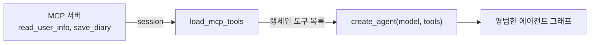
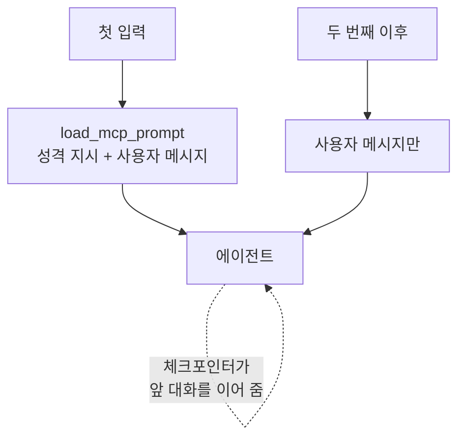
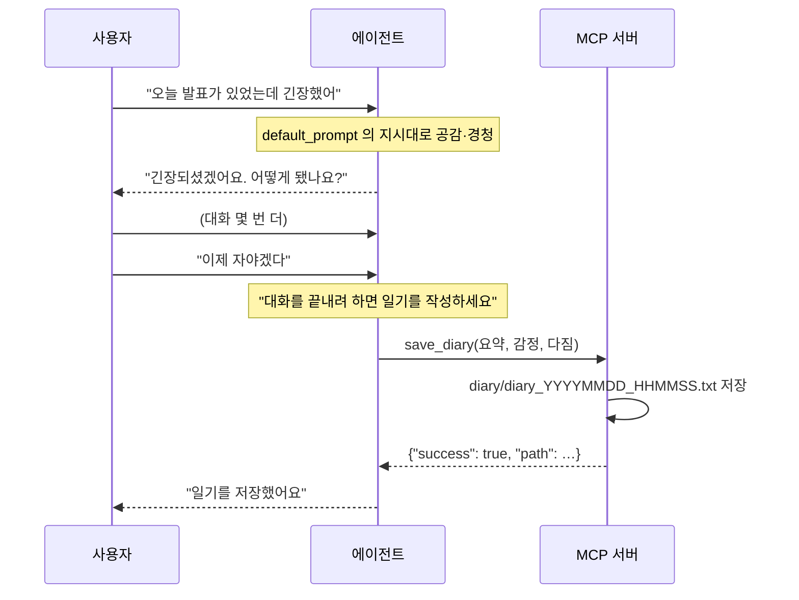

# 9.4 MCP 클라이언트 구축하기: 랭그래프

> **저자 예제** — [`examples/mcp_agent/client.py`](examples/mcp_agent/client.py)
> **공식 문서** — [langchain-mcp-adapters](https://github.com/langchain-ai/langchain-mcp-adapters)

> **여기까지** — MCP 서버를 만들었습니다([9.3절](09-03_MCP%20%EC%84%9C%EB%B2%84%20%EA%B5%AC%EC%B6%95%ED%95%98%EA%B8%B0.md)).
> **이 절의 질문** — 그 서버에 **어떻게 붙지?** 그리고 붙인 도구를 에이전트에 어떻게 넣지?
> **다 읽으면** — **두 줄**이면 `create_agent` 에 그대로 들어간다는 걸 알게 됩니다.

[9.3절](09-03_MCP%20%EC%84%9C%EB%B2%84%20%EA%B5%AC%EC%B6%95%ED%95%98%EA%B8%B0.md)에서 만든 서버에 붙습니다.

## 9.4.1 [실습] 에이전트가 포함된 MCP 클라이언트 구축하기

### 서버를 어떻게 띄울지 알려 줍니다

```python
from mcp import ClientSession, StdioServerParameters
from mcp.client.stdio import stdio_client

server_params = StdioServerParameters(
    command="python",
    args=["./server.py"],
)
```

**말 그대로 `python ./server.py`를 실행하라는 지시**입니다. [9.1.2절](09-01_MCP%EB%9E%80.md)에서 말한 대로 `stdio` 방식은 클라이언트가 서버를 자식 프로세스로 띄웁니다.

> **`./server.py`가 상대 경로**입니다. **클라이언트를 실행한 디렉터리 기준**이므로 `examples/mcp_agent/`에서 `python client.py`를 돌려야 합니다([4.1절](../ch04_dev-env/04-01_%EB%B9%84%EC%A3%BC%EC%96%BC%20%EC%8A%A4%ED%8A%9C%EB%94%94%EC%98%A4%20%EC%BD%94%EB%93%9C%20%ED%99%98%EA%B2%BD%20%EC%84%A4%EC%A0%95%ED%95%98%EA%B8%B0.md)의 작업 디렉터리 문제).
>
> `command="python"`도 주의할 점입니다. **PATH의 `python`이 가상환경의 것인지** 확인하세요([4.2절](../ch04_dev-env/04-02_%EC%95%84%EB%82%98%EC%BD%98%EB%8B%A4%20%EB%B0%8F%20%EA%B0%80%EC%83%81%20%ED%99%98%EA%B2%BD%20%EC%84%A4%EC%A0%95%ED%95%98%EA%B8%B0.md)). 서버가 다른 파이썬으로 뜨면 `mcp` 패키지를 못 찾습니다.

### 연결을 여는 두 겹의 `async with`

```python
async def run():
    async with stdio_client(server_params) as (read, write):
        async with ClientSession(read, write) as session:
            await session.initialize()
            ...
```

| 층 | 하는 일 |
| :--- | :--- |
| `stdio_client(...)` | **프로세스를 띄우고** 읽기/쓰기 통로를 엶 |
| `ClientSession(read, write)` | 그 통로 위에서 **MCP 프로토콜로 대화** |
| `session.initialize()` | 첫 인사 — **서버가 무엇을 제공하는지 주고받음** |

**`async with` 블록을 벗어나면 서버 프로세스가 종료됩니다.** 그래서 대화 루프 전체가 이 안에 들어 있습니다.

> **전부 `async`입니다.** MCP 통신이 비동기라 클라이언트 코드도 비동기가 됩니다. `agent.invoke`가 아니라 **`agent.ainvoke`** 를 쓰는 이유입니다.

### 도구를 랭체인 형태로 변환합니다

```python
from langchain_mcp_adapters.tools import load_mcp_tools

tools = await load_mcp_tools(session)
agent = create_agent(model, tools, checkpointer=InMemorySaver())
```

**두 줄이 이 절의 핵심입니다.**

`load_mcp_tools(session)`이 서버에서 도구 목록을 받아 **랭체인 도구 객체로 바꿔 줍니다.** 그러면 [6.4절](../ch06_single-agent/06-04_create_agent%20%EC%83%81%EC%84%B8%20%EA%B5%AC%EC%A1%B0%20%EC%9D%B4%ED%95%B4%ED%95%98%EA%B8%B0.md)의 `create_agent`에 **그냥 넣으면 됩니다.**



**`create_agent` 입장에서는 MCP인지 아닌지 모릅니다.** [9.1절](09-01_MCP%EB%9E%80.md)에서 말한 "모델 입장에서는 똑같다"가 코드로 확인되는 지점입니다.

`checkpointer=InMemorySaver()`도 [8.2절](../ch08_memory/08-02_%EB%8C%80%ED%99%94%20%EB%A7%A5%EB%9D%BD%EC%9D%84%20%EC%9D%B4%ED%95%B4%ED%95%98%EB%8A%94%20%EC%97%90%EC%9D%B4%EC%A0%84%ED%8A%B8.md) 그대로입니다. **일기를 쓰려면 대화가 이어져야 하니** 필수입니다.

### 서버가 준 프롬프트를 가져옵니다

```python
from langchain_mcp_adapters.prompts import load_mcp_prompt

is_first_input = True
while True:
    user_input = input("질문을 입력하세요: ")
    ...
    if is_first_input:
        prompts = await load_mcp_prompt(
            session, "default_prompt", arguments={"message": user_input}
        )
        is_first_input = False
    else:
        prompts = [{"role": "user", "content": user_input}]
```

**첫 입력에만 서버 프롬프트를 씁니다.**

[9.3.4절](09-03_MCP%20%EC%84%9C%EB%B2%84%20%EA%B5%AC%EC%B6%95%ED%95%98%EA%B8%B0.md)의 `default_prompt`가 여기서 불립니다. `arguments={"message": user_input}`이 그 함수의 `message` 인자로 들어갑니다.

**두 번째부터는 평범한 사용자 메시지**입니다. 성격 지시는 첫 메시지에 이미 들어갔고, 체크포인터가 대화를 이어 주므로([8.2절](../ch08_memory/08-02_%EB%8C%80%ED%99%94%20%EB%A7%A5%EB%9D%BD%EC%9D%84%20%EC%9D%B4%ED%95%B4%ED%95%98%EB%8A%94%20%EC%97%90%EC%9D%B4%EC%A0%84%ED%8A%B8.md)) 매번 다시 넣을 필요가 없습니다.



## 9.4.2 [실습] 에이전트와 대화를 통해 일기 작성하기

```python
response = await agent.ainvoke(
    {"messages": prompts},
    config={"configurable": {"user_id": "user_123", "thread_id": "1"}}
)

for msg in response["messages"]:
    msg.pretty_print()
```

[8.4절](../ch08_memory/08-04_%EB%88%84%EC%A0%81%EB%90%9C%20%EC%82%AC%EC%9A%A9%EC%9E%90%20%EB%A9%94%EB%AA%A8%EB%A6%AC%EB%A5%BC%20%EA%B8%B0%EB%B0%98%EC%9C%BC%EB%A1%9C%20%EB%A7%9E%EC%B6%A4%20%EC%A1%B0%EC%96%B8%EC%9D%84%20%EC%A0%9C%EA%B3%B5%ED%95%98%EB%8A%94%20%EC%97%90%EC%9D%B4%EC%A0%84%ED%8A%B8.md)에서 본 `config` 형태 그대로입니다. `thread_id`가 고정이라 **한 번 실행하는 동안 대화가 계속 이어집니다.**

> `user_id`도 넘기고 있지만 이 예제에는 스토어가 없어서 쓰이지 않습니다. [8.4절](../ch08_memory/08-04_%EB%88%84%EC%A0%81%EB%90%9C%20%EC%82%AC%EC%9A%A9%EC%9E%90%20%EB%A9%94%EB%AA%A8%EB%A6%AC%EB%A5%BC%20%EA%B8%B0%EB%B0%98%EC%9C%BC%EB%A1%9C%20%EB%A7%9E%EC%B6%A4%20%EC%A1%B0%EC%96%B8%EC%9D%84%20%EC%A0%9C%EA%B3%B5%ED%95%98%EB%8A%94%20%EC%97%90%EC%9D%B4%EC%A0%84%ED%8A%B8.md)의 형태를 그대로 가져온 흔적으로 보입니다.

### 흐름을 따라가 보기



**도구를 부르라고 명령한 적이 없습니다.** [9.3.4절](09-03_MCP%20%EC%84%9C%EB%B2%84%20%EA%B5%AC%EC%B6%95%ED%95%98%EA%B8%B0.md)의 프롬프트에 있는 "사용자가 대화를 끝내려 하면 일기를 작성하세요" 한 줄이 방아쇠입니다.

**저장 결과는 `examples/mcp_agent/diary/`에 남습니다.** 저자가 실행해서 만든 파일이 하나 들어 있으니 형식을 확인해 보세요.

> 실행 결과는 대화 내용에 따라 매번 달라지므로 이 노트에는 싣지 않았습니다.

### 막힐 만한 곳

| 증상 | 확인할 것 |
| :--- | :--- |
| 서버가 안 뜸 | 실행 디렉터리가 `mcp_agent/`인지, `python`이 가상환경 것인지 |
| 도구가 안 불림 | 독스트링이 언제 쓰는지 설명하는지([2.2절](../ch02_core-elements/02-02_%EC%97%90%EC%9D%B4%EC%A0%84%ED%8A%B8%EC%9D%98%20%EC%99%B8%EB%B6%80%20%EC%A7%80%EC%8B%9D%20%ED%99%9C%EC%9A%A9%20-%20%EB%8F%84%EA%B5%AC%20%ED%98%B8%EC%B6%9C.md)) |
| 앞 대화를 못 기억 | `checkpointer`와 `thread_id`([8.2절](../ch08_memory/08-02_%EB%8C%80%ED%99%94%20%EB%A7%A5%EB%9D%BD%EC%9D%84%20%EC%9D%B4%ED%95%B4%ED%95%98%EB%8A%94%20%EC%97%90%EC%9D%B4%EC%A0%84%ED%8A%B8.md)) |
| 파일을 못 찾음 | 서버 쪽 `Path(__file__).parent`([9.3절](09-03_MCP%20%EC%84%9C%EB%B2%84%20%EA%B5%AC%EC%B6%95%ED%95%98%EA%B8%B0.md)) |

**MCP를 붙였다고 새로운 종류의 문제가 생기지 않습니다.** 앞 장들에서 겪은 것과 같은 문제에 **"서버가 제대로 떴나"** 가 하나 추가될 뿐입니다.

## 요약 및 비유

**외부 업체와 계약하는 일**입니다. 계약을 맺고(`initialize`), **업체가 뭘 할 수 있는지 목록을 받고**(`load_mcp_tools`), 업무 매뉴얼도 함께 받습니다(`load_mcp_prompt`). 그다음부터는 **내 직원인 것처럼** 일을 시킵니다.

| 개념 | 외주 계약 비유 | 기술적 의미 |
| :--- | :--- | :--- |
| **`StdioServerParameters`** | 업체를 어떻게 부를지 | 실행 명령과 인자 |
| **`stdio_client`** | 업체와 회선 개설 | 프로세스 실행 + 통로 |
| **`ClientSession`** | 계약 관계 | MCP 프로토콜 세션 |
| **`initialize()`** | 상견례 | 제공 항목 교환 |
| **`load_mcp_tools`** | 가능 업무 목록 수령 | 랭체인 도구로 변환 |
| **`load_mcp_prompt`** | 업무 매뉴얼 수령 | 서버 제공 프롬프트 |
| **첫 입력에만 프롬프트** | 매뉴얼은 처음 한 번 | 이후엔 체크포인터가 이어 줌 |
| **`ainvoke`** | 비동기 업무 요청 | MCP가 비동기라서 |
| **`async with` 종료** | 계약 종료 | 서버 프로세스 종료 |

## 결론

* `StdioServerParameters(command, args)`는 **"이 명령으로 서버를 띄워라"** 는 지시입니다. 서버를 미리 실행할 필요가 없습니다.
* **상대 경로와 `python` 위치를 확인하세요.** 클라이언트를 실행한 디렉터리 기준이고, 가상환경의 파이썬이어야 합니다.
* 연결은 **`stdio_client` → `ClientSession` → `initialize()`** 세 단계입니다. `async with`를 벗어나면 서버가 종료됩니다.
* **`load_mcp_tools(session)` 한 줄이면 `create_agent`에 그대로 넣을 수 있습니다.** 에이전트는 MCP인지 모릅니다.
* MCP는 비동기라 **`ainvoke`** 를 씁니다.
* **`load_mcp_prompt`는 첫 입력에만** 씁니다. 이후는 체크포인터가 대화를 이어 줍니다.
* 도구를 부르라고 명령하지 않았는데 불리는 것은 **서버가 준 프롬프트의 한 줄** 덕분입니다.
* 문제가 생기면 **작업 디렉터리 · 도구 설명 · 체크포인터**를 보세요. 앞 장들과 같은 문제입니다.

---

## 다음 절로

서버 하나는 붙였습니다. **그럼 여러 개면요?**

내가 만든 로컬 서버와 **남이 운영하는 원격 서버**를 같이 쓸 수 있을까요? 그리고 도구가 많아지면 [2.2절](../ch02_core-elements/02-02_%EC%97%90%EC%9D%B4%EC%A0%84%ED%8A%B8%EC%9D%98%20%EC%99%B8%EB%B6%80%20%EC%A7%80%EC%8B%9D%20%ED%99%9C%EC%9A%A9%20-%20%EB%8F%84%EA%B5%AC%20%ED%98%B8%EC%B6%9C.md)의 문제가 다시 생길 텐데 — **7장의 멀티 에이전트로 풀면 되지 않을까요?** → **[9.5절](09-05_%EB%9E%AD%EA%B7%B8%EB%9E%98%ED%94%84%EC%97%90%EC%84%9C%20MCP%20%EA%B8%B0%EB%B0%98%20%EB%A9%80%ED%8B%B0%20%EC%97%90%EC%9D%B4%EC%A0%84%ED%8A%B8%20%EA%B5%AC%ED%98%84%ED%95%98%EA%B8%B0.md)**

---

[⬅ 9.3](09-03_MCP%20%EC%84%9C%EB%B2%84%20%EA%B5%AC%EC%B6%95%ED%95%98%EA%B8%B0.md) · [Chapter 09](README.md) · [9.5 ➡](09-05_%EB%9E%AD%EA%B7%B8%EB%9E%98%ED%94%84%EC%97%90%EC%84%9C%20MCP%20%EA%B8%B0%EB%B0%98%20%EB%A9%80%ED%8B%B0%20%EC%97%90%EC%9D%B4%EC%A0%84%ED%8A%B8%20%EA%B5%AC%ED%98%84%ED%95%98%EA%B8%B0.md)
