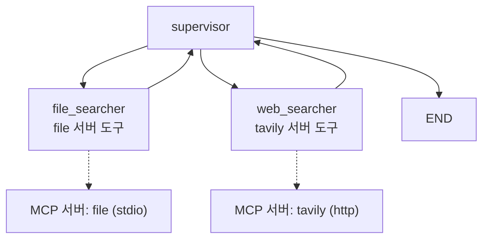

# 9.5 랭그래프에서 MCP 기반 멀티 에이전트 구현하기

> **저자 예제** — [`examples/mcp_multi_agent/server.py`](examples/mcp_multi_agent/server.py) · [`examples/mcp_multi_agent/client.py`](examples/mcp_multi_agent/client.py)
> **공식 문서** — [langchain-mcp-adapters](https://github.com/langchain-ai/langchain-mcp-adapters)

> **여기까지** — 서버 하나에 붙여 에이전트를 만들었습니다([9.4절](09-04_MCP%20%ED%81%B4%EB%9D%BC%EC%9D%B4%EC%96%B8%ED%8A%B8%20%EA%B5%AC%EC%B6%95%ED%95%98%EA%B8%B0%20-%20%EB%9E%AD%EA%B7%B8%EB%9E%98%ED%94%84.md)).
> **이 절의 질문** — 서버가 **여러 개**면? 그리고 **7장의 멀티 에이전트**와 어떻게 합치지?
> **다 읽으면** — **MCP 서버 하나 = 에이전트 하나**라는 깔끔한 구조를 보게 됩니다. 11장의 원형입니다.

[9.4절](09-04_MCP%20%ED%81%B4%EB%9D%BC%EC%9D%B4%EC%96%B8%ED%8A%B8%20%EA%B5%AC%EC%B6%95%ED%95%98%EA%B8%B0%20-%20%EB%9E%AD%EA%B7%B8%EB%9E%98%ED%94%84.md)은 서버 하나였습니다. 이번엔 **둘**입니다. 그리고 [7장](../ch07_multi-agent/07-04_%EC%9B%B9%ED%8E%98%EC%9D%B4%EC%A7%80%EB%A5%BC%20%EC%9A%94%EC%95%BD%ED%95%B4%EC%84%9C%20%EB%8D%B0%EC%9D%B4%ED%84%B0%EB%B2%A0%EC%9D%B4%EC%8A%A4%EC%97%90%20%EC%A0%80%EC%9E%A5%ED%95%98%EB%8A%94%20%EC%97%90%EC%9D%B4%EC%A0%84%ED%8A%B8%20%23%EC%8A%88%ED%8D%BC%EB%B0%94%EC%9D%B4%EC%A0%80.md)의 슈퍼바이저 패턴을 그 위에 얹습니다.

## 9.5.1 [실습] 파일 탐색 및 저장 MCP 서버 구축하기

[`mcp_multi_agent/server.py`](examples/mcp_multi_agent/server.py)는 [9.3절](09-03_MCP%20%EC%84%9C%EB%B2%84%20%EA%B5%AC%EC%B6%95%ED%95%98%EA%B8%B0.md)과 같은 틀인데 **두 가지가 다릅니다.**

### `instructions`가 붙었습니다

```python
mcp = FastMCP(
    "FileSearch",
    instructions="로컬 파일 검색을 도와주는 어시스턴트입니다."
)
```

**서버 전체에 대한 설명**입니다. 도구마다 붙는 독스트링과 별개로, "이 서버는 무엇을 하는 곳인가"를 알려 줍니다. 서버가 여러 개일 때 특히 쓸모가 있습니다.

### 도구가 `async`입니다

```python
@mcp.tool()
async def file_listup(directory: str) -> List[str]:
    """지정된 디렉토리 경로의 파일 이름 목록을 반환합니다."""
    try:
        return os.listdir(directory)
    except Exception as e:
        return [f"오류: {str(e)}"]
```

MCP 도구는 **동기·비동기 둘 다 됩니다.** [9.3절](09-03_MCP%20%EC%84%9C%EB%B2%84%20%EA%B5%AC%EC%B6%95%ED%95%98%EA%B8%B0.md)은 동기였고 여기는 비동기입니다.

도구 셋이 들어 있습니다.

| 도구 | 하는 일 |
| :--- | :--- |
| `file_listup(directory)` | 디렉터리의 파일 이름 목록 |
| `file_info(path)` | 파일 내용 + 크기·시각·권한 |
| `save_file(content, output_path)` | 파일 저장 |

> **`file_info`는 파일을 통째로 읽어서 돌려줍니다.** 큰 파일을 지목하면 [2.3절](../ch02_core-elements/02-03_%EC%97%90%EC%9D%B4%EC%A0%84%ED%8A%B8%EC%9D%98%20%EA%B8%B0%EC%96%B5%EB%A0%A5%20-%20%EB%A9%94%EB%AA%A8%EB%A6%AC.md)의 컨텍스트가 한 번에 찹니다. 실무라면 크기 상한이나 일부만 읽는 옵션이 필요합니다.
>
> **`st_birthtime`은 플랫폼에 따라 없을 수 있습니다.** 생성 시각을 다루는 코드는 OS마다 다르니, 오류가 나면 이 줄을 의심하세요.

## 9.5.2 [실습] 멀티 서버 클라이언트 구축하기

### `MultiServerMCPClient`

[9.4절](09-04_MCP%20%ED%81%B4%EB%9D%BC%EC%9D%B4%EC%96%B8%ED%8A%B8%20%EA%B5%AC%EC%B6%95%ED%95%98%EA%B8%B0%20-%20%EB%9E%AD%EA%B7%B8%EB%9E%98%ED%94%84.md)에서 `ClientSession`을 직접 열었습니다. 서버가 둘이면 그걸 두 번 해야 합니다. `MultiServerMCPClient`가 대신해 줍니다.

```python
from langchain_mcp_adapters.client import MultiServerMCPClient

client = MultiServerMCPClient(
    {
        "tavily": {
            "url": f"https://mcp.tavily.com/mcp/?tavilyApiKey={TAVILY_API_KEY}",
            "transport": "streamable_http",
        },
        "file": {
            "transport": "stdio",
            "command": "python",
            "args": ["./server.py"],
        }
    }
)
```

**두 전송 방식이 한 딕셔너리에 나란히 있습니다**([9.1.2절](09-01_MCP%EB%9E%80.md)).

| 서버 | 전송 | 어디에 |
| :--- | :--- | :--- |
| `tavily` | `streamable_http` | **Tavily가 운영하는 원격 서버** |
| `file` | `stdio` | 내가 만든 로컬 서버 |

[9.2.2절](09-02_MCP%20%EA%B8%B0%EB%8A%A5%EC%9D%B4%20%EB%93%A4%EC%96%B4%EA%B0%84%20%EC%97%90%EC%9D%B4%EC%A0%84%ED%8A%B8%20%EC%84%9C%EB%B9%84%EC%8A%A4.md)에서 말한 **"남이 만든 서버를 주소만으로"** 가 실제로 이렇게 생겼습니다. [6.2절](../ch06_single-agent/06-02_%EC%9B%B9%20%EA%B2%80%EC%83%89%20%EC%97%90%EC%9D%B4%EC%A0%84%ED%8A%B8%20%EB%A7%8C%EB%93%A4%EA%B8%B0.md)에서는 `langchain-tavily`를 설치했는데, 여기서는 **설치 없이 URL만** 있습니다.

> **API 키가 URL에 들어갑니다.** `?tavilyApiKey=…` 형태라 로그·에러 메시지에 그대로 찍힐 수 있습니다. [4.3절](../ch04_dev-env/04-03_%ED%99%98%EA%B2%BD%EB%B3%80%EC%88%98%20%EC%84%A4%EC%A0%95%ED%95%98%EA%B8%B0.md)에서 "키를 출력하지 말라"고 한 이유가 여기서도 적용됩니다. `print(client)` 같은 걸 하지 마세요.

### 서버별로 도구를 나눠 받습니다

```python
all_tools = await client.get_tools()                        # 전부
tavily_tools = await client.get_tools(server_name="tavily")  # tavily 것만
file_tools = await client.get_tools(server_name="file")      # file 것만
```

**`server_name`으로 나눠 받는 것**이 이 절의 설계입니다.

전부 한 에이전트에 주면 [2.2절](../ch02_core-elements/02-02_%EC%97%90%EC%9D%B4%EC%A0%84%ED%8A%B8%EC%9D%98%20%EC%99%B8%EB%B6%80%20%EC%A7%80%EC%8B%9D%20%ED%99%9C%EC%9A%A9%20-%20%EB%8F%84%EA%B5%AC%20%ED%98%B8%EC%B6%9C.md)의 문제가 생깁니다 — 도구가 많아져 헷갈리고 컨텍스트를 잡아먹습니다. **서버 단위로 나누면 자연스럽게 역할이 갈립니다.**

[3.3절](../ch03_architecture/03-03_%EC%96%B4%EB%96%A4%20%EC%97%90%EC%9D%B4%EC%A0%84%ED%8A%B8%EB%A5%BC%20%EC%84%A4%EA%B3%84%ED%95%B4%EC%95%BC%20%ED%95%A0%EA%B9%8C.md)에서 좋은 분리 기준으로 **"데이터 출처"** 를 꼽았는데, MCP 서버가 바로 출처 단위입니다.

```python
print(f"Total tools loaded: {len(all_tools)}")
print(f"Tool names: {[tool.name for tool in all_tools]}")
```

**어떤 도구가 실제로 붙었는지 찍어 보는 코드**가 들어 있습니다. 원격 서버는 제공 도구가 바뀔 수 있으니 확인하는 습관이 좋습니다.

### 윈도우에서 필요한 한 줄

```python
import sys, asyncio
if sys.platform.startswith("win"):
    asyncio.set_event_loop_policy(asyncio.WindowsSelectorEventLoopPolicy())
```

**윈도우에서 비동기 서브프로세스를 다룰 때 필요한 설정**입니다. 없으면 `stdio` 서버를 띄우는 과정에서 문제가 생길 수 있습니다.

```python
os.chdir(os.path.dirname(os.path.abspath(__file__)))
```

**작업 디렉터리를 이 파일 위치로 강제**합니다. `args=["./server.py"]`가 상대 경로라 [9.4절](09-04_MCP%20%ED%81%B4%EB%9D%BC%EC%9D%B4%EC%96%B8%ED%8A%B8%20%EA%B5%AC%EC%B6%95%ED%95%98%EA%B8%B0%20-%20%EB%9E%AD%EA%B7%B8%EB%9E%98%ED%94%84.md)에서 걸렸던 문제를 코드로 막은 것입니다. **어디서 실행하든 동작합니다.**

## 9.5.3 [실습] 슈퍼바이저 에이전트 만들기

**[7.4절](../ch07_multi-agent/07-04_%EC%9B%B9%ED%8E%98%EC%9D%B4%EC%A7%80%EB%A5%BC%20%EC%9A%94%EC%95%BD%ED%95%B4%EC%84%9C%20%EB%8D%B0%EC%9D%B4%ED%84%B0%EB%B2%A0%EC%9D%B4%EC%8A%A4%EC%97%90%20%EC%A0%80%EC%9E%A5%ED%95%98%EB%8A%94%20%EC%97%90%EC%9D%B4%EC%A0%84%ED%8A%B8%20%23%EC%8A%88%ED%8D%BC%EB%B0%94%EC%9D%B4%EC%A0%80.md)과 똑같습니다.** 새로 배울 게 없습니다.

```python
class Router(TypedDict):
    """라우팅 할 작업자
    file_searcher: 파일 정보 호출 및 생성 작업자
    web_searcher: 웹 검색 작업자
    """
    next: Literal["file_searcher", "web_searcher"]

response = model.bind_tools([Router]).invoke(messages)

if hasattr(response, "tool_calls") and len(response.tool_calls) > 0:
    goto = response.tool_calls[0]["args"]["next"]
    return Command(goto=goto, update={"next": goto})
else:
    final_message = AIMessage(content=response.content, name="supervisor")
    return Command(goto=END, update={"messages": [final_message]})
```

`Router` 스키마, `tool_calls` 유무로 종료 판단, `Command`로 이동 — [7.4절](../ch07_multi-agent/07-04_%EC%9B%B9%ED%8E%98%EC%9D%B4%EC%A7%80%EB%A5%BC%20%EC%9A%94%EC%95%BD%ED%95%B4%EC%84%9C%20%EB%8D%B0%EC%9D%B4%ED%84%B0%EB%B2%A0%EC%9D%B4%EC%8A%A4%EC%97%90%20%EC%A0%80%EC%9E%A5%ED%95%98%EB%8A%94%20%EC%97%90%EC%9D%B4%EC%A0%84%ED%8A%B8%20%23%EC%8A%88%ED%8D%BC%EB%B0%94%EC%9D%B4%EC%A0%80.md)에서 배운 그대로입니다.

### 작업자는 서버별 도구를 받습니다

```python
file_searcher = create_agent(model, file_tools)
web_searcher = create_agent(model, tavily_tools)
```

**한 줄씩입니다.** MCP 도구가 이미 랭체인 도구로 변환돼 있으니 그냥 넣으면 됩니다.



**MCP 서버 하나 = 에이전트 하나** 구조입니다. 깔끔한 대응입니다.

작업자 노드는 [7.4절](../ch07_multi-agent/07-04_%EC%9B%B9%ED%8E%98%EC%9D%B4%EC%A7%80%EB%A5%BC%20%EC%9A%94%EC%95%BD%ED%95%B4%EC%84%9C%20%EB%8D%B0%EC%9D%B4%ED%84%B0%EB%B2%A0%EC%9D%B4%EC%8A%A4%EC%97%90%20%EC%A0%80%EC%9E%A5%ED%95%98%EB%8A%94%20%EC%97%90%EC%9D%B4%EC%A0%84%ED%8A%B8%20%23%EC%8A%88%ED%8D%BC%EB%B0%94%EC%9D%B4%EC%A0%80.md)·[7.3절](../ch07_multi-agent/07-03_%EC%A0%95%EB%B3%B4%20%EA%B2%80%EC%83%89%EC%9D%84%20%EA%B8%B0%EB%B0%98%EC%9C%BC%EB%A1%9C%20%EC%B0%A8%ED%8A%B8%EB%A5%BC%20%EA%B7%B8%EB%A0%A4%EC%A3%BC%EB%8A%94%20%EC%97%90%EC%9D%B4%EC%A0%84%ED%8A%B8%20%23%EB%84%A4%ED%8A%B8%EC%9B%8C%ED%81%AC%20%ED%8C%A8%ED%84%B4.md)의 관례를 따릅니다.

```python
async def file_search_node(state: State) -> Command[Literal["supervisor"]]:
    result = await file_searcher.ainvoke(state)
    return Command(
        update={"messages": [HumanMessage(content=result["messages"][-1].content,
                                          name="file_searcher")]},
        goto="supervisor",
    )
```

**결과를 `HumanMessage`로 바꾸고 `name`을 붙입니다**([7.3절](../ch07_multi-agent/07-03_%EC%A0%95%EB%B3%B4%20%EA%B2%80%EC%83%89%EC%9D%84%20%EA%B8%B0%EB%B0%98%EC%9C%BC%EB%A1%9C%20%EC%B0%A8%ED%8A%B8%EB%A5%BC%20%EA%B7%B8%EB%A0%A4%EC%A3%BC%EB%8A%94%20%EC%97%90%EC%9D%B4%EC%A0%84%ED%8A%B8%20%23%EB%84%A4%ED%8A%B8%EC%9B%8C%ED%81%AC%20%ED%8C%A8%ED%84%B4.md)). 그리고 **마지막 메시지 하나만** 넘깁니다 — 작업자 내부의 도구 호출 이력까지 슈퍼바이저에게 보낼 필요가 없습니다. [3.2절](../ch03_architecture/03-02_%EB%A9%80%ED%8B%B0%20%EC%97%90%EC%9D%B4%EC%A0%84%ED%8A%B8.md)의 "컨텍스트를 나눈다"가 여기서 실현됩니다.

**전부 `async`입니다.** MCP가 비동기라 노드 함수까지 `async def`가 됩니다.

## 9.5.4 [실습] 웹 검색과 파일 탐색 요청하기

```python
async for _, chunk in graph.astream(
    {"messages": user_input},
    stream_mode="updates",
    subgraphs=True,
    config=config,
):
```

두 옵션이 새롭습니다.

| 옵션 | 뜻 |
| :--- | :--- |
| `stream_mode="updates"` | 노드가 바꾼 부분만 ([6.2.4절](../ch06_single-agent/06-02_%EC%9B%B9%20%EA%B2%80%EC%83%89%20%EC%97%90%EC%9D%B4%EC%A0%84%ED%8A%B8%20%EB%A7%8C%EB%93%A4%EA%B8%B0.md)) |
| **`subgraphs=True`** | **작업자 에이전트 내부까지** 흘려보냄 |

**`subgraphs=True`가 중요합니다.** 작업자는 `create_agent`가 만든 **또 하나의 그래프**입니다. 이 옵션이 없으면 작업자 안에서 어떤 도구를 불렀는지 안 보이고 **결과만** 나옵니다.

멀티 에이전트에서 무슨 일이 일어나는지 보려면 켜 두는 게 좋습니다.

### 시험해 볼 것

| 질문 | 기대 경로 |
| :--- | :--- |
| "이 폴더에 어떤 파일이 있어?" | `file_searcher` 하나 |
| "MCP 최신 동향 알려줘" | `web_searcher` 하나 |
| **"MCP를 검색해서 요약한 걸 파일로 저장해줘"** | `web_searcher` → `file_searcher` |

마지막이 이 절의 목표입니다. **원격 서버(Tavily)와 로컬 서버(file)를 한 요청에서 이어 쓰는 것**입니다.

> 실행 결과는 검색 시점과 파일 상태에 따라 달라지므로 이 노트에는 싣지 않았습니다.

### 9장이 앞 장들과 만나는 지점

이 예제 하나에 지금까지 배운 것이 거의 다 들어 있습니다.

| 요소 | 배운 곳 |
| :--- | :--- |
| 도구 호출 루프 | [6.1절](../ch06_single-agent/06-01_%EB%8F%84%EA%B5%AC%EB%A5%BC%20%ED%98%B8%EC%B6%9C%ED%95%98%EB%8A%94%20%EC%97%90%EC%9D%B4%EC%A0%84%ED%8A%B8%20%EC%9D%B4%ED%95%B4%ED%95%98%EA%B8%B0.md) |
| `create_agent` | [6.4절](../ch06_single-agent/06-04_create_agent%20%EC%83%81%EC%84%B8%20%EA%B5%AC%EC%A1%B0%20%EC%9D%B4%ED%95%B4%ED%95%98%EA%B8%B0.md) |
| 슈퍼바이저 + `Router` | [7.4절](../ch07_multi-agent/07-04_%EC%9B%B9%ED%8E%98%EC%9D%B4%EC%A7%80%EB%A5%BC%20%EC%9A%94%EC%95%BD%ED%95%B4%EC%84%9C%20%EB%8D%B0%EC%9D%B4%ED%84%B0%EB%B2%A0%EC%9D%B4%EC%8A%A4%EC%97%90%20%EC%A0%80%EC%9E%A5%ED%95%98%EB%8A%94%20%EC%97%90%EC%9D%B4%EC%A0%84%ED%8A%B8%20%23%EC%8A%88%ED%8D%BC%EB%B0%94%EC%9D%B4%EC%A0%80.md) |
| `Command` 핸드오프 | [7.2절](../ch07_multi-agent/07-02_%ED%95%B8%EB%93%9C%EC%98%A4%ED%94%84%EB%A5%BC%20%EC%9C%84%ED%95%9C%20%EA%B8%B0%EB%8A%A5%20%EC%82%B4%ED%8E%B4%EB%B3%B4%EA%B8%B0.md) |
| 체크포인터 | [8.2절](../ch08_memory/08-02_%EB%8C%80%ED%99%94%20%EB%A7%A5%EB%9D%BD%EC%9D%84%20%EC%9D%B4%ED%95%B4%ED%95%98%EB%8A%94%20%EC%97%90%EC%9D%B4%EC%A0%84%ED%8A%B8.md) |
| MCP 서버 연결 | 이 장 |

**MCP는 도구를 어디서 가져오는지만 바꿉니다.** 나머지 구조는 그대로입니다.

## 요약 및 비유

**협력 업체를 여러 곳 두는 일**입니다. 한 곳은 옆 건물(로컬 `stdio`), 한 곳은 해외 원격지(`streamable_http`)입니다. **업체마다 담당자를 따로 두고**(에이전트 분리), 팀장이 건별로 배분합니다(슈퍼바이저).

| 개념 | 협력 업체 비유 | 기술적 의미 |
| :--- | :--- | :--- |
| **`MultiServerMCPClient`** | 계약 관리 부서 | 여러 세션을 한 번에 관리 |
| **`streamable_http`** | 해외 원격 업체 | 원격 서버 |
| **`stdio`** | 옆 건물 업체 | 로컬 프로세스 |
| **`get_tools(server_name=…)`** | 업체별 가능 업무 목록 | 서버별 도구 분리 |
| **서버 = 에이전트** | 업체마다 담당자 | 출처 단위 역할 분리 |
| **`instructions`** | 업체 소개문 | 서버 전체 설명 |
| **`subgraphs=True`** | 담당자의 세부 작업까지 보고 | 하위 그래프 스트리밍 |
| **`os.chdir`** | 사무실 위치 고정 | 작업 디렉터리 강제 |
| **URL 속 API 키** | 계약서에 적힌 비밀번호 | 로그에 노출 위험 |

## 결론

* **`MultiServerMCPClient`가 서버 여러 개의 세션을 한꺼번에** 관리합니다. `stdio`와 `streamable_http`를 한 딕셔너리에 섞어 쓸 수 있습니다.
* **`get_tools(server_name=…)`으로 서버별 도구를 나눠 받는 것**이 이 절의 설계입니다. 서버가 곧 [3.3절](../ch03_architecture/03-03_%EC%96%B4%EB%96%A4%20%EC%97%90%EC%9D%B4%EC%A0%84%ED%8A%B8%EB%A5%BC%20%EC%84%A4%EA%B3%84%ED%95%B4%EC%95%BC%20%ED%95%A0%EA%B9%8C.md)의 "데이터 출처" 분리 기준이 됩니다.
* **MCP 서버 하나 = 에이전트 하나** 구조가 깔끔합니다.
* 슈퍼바이저는 **[7.4절](../ch07_multi-agent/07-04_%EC%9B%B9%ED%8E%98%EC%9D%B4%EC%A7%80%EB%A5%BC%20%EC%9A%94%EC%95%BD%ED%95%B4%EC%84%9C%20%EB%8D%B0%EC%9D%B4%ED%84%B0%EB%B2%A0%EC%9D%B4%EC%8A%A4%EC%97%90%20%EC%A0%80%EC%9E%A5%ED%95%98%EB%8A%94%20%EC%97%90%EC%9D%B4%EC%A0%84%ED%8A%B8%20%23%EC%8A%88%ED%8D%BC%EB%B0%94%EC%9D%B4%EC%A0%80.md)과 완전히 같습니다.** MCP를 쓴다고 달라지는 게 없습니다.
* 작업자는 **마지막 메시지 하나만** 슈퍼바이저에게 넘깁니다. 내부 도구 이력은 넘기지 않습니다.
* **`subgraphs=True`** 를 켜야 작업자 내부에서 무슨 도구를 불렀는지 보입니다.
* 윈도우에서는 **이벤트 루프 정책 설정**이, 경로 문제에는 **`os.chdir`** 이 방어책으로 들어 있습니다.
* **API 키가 URL에 들어갑니다.** 로그에 찍히지 않게 주의하세요.
* MCP는 **도구를 어디서 가져오는지만 바꿉니다.** 6~8장에서 배운 구조는 그대로입니다.

---

## 9장을 마치며

다섯 개 절을 한 줄로 이으면 이렇습니다.

> **MCP가 도구를 밖으로 뺀 것임을 알았고(9.1) → 왜 표준인지와 쓸 때 주의점을 봤고(9.2) → 직접 서버를 만들었고(9.3) → 클라이언트로 붙였고(9.4) → 서버 여러 개를 멀티 에이전트로 엮었습니다(9.5).**

**가장 중요한 한 줄은 이것입니다.**

> **MCP는 도구를 어디서 가져오는지만 바꿉니다.** 6~8장에서 배운 구조는 그대로입니다.

**10장에서는** 잇는 대상이 바뀝니다.

| | 잇는 것 | 상대에게 LLM이 |
| :--- | :--- | :--- |
| **9장 MCP** | 에이전트 ↔ **도구** | 없음 |
| **10장 A2A** | 에이전트 ↔ **에이전트** | **있음** |

**도구는 인자를 정확히 채워 부르지만, 에이전트는 자연어로 일을 맡깁니다.** 그 차이가 10장의 출발점입니다.

---

[⬅ 9.4](09-04_MCP%20%ED%81%B4%EB%9D%BC%EC%9D%B4%EC%96%B8%ED%8A%B8%20%EA%B5%AC%EC%B6%95%ED%95%98%EA%B8%B0%20-%20%EB%9E%AD%EA%B7%B8%EB%9E%98%ED%94%84.md) · [Chapter 09](README.md) · [전체 목차](../STUDY.md)
