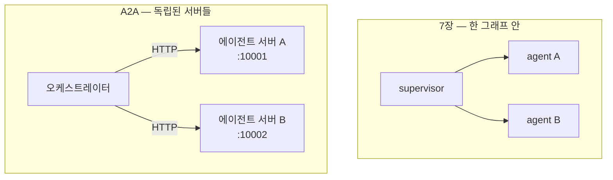
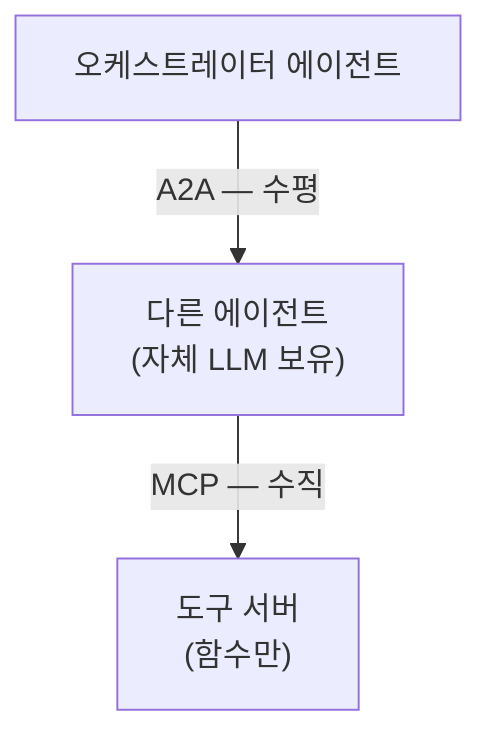

# 10.1 A2A란

> **공식 문서** — [A2A Protocol](https://a2a-protocol.org/) · [A2A Specification](https://a2a-protocol.org/latest/specification/)

> **여기까지** — MCP로 **도구**를 밖에서 가져왔습니다(9장).
> **이 절의 질문** — **다른 사람이 만든 에이전트**와는 어떻게 붙지?
> **다 읽으면** — **MCP는 수직, A2A는 수평**이라는 그림이 잡힙니다. 10장 전체가 이 한 장으로 요약됩니다.

## 10.1.1 A2A 개념

### 7장의 멀티 에이전트에는 전제가 하나 있었습니다

[7장](../ch07_multi-agent/07-01_%EB%A9%80%ED%8B%B0%20%EC%97%90%EC%9D%B4%EC%A0%84%ED%8A%B8%20%EC%9C%A0%ED%98%95%20%EC%86%8C%EA%B0%9C.md)에서 에이전트 여러 개를 엮었습니다. 그런데 그것들은 전부 **내 그래프 안에 있었습니다.**

- 같은 프로세스에서 돕니다
- 같은 상태를 공유합니다
- 내가 전부 만들었습니다

**다른 회사가 만든 에이전트, 다른 팀이 운영하는 에이전트와 붙이려면** 이 방식으로는 안 됩니다. 코드를 합칠 수도 없고, 상태를 공유할 수도 없습니다.

**A2A(Agent2Agent)** 는 **에이전트끼리 통신하는 방법을 표준화한 프로토콜**입니다.



각 에이전트가 **독립된 서버**로 돌고, HTTP로 대화합니다. 안에서 랭그래프를 쓰든 다른 걸 쓰든 **바깥에서는 알 필요가 없습니다.**

## 10.1.2 MCP vs A2A

[9장](../ch09_mcp/09-01_MCP%EB%9E%80.md)의 MCP와 헷갈리기 쉽습니다. **둘은 잇는 대상이 다릅니다.**

| | MCP (9장) | A2A (10장) |
| :--- | :--- | :--- |
| 잇는 것 | **에이전트 ↔ 도구** | **에이전트 ↔ 에이전트** |
| 상대는 | 함수를 가진 서버 | **스스로 판단하는 에이전트** |
| 상대에게 LLM이 | 없음 | **있음** |
| 요청 결과 | 함수 실행 결과 | **판단을 거친 답변** |
| 방향 | 수직 (아래로 내려감) | **수평 (옆으로)** |



**이 그림이 10장 전체를 요약합니다.** [10.4절](10-04_MCP%EC%99%80%20A2A%EB%A5%BC%20%ED%99%9C%EC%9A%A9%ED%95%9C%20%EB%A9%80%ED%8B%B0%20%EC%97%90%EC%9D%B4%EC%A0%84%ED%8A%B8%20%EA%B5%AC%EC%B6%95%ED%95%98%EA%B8%B0.md)의 예제가 정확히 이 모양입니다 — 오케스트레이터가 A2A로 에이전트를 부르고, 그 에이전트가 MCP로 Tavily 도구를 씁니다.

### 무엇이 달라지나

**도구를 부를 때**는 인자를 정확히 채워야 합니다([2.2절](../ch02_core-elements/02-02_%EC%97%90%EC%9D%B4%EC%A0%84%ED%8A%B8%EC%9D%98%20%EC%99%B8%EB%B6%80%20%EC%A7%80%EC%8B%9D%20%ED%99%9C%EC%9A%A9%20-%20%EB%8F%84%EA%B5%AC%20%ED%98%B8%EC%B6%9C.md)). `get_weather(city="서울")` 처럼요.

**에이전트를 부를 때**는 **자연어로 일을 맡깁니다.** "2025년 AI 트렌드를 검색해줘" 라고 하면 상대가 알아서 판단해 처리합니다. 어떤 도구를 쓸지는 그쪽 사정입니다.

> **[7.5절](../ch07_multi-agent/07-05_%EC%B5%9C%EC%8B%A0%20%EB%AC%B8%EC%84%9C%20%EA%B2%80%EC%83%89%20%2B%20%EB%82%B4%EB%B6%80%20DB%20%EA%B2%80%EC%83%89%20%2B%20%ED%85%9C%ED%94%8C%EB%A6%BF%20%EB%8B%B5%EB%B3%80%203%EC%A4%91%20%EB%A9%80%ED%8B%B0%20%EC%97%90%EC%9D%B4%EC%A0%84%ED%8A%B8%20%23%EC%8A%88%ED%8D%BC%EB%B0%94%EC%9D%B4%EC%A0%80.md)의 핸드오프 도구를 떠올리세요.** 거기서도 `query`라는 자연어를 넘겼습니다. **A2A는 그것을 프로세스 경계 너머로** 하는 것입니다.

### 왜 별도 프로토콜이 필요한가

"그냥 REST API로 부르면 되지 않나" 싶습니다. 에이전트에는 API에 없는 사정이 있습니다.

| 에이전트의 사정 | A2A가 다루는 방식 |
| :--- | :--- |
| **오래 걸린다** — 도구를 여러 번 부를 수 있음 | 작업(Task)에 상태를 두고 진행 상황을 알림 |
| **되물을 수 있다** — 정보가 부족하면 | `input_required` 상태 |
| **뭘 할 수 있는지 미리 알려야** | **에이전트 카드(Agent Card)** |
| **결과가 텍스트만이 아님** | 여러 형식(Part)을 담는 구조 |

[10.2절](10-02_A2A%EC%9D%98%20%EA%B5%AC%EC%84%B1%20%EC%9A%94%EC%86%8C%EC%99%80%20%EB%8F%99%EC%9E%91%20%ED%9D%90%EB%A6%84%20%EC%9D%B4%ED%95%B4%ED%95%98%EA%B8%B0.md)에서 하나씩 봅니다.

## 10.1.3 A2A 파이썬 SDK

공식 SDK가 **서버와 클라이언트를 모두** 제공합니다.

| 만들 때 | 쓰는 것 |
| :--- | :--- |
| **에이전트 서버** | `AgentExecutor` · `A2AStarletteApplication` · `AgentCard` |
| **에이전트 클라이언트** | `A2ACardResolver` · `A2AClient` |

서버는 **Starlette(ASGI) 애플리케이션**이고 `uvicorn`으로 띄웁니다. [`pyproject.toml`](../pyproject.toml)에 `uvicorn`과 `httpx`가 들어 있는 이유입니다.

```python
uvicorn.run(server_app.build(), host='0.0.0.0', port=9999)
```

**에이전트 하나가 웹 서버 하나**입니다. [10.4절](10-04_MCP%EC%99%80%20A2A%EB%A5%BC%20%ED%99%9C%EC%9A%A9%ED%95%9C%20%EB%A9%80%ED%8B%B0%20%EC%97%90%EC%9D%B4%EC%A0%84%ED%8A%B8%20%EA%B5%AC%EC%B6%95%ED%95%98%EA%B8%B0.md)에서는 포트 10001·10002에 하나씩 띄우고 오케스트레이터가 따로 돕니다. **터미널 세 개**가 필요합니다.

### 버전 주의 — 이 저장소는 0.3.x입니다

> **이 저장소는 `a2a-sdk` 0.3.x(프로토콜 스펙 0.3)를 씁니다.**
> [A2A 공식 사이트](https://a2a-protocol.org/)의 `latest` 문서는 **스펙 1.0 기준**이라 일부 타입과 시그니처가 다릅니다. **문서 상단의 버전 선택기를 확인하세요.**
>
> [`pyproject.toml`](../pyproject.toml)에 `a2a-sdk>=0.3.25,<1` 상한이 걸려 있습니다. **풀지 마세요.** 10·11장 예제 21개 파일이 깨집니다([CLAUDE.md](../CLAUDE.md) §6).

## 요약 및 비유

**MCP는 사내 비품 청구, A2A는 협력사 발주**입니다. 비품은 규격을 정확히 적어 신청하고(도구 인자), 협력사에는 **"이런 걸 만들어 주세요"라고 말로 맡깁니다**(자연어 위임). 협력사는 자기 방식대로 처리하고 결과만 보냅니다.

| 개념 | 발주 비유 | 기술적 의미 |
| :--- | :--- | :--- |
| **MCP** | 사내 비품 청구 | 에이전트 → 도구 (수직) |
| **A2A** | 협력사 발주 | 에이전트 → 에이전트 (수평) |
| **도구 호출** | 품목·수량 정확히 기재 | 인자 스키마를 채움 |
| **에이전트 호출** | "이런 걸 해 주세요" | 자연어 위임 |
| **상대의 내부** | 협력사 사정은 모름 | 프레임워크 무관 |
| **에이전트 카드** | 회사 소개서 | 능력을 미리 공개 |
| **작업 상태** | 진행 현황 보고 | Task 상태 |
| **되묻기** | "사양을 확인해 주세요" | `input_required` |
| **서버 = 에이전트** | 협력사마다 별도 법인 | 독립 프로세스·포트 |

## 결론

* [7장](../ch07_multi-agent/07-01_%EB%A9%80%ED%8B%B0%20%EC%97%90%EC%9D%B4%EC%A0%84%ED%8A%B8%20%EC%9C%A0%ED%98%95%20%EC%86%8C%EA%B0%9C.md)의 멀티 에이전트는 **전부 내 그래프 안**에 있었습니다. A2A는 **독립된 서버끼리** 잇습니다.
* **MCP는 에이전트↔도구(수직), A2A는 에이전트↔에이전트(수평)** 입니다. 상대에게 LLM이 있느냐가 갈림길입니다.
* 도구는 **인자를 정확히** 채워 부르고, 에이전트는 **자연어로 일을 맡깁니다.**
* REST API로 충분하지 않은 이유는 에이전트가 **오래 걸리고, 되묻고, 능력을 미리 알려야** 하기 때문입니다.
* SDK는 서버(`AgentExecutor` 등)와 클라이언트(`A2AClient` 등)를 모두 제공합니다. **에이전트 하나가 웹 서버 하나**입니다.
* **이 저장소는 `a2a-sdk` 0.3.x**입니다. 공식 문서 `latest`는 스펙 1.0이니 **버전 선택기를 확인**하세요.

---

## 다음 절로

에이전트끼리 잇는다는 건 알았습니다. **그런데 무엇을 주고받죠?**

상대가 무엇을 할 수 있는지 미리 알아야 하고, 오래 걸리면 진행 상황도 알려야 하고, 정보가 부족하면 되물어야 합니다. **일반 API로는 부족합니다.** → **[10.2절](10-02_A2A%EC%9D%98%20%EA%B5%AC%EC%84%B1%20%EC%9A%94%EC%86%8C%EC%99%80%20%EB%8F%99%EC%9E%91%20%ED%9D%90%EB%A6%84%20%EC%9D%B4%ED%95%B4%ED%95%98%EA%B8%B0.md)**

---

[Chapter 10](README.md) · [10.2 ➡](10-02_A2A%EC%9D%98%20%EA%B5%AC%EC%84%B1%20%EC%9A%94%EC%86%8C%EC%99%80%20%EB%8F%99%EC%9E%91%20%ED%9D%90%EB%A6%84%20%EC%9D%B4%ED%95%B4%ED%95%98%EA%B8%B0.md)
