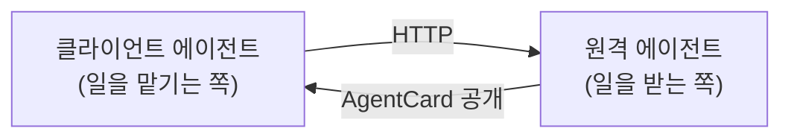
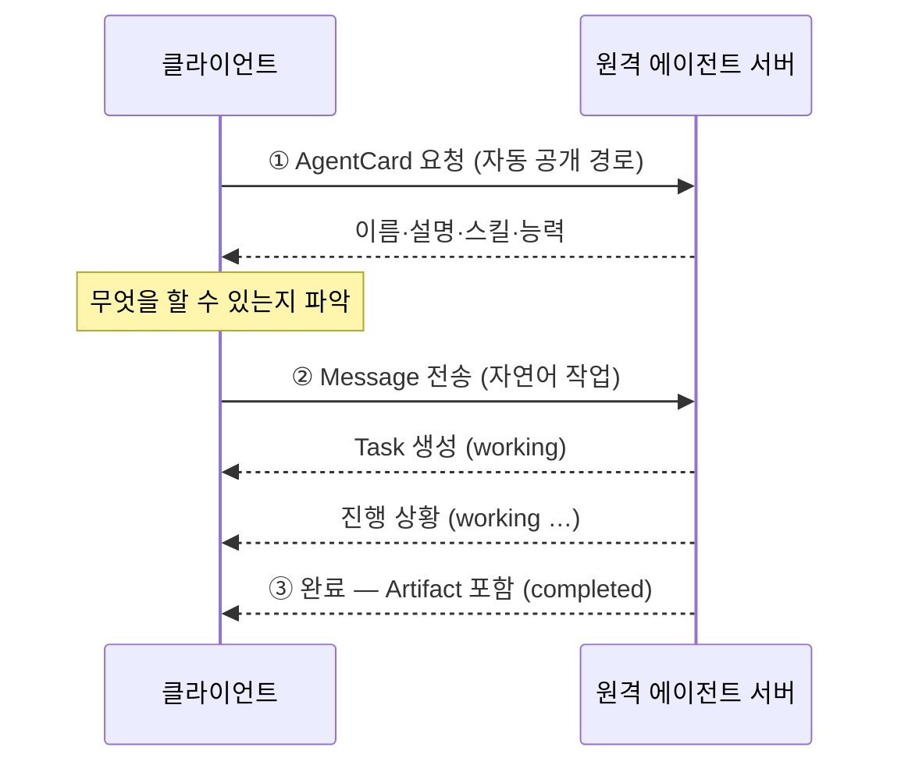
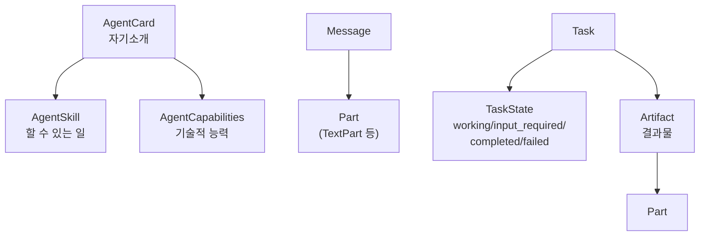

# 10.2 A2A의 구성 요소와 동작 흐름 이해하기

> **공식 문서** — [A2A Specification](https://a2a-protocol.org/latest/specification/) — **스펙 0.3 기준으로 볼 것**

[10.1절](10-01_A2A%EB%9E%80.md)에서 A2A가 무엇을 잇는지 봤습니다. 이 절은 **누가 참여하고 무엇이 오가는지**를 정리합니다. [10.3절](10-03_A2A%EC%9D%98%20%EA%B8%B0%EB%B3%B8%20%EC%82%AC%EC%9A%A9%EB%B2%95%20%EC%9D%B4%ED%95%B4%ED%95%98%EA%B8%B0.md)부터 나오는 클래스 이름들이 여기서 정리됩니다.

## 10.2.1 A2A의 주요 참여자



| 참여자 | 역할 | 예제에서 |
| :--- | :--- | :--- |
| **클라이언트 에이전트** | 일을 맡기는 쪽 | [10.3.4절](10-03_A2A%EC%9D%98%20%EA%B8%B0%EB%B3%B8%20%EC%82%AC%EC%9A%A9%EB%B2%95%20%EC%9D%B4%ED%95%B4%ED%95%98%EA%B8%B0.md)의 `test_client.py`, [10.4절](10-04_MCP%EC%99%80%20A2A%EB%A5%BC%20%ED%99%9C%EC%9A%A9%ED%95%9C%20%EB%A9%80%ED%8B%B0%20%EC%97%90%EC%9D%B4%EC%A0%84%ED%8A%B8%20%EA%B5%AC%EC%B6%95%ED%95%98%EA%B8%B0.md)의 오케스트레이터 |
| **원격 에이전트** | 일을 받아 처리하는 쪽 | 포트 9999·10001·10002의 서버들 |

**역할은 고정이 아닙니다.** 원격 에이전트가 또 다른 에이전트에게 일을 맡기면 그때는 클라이언트가 됩니다.

## 10.2.2 A2A의 동작 방식

### 전체 흐름



세 단계입니다.

| 단계 | 하는 일 |
| :--- | :--- |
| **① 발견** | 에이전트 카드를 읽어 **무엇을 할 수 있는지** 확인 |
| **② 위임** | 메시지를 보내 작업을 맡김 |
| **③ 수신** | 작업 상태를 따라가다 **결과물(Artifact)** 을 받음 |

**①이 A2A의 특징입니다.** [9장](../ch09_mcp/09-01_MCP%EB%9E%80.md)의 MCP에서 도구 목록을 받아 오던 것과 비슷하지만, A2A는 **URL만 알면 카드를 읽을 수 있습니다.** 상대가 무엇을 하는 에이전트인지 미리 몰라도 됩니다.

### 작업(Task)에 상태가 있습니다

에이전트 일은 오래 걸립니다. 그래서 **한 번 요청하고 끝이 아니라 상태가 바뀝니다.**

| 상태 | 뜻 | 클라이언트가 할 일 |
| :--- | :--- | :--- |
| `working` | 처리 중 | 기다림 |
| `input_required` | **정보가 부족해 되묻는 중** | 답을 보냄 |
| `completed` | 완료 | 결과물을 꺼냄 |
| `failed` | 실패 | 오류 처리 |

**`input_required`가 A2A다운 부분입니다.** 일반 API는 인자가 부족하면 오류를 냅니다. 에이전트는 **"어느 도시요?"라고 되물을 수 있습니다.**

[10.4절](10-04_MCP%EC%99%80%20A2A%EB%A5%BC%20%ED%99%9C%EC%9A%A9%ED%95%9C%20%EB%A9%80%ED%8B%B0%20%EC%97%90%EC%9D%B4%EC%A0%84%ED%8A%B8%20%EA%B5%AC%EC%B6%95%ED%95%98%EA%B8%B0.md) 예제가 이 상태들을 직접 다룹니다.

```python
if not is_task_complete and not require_user_input:
    await updater.update_status(TaskState.working, ...)
elif require_user_input:
    await updater.update_status(TaskState.input_required, ..., final=True)
elif is_task_complete:
    await updater.add_artifact(...)
    await updater.complete()
```

## 10.2.3 A2A 구성 요소별 특징

### 에이전트 카드(AgentCard)

**에이전트의 자기소개서**입니다. 클라이언트가 제일 먼저 읽습니다.

```python
agent_card = AgentCard(
    name='Hello World 에이전트',
    description='A2A 프로토콜을 학습하기 위한 가장 간단한 에이전트입니다',
    url='http://localhost:9999',
    version='1.0.0',
    default_input_modes=['text'],
    default_output_modes=['text'],
    capabilities=capabilities,
    skills=[skill],
)
```

| 필드 | 담는 것 |
| :--- | :--- |
| `name` · `description` | **무엇을 하는 에이전트인가** |
| `url` | 어디로 요청을 보낼지 |
| `version` | 버전 |
| `capabilities` | 기술적 능력 (스트리밍 지원 등) |
| `skills` | **할 수 있는 일들** |

> **`description`이 [2.2절](../ch02_core-elements/02-02_%EC%97%90%EC%9D%B4%EC%A0%84%ED%8A%B8%EC%9D%98%20%EC%99%B8%EB%B6%80%20%EC%A7%80%EC%8B%9D%20%ED%99%9C%EC%9A%A9%20-%20%EB%8F%84%EA%B5%AC%20%ED%98%B8%EC%B6%9C.md)의 도구 설명과 같은 역할**을 합니다. [10.4절](10-04_MCP%EC%99%80%20A2A%EB%A5%BC%20%ED%99%9C%EC%9A%A9%ED%95%9C%20%EB%A9%80%ED%8B%B0%20%EC%97%90%EC%9D%B4%EC%A0%84%ED%8A%B8%20%EA%B5%AC%EC%B6%95%ED%95%98%EA%B8%B0.md)의 오케스트레이터가 이 설명들을 모아 프롬프트에 넣고 **어느 에이전트에게 맡길지 판단**합니다. 부실하게 쓰면 배분이 어긋납니다.

### 스킬(AgentSkill)

카드 안에서 **개별 능력**을 설명합니다.

```python
skill = AgentSkill(
    id='hello_world',
    name='Hello World 인사',
    description='간단한 인사말을 반환합니다',
    tags=['인사', 'hello world', '기본'],
    examples=['안녕', '안녕하세요', 'hi', 'hello'],
)
```

**`examples`가 유용합니다.** 어떤 입력이 이 스킬에 해당하는지 예시로 보여 줍니다. 설명만으로 애매할 때 판단 근거가 됩니다.

### 능력(AgentCapabilities)

```python
capabilities = AgentCapabilities(
    streaming=False,
    input_modes=['text'],
    output_modes=['text'],
)
```

**기술적으로 무엇이 되는가**입니다. 스트리밍을 지원하는지, 텍스트 말고 다른 형식도 받는지.

| `skills` vs `capabilities` | 구분 |
| :--- | :--- |
| `skills` | **무슨 일을 하는가** (업무) |
| `capabilities` | **어떻게 주고받는가** (기술) |

### 메시지(Message)와 파트(Part)

주고받는 단위입니다.

```python
message = Message(
    role='user',
    parts=[TextPart(kind='text', text=user_input)],
    message_id=uuid4().hex,
)
```

**`parts`가 목록**인 것이 중요합니다. 한 메시지에 **여러 조각**을 담을 수 있습니다. 지금은 `TextPart` 하나뿐이지만, 파일이나 데이터도 담을 수 있는 구조입니다.

`role='user'`는 [1.2절](../ch01_llm-decision/01-02_LLM%EC%9D%84%20%EA%B8%B0%EB%B0%98%EC%9C%BC%EB%A1%9C%20%EC%9D%98%EC%82%AC%EA%B2%B0%EC%A0%95%ED%95%98%EB%8B%A4.md)의 역할과 같은 개념입니다.

### 결과물(Artifact)

**작업의 산출물**입니다. 진행 메시지와 구분됩니다.

```python
await updater.add_artifact(
    parts=[Part(root=TextPart(text=content))],
    name='agent_result'
)
await updater.complete()
```

| | 상태 메시지 | Artifact |
| :--- | :--- | :--- |
| 무엇 | "도구를 실행하는 중…" | **최종 결과물** |
| 언제 | 진행 중 여러 번 | 완료 시 |
| 클라이언트가 | 표시용으로 씀 | **실제로 가져다 씀** |

[10.4절](10-04_MCP%EC%99%80%20A2A%EB%A5%BC%20%ED%99%9C%EC%9A%A9%ED%95%9C%20%EB%A9%80%ED%8B%B0%20%EC%97%90%EC%9D%B4%EC%A0%84%ED%8A%B8%20%EA%B5%AC%EC%B6%95%ED%95%98%EA%B8%B0.md)의 오케스트레이터가 **`artifacts`에서만 결과를 꺼냅니다.**

```python
result = response.root.result
artifacts = result.artifacts

if artifacts:
    for artifact in artifacts:
        if artifact.parts:
            texts = [p.root.text for p in artifact.parts if hasattr(p.root, 'text')]
```

**진행 메시지는 무시하고 결과물만** 씁니다. 이 구분이 있어서 가능한 일입니다.

### 정리



## 요약 및 비유

**외주 계약의 서류들**입니다. 회사 소개서(AgentCard)에 사업 영역(Skill)과 설비 현황(Capabilities)이 적혀 있고, 발주서(Message)를 보내면 진행 보고(상태)를 받다가 **납품물(Artifact)** 을 받습니다.

| 개념 | 외주 비유 | 기술적 의미 |
| :--- | :--- | :--- |
| **AgentCard** | 회사 소개서 | 에이전트 메타데이터 |
| **`description`** | 사업 개요 | 오케스트레이터의 배분 근거 |
| **AgentSkill** | 사업 영역별 소개 | 개별 능력 |
| **`examples`** | 시공 사례 | 어떤 요청이 해당되는지 |
| **AgentCapabilities** | 설비·인증 현황 | 스트리밍·입출력 형식 |
| **Message / Part** | 발주서와 첨부물 | 여러 형식을 담는 구조 |
| **Task** | 진행 중인 건 | 상태를 가진 작업 |
| **`input_required`** | "사양 확인 요청" | 되묻기 |
| **Artifact** | 납품물 | 최종 결과물 |
| **상태 메시지 vs Artifact** | 진행 보고 vs 납품 | 표시용 vs 실제 결과 |

## 결론

* 참여자는 **클라이언트 에이전트**와 **원격 에이전트**이고, **역할은 고정이 아닙니다.**
* 흐름은 **① 카드 읽기 → ② 메시지로 위임 → ③ 결과물 수신** 세 단계입니다.
* **URL만 알면 카드를 읽을 수 있습니다.** 상대를 미리 몰라도 능력을 파악할 수 있습니다.
* 작업에는 상태가 있습니다 — `working` · **`input_required`** · `completed` · `failed`.
* **`input_required`가 A2A다운 지점**입니다. 일반 API는 오류를 내지만 에이전트는 되물을 수 있습니다.
* **AgentCard의 `description`은 [2.2절](../ch02_core-elements/02-02_%EC%97%90%EC%9D%B4%EC%A0%84%ED%8A%B8%EC%9D%98%20%EC%99%B8%EB%B6%80%20%EC%A7%80%EC%8B%9D%20%ED%99%9C%EC%9A%A9%20-%20%EB%8F%84%EA%B5%AC%20%ED%98%B8%EC%B6%9C.md)의 도구 설명과 같은 역할**입니다. 부실하면 배분이 어긋납니다.
* `skills`는 **무슨 일을 하는가**, `capabilities`는 **어떻게 주고받는가**입니다.
* **Artifact는 최종 결과물**이고 진행 상태 메시지와 구분됩니다. 클라이언트는 Artifact에서만 결과를 꺼냅니다.

---

[⬅ 10.1](10-01_A2A%EB%9E%80.md) · [Chapter 10](README.md) · [10.3 ➡](10-03_A2A%EC%9D%98%20%EA%B8%B0%EB%B3%B8%20%EC%82%AC%EC%9A%A9%EB%B2%95%20%EC%9D%B4%ED%95%B4%ED%95%98%EA%B8%B0.md)
