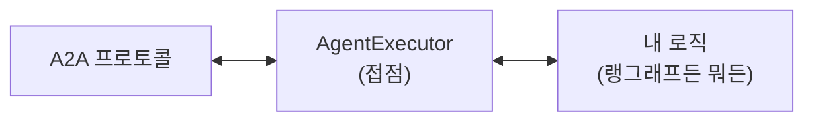
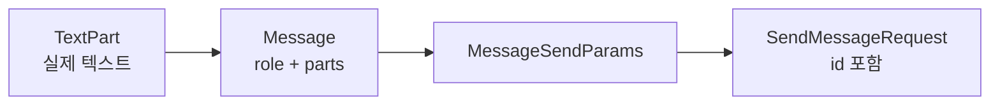

# 10.3 A2A의 기본 사용법 이해하기

> **저자 예제** — [`examples/hello_world/`](examples/hello_world) (`agent_executor.py` · `agent_server.py` · `test_client.py` · `README.md`)
> **공식 문서** — [Python 튜토리얼](https://a2a-protocol.org/latest/tutorials/python/2-setup/) · [a2a-sdk API](https://a2a-protocol.org/latest/sdk/python/api/)

> **여기까지** — A2A의 구성 요소와 흐름을 정리했습니다([10.2절](10-02_A2A%EC%9D%98%20%EA%B5%AC%EC%84%B1%20%EC%9A%94%EC%86%8C%EC%99%80%20%EB%8F%99%EC%9E%91%20%ED%9D%90%EB%A6%84%20%EC%9D%B4%ED%95%B4%ED%95%98%EA%B8%B0.md)).
> **이 절의 질문** — **가장 단순한 A2A 에이전트**는 어떻게 생겼지?
> **다 읽으면** — 서버와 클라이언트를 만들 수 있습니다. **로직을 비워 두고 배관만** 보는 게 요점입니다.

가장 단순한 A2A 에이전트를 만듭니다. **항상 "Hello World!"만 답하는** 에이전트입니다. LLM도 도구도 없습니다.

**일부러 그렇게 만든 것**입니다. A2A의 뼈대만 보려는 예제입니다.

## 10.3.1 에이전트 기능 설명하기

[10.2.3절](10-02_A2A%EC%9D%98%20%EA%B5%AC%EC%84%B1%20%EC%9A%94%EC%86%8C%EC%99%80%20%EB%8F%99%EC%9E%91%20%ED%9D%90%EB%A6%84%20%EC%9D%B4%ED%95%B4%ED%95%98%EA%B8%B0.md)의 세 가지를 채웁니다.

```python
skill = AgentSkill(
    id='hello_world',
    name='Hello World 인사',
    description='간단한 인사말을 반환합니다',
    tags=['인사', 'hello world', '기본'],
    examples=['안녕', '안녕하세요', 'hi', 'hello'],
)

capabilities = AgentCapabilities(
    streaming=False,
    input_modes=['text'],
    output_modes=['text'],
)

agent_card = AgentCard(
    name='Hello World 에이전트',
    description='A2A 프로토콜을 학습하기 위한 가장 간단한 에이전트입니다',
    url='http://localhost:9999',
    version='1.0.0',
    default_input_modes=['text'],
    default_output_modes=['text'],
    capabilities=capabilities,
    skills=[skill],
)
```

> **`url`이 카드 안에 들어 있습니다.** 클라이언트는 이 값을 보고 요청을 보냅니다. **실제 서버 주소와 다르면 통신이 안 됩니다.** 포트를 바꾸면 여기도 함께 고쳐야 합니다.

## 10.3.2 [실습] 에이전트 실행기 구현하기

**실행기(AgentExecutor)** 가 A2A와 내 코드를 잇는 자리입니다.

> **`async def`가 계속 나옵니다.** 지금은 **"기다리는 동안 다른 일을 할 수 있는 함수"** 정도로만 알아도 충분합니다. 서버는 여러 요청을 동시에 받으므로, 한 요청이 LLM 응답을 기다리는 동안 다른 요청을 처리해야 합니다. 그래서 `async`입니다. **내부 동작을 몰라도 A2A 에이전트는 만들 수 있습니다.** 규칙은 둘뿐입니다 — `async def`로 정의한 함수는 `await`을 붙여 부르고, `async def` 안에서만 `await`을 쓸 수 있습니다.

```python
class HelloWorldAgent:
    async def invoke(self) -> str:
        return "Hello World! 안녕하세요, A2A 에이전트입니다!"


class HelloWorldAgentExecutor(AgentExecutor):
    def __init__(self):
        self.agent = HelloWorldAgent()

    async def execute(self, context: RequestContext, event_queue: EventQueue) -> None:
        result = await self.agent.invoke()
        await event_queue.enqueue_event(new_agent_text_message(result))

    async def cancel(self, context: RequestContext, event_queue: EventQueue) -> None:
        raise Exception("cancel은 지원되지 않습니다")
```

### 두 층으로 나눈 것에 주목하세요

| 클래스 | 역할 |
| :--- | :--- |
| `HelloWorldAgent` | **실제 로직** — A2A를 모름 |
| `HelloWorldAgentExecutor` | **A2A와의 접점** — 프로토콜 담당 |

**로직과 프로토콜을 분리한 것**입니다. [10.4절](10-04_MCP%EC%99%80%20A2A%EB%A5%BC%20%ED%99%9C%EC%9A%A9%ED%95%9C%20%EB%A9%80%ED%8B%B0%20%EC%97%90%EC%9D%B4%EC%A0%84%ED%8A%B8%20%EA%B5%AC%EC%B6%95%ED%95%98%EA%B8%B0.md)에서 이 자리에 **랭그래프 에이전트**가 들어갑니다. 실행기만 갈아 끼우면 어떤 프레임워크든 A2A로 노출할 수 있습니다.



### `execute`가 구현해야 할 것

| 인자 | 담는 것 |
| :--- | :--- |
| `context: RequestContext` | 사용자 메시지, 세션 정보 |
| `event_queue: EventQueue` | **결과를 흘려보낼 통로** |

**반환값이 없습니다(`-> None`).** 결과를 `return`하는 게 아니라 **이벤트 큐에 넣습니다.**

```python
await event_queue.enqueue_event(new_agent_text_message(result))
```

이 방식이라 **처리 중에 여러 번 보낼 수 있습니다.** [10.4절](10-04_MCP%EC%99%80%20A2A%EB%A5%BC%20%ED%99%9C%EC%9A%A9%ED%95%9C%20%EB%A9%80%ED%8B%B0%20%EC%97%90%EC%9D%B4%EC%A0%84%ED%8A%B8%20%EA%B5%AC%EC%B6%95%ED%95%98%EA%B8%B0.md)에서 진행 상황을 계속 보내는 것이 이 구조 덕분입니다.

**`cancel`도 구현해야 합니다.** 여기서는 예외를 던져 "지원 안 함"으로 처리했습니다. 오래 걸리는 작업을 하는 에이전트라면 실제로 구현해야 합니다.

## 10.3.3 [실습] 에이전트 서버 구축하기

부품 다섯 개를 쌓습니다.

```python
agent_card = create_agent_card()                    # ① 자기소개
agent_executor = HelloWorldAgentExecutor()          # ② 실행기
task_store = InMemoryTaskStore()                    # ③ 작업 저장소

request_handler = DefaultRequestHandler(            # ④ 요청 처리기
    agent_executor=agent_executor,
    task_store=task_store,
)

server_app = A2AStarletteApplication(               # ⑤ 서버 앱
    agent_card=agent_card,
    http_handler=request_handler,
)

uvicorn.run(server_app.build(), host='0.0.0.0', port=9999)
```

| 부품 | 하는 일 |
| :--- | :--- |
| `InMemoryTaskStore` | **작업 상태를 저장** ([10.2.2절](10-02_A2A%EC%9D%98%20%EA%B5%AC%EC%84%B1%20%EC%9A%94%EC%86%8C%EC%99%80%20%EB%8F%99%EC%9E%91%20%ED%9D%90%EB%A6%84%20%EC%9D%B4%ED%95%B4%ED%95%98%EA%B8%B0.md)의 Task) |
| `DefaultRequestHandler` | HTTP 요청을 실행기로 연결 |
| `A2AStarletteApplication` | **카드 공개 + 요청 라우팅**을 하는 웹 앱 |
| `uvicorn.run` | 실제로 띄움 |

> **`InMemoryTaskStore`는 8장의 `InMemorySaver`와 같은 성격**입니다. 프로세스가 꺼지면 작업 이력이 사라집니다. 이름 규칙이 일관돼서 알아보기 쉽습니다.

**`A2AStarletteApplication`이 에이전트 카드를 자동으로 공개**합니다. 우리가 라우트를 만들지 않아도 클라이언트가 카드를 읽어 갈 수 있습니다.

## 10.3.4 [실습] A2A 클라이언트 구축하기

### ① 카드부터 읽습니다

```python
async with httpx.AsyncClient() as httpx_client:
    card_resolver = A2ACardResolver(
        httpx_client=httpx_client,
        base_url=agent_url,
    )
    agent_card = await card_resolver.get_agent_card()

    print(f"   - 이름: {agent_card.name}")
    print(f"   - 스킬 개수: {len(agent_card.skills)}")
```

**[10.2.2절](10-02_A2A%EC%9D%98%20%EA%B5%AC%EC%84%B1%20%EC%9A%94%EC%86%8C%EC%99%80%20%EB%8F%99%EC%9E%91%20%ED%9D%90%EB%A6%84%20%EC%9D%B4%ED%95%B4%ED%95%98%EA%B8%B0.md)의 ① 발견 단계**입니다. `base_url`만 주면 카드를 가져옵니다.

예제가 카드 내용을 **하나씩 출력해 보는 것**이 좋습니다. 상대 에이전트에 대해 무엇을 알 수 있는지 눈으로 확인하게 합니다.

### ② 클라이언트를 만들고 메시지를 보냅니다

```python
client = A2AClient(httpx_client=httpx_client, agent_card=agent_card)

message = Message(
    role='user',
    parts=[TextPart(kind='text', text=user_input)],
    message_id=uuid4().hex,
)

request = SendMessageRequest(
    id=uuid4().hex,
    params=MessageSendParams(message=message),
)

response = await client.send_message(request)
```

**`A2AClient`가 카드를 받아서 만들어집니다.** 카드 안의 `url`을 보고 어디로 보낼지 정합니다.

메시지를 만드는 데 **세 겹이 필요합니다.**



번거로워 보이지만 [10.2.3절](10-02_A2A%EC%9D%98%20%EA%B5%AC%EC%84%B1%20%EC%9A%94%EC%86%8C%EC%99%80%20%EB%8F%99%EC%9E%91%20%ED%9D%90%EB%A6%84%20%EC%9D%B4%ED%95%B4%ED%95%98%EA%B8%B0.md)에서 본 대로 **텍스트 말고도 담을 수 있게** 한 구조입니다.

> **`uuid4().hex`가 두 번 나옵니다.** `message_id`와 요청 `id`입니다. 각각을 구분하기 위한 식별자로, [6.1절](../ch06_single-agent/06-01_%EB%8F%84%EA%B5%AC%EB%A5%BC%20%ED%98%B8%EC%B6%9C%ED%95%98%EB%8A%94%20%EC%97%90%EC%9D%B4%EC%A0%84%ED%8A%B8%20%EC%9D%B4%ED%95%B4%ED%95%98%EA%B8%B0.md)의 `tool_call_id`와 같은 역할입니다.

### ③ 응답을 꺼냅니다

```python
if hasattr(response, 'root') and response.root:
    result = response.root.result
    if hasattr(result, 'parts') and result.parts:
        for part in result.parts:
            if hasattr(part, 'root'):
                text_part = part.root
                if hasattr(text_part, 'text'):
                    print(f"🤖 에이전트: {text_part.text}")
```

**`hasattr` 검사가 많습니다.** 응답 구조가 여러 겹이고 상황에 따라 형태가 달라서입니다.

## 실제로 돌려 본 결과

**저자 예제를 그대로 실행했습니다.** LLM도 API 키도 없어서 이 절은 처음부터 끝까지 재현됩니다.

> **실측 (2026-08-31 · a2a-sdk 0.3.26 · 파이썬 3.12.14)**
>
> 터미널 두 개가 필요합니다. 먼저 서버, 그다음 클라이언트입니다.

```powershell
uv run python agent_server.py
```

```
INFO:     Started server process [16140]
INFO:     Application startup complete.
INFO:     Uvicorn running on http://0.0.0.0:9999 (Press CTRL+C to quit)
```

### 카드가 실제로 어떻게 노출되나

서버가 뜨면 **브라우저나 `curl`로도 카드를 볼 수 있습니다.**

```powershell
curl http://localhost:9999/.well-known/agent-card.json
```

```json
{
  "capabilities": { "streaming": false },
  "defaultInputModes": ["text"],
  "defaultOutputModes": ["text"],
  "description": "A2A 프로토콜을 학습하기 위한 가장 간단한 에이전트입니다",
  "name": "Hello World 에이전트",
  "preferredTransport": "JSONRPC",
  "protocolVersion": "0.3.0",
  "skills": [{
    "description": "간단한 인사말을 반환합니다",
    "examples": ["안녕", "안녕하세요", "hi", "hello"],
    "id": "hello_world",
    "name": "Hello World 인사",
    "tags": ["인사", "hello world", "기본"]
  }],
  "url": "http://localhost:9999",
  "version": "1.0.0"
}
```

세 가지를 짚어 두세요.

- **경로는 `/.well-known/agent-card.json`입니다.** 약속된 자리라 클라이언트가 주소만 알면 찾아냅니다
- **`protocolVersion: "0.3.0"`** — [10.1절](10-01_A2A%EB%9E%80.md)에서 말한 버전이 여기 찍힙니다. 상대 에이전트와 이게 다르면 안 맞습니다
- **`capabilities`에 `streaming`만 남았습니다.** 예제가 `AgentCapabilities(input_modes=[...], output_modes=[...])`도 넘겼지만 카드에는 안 나옵니다. 입출력 형식은 **`AgentCard`의 `default_input_modes`/`default_output_modes`가 담당**합니다

### 클라이언트를 붙이면

```powershell
uv run python test_client.py
```

```
에이전트 정보:
   - 이름: Hello World 에이전트
   - 설명: A2A 프로토콜을 학습하기 위한 가장 간단한 에이전트입니다
   - 버전: 1.0.0
   - 스킬 개수: 1

   스킬 목록:
   • Hello World 인사: 간단한 인사말을 반환합니다
     예시: 안녕, 안녕하세요, hi

[메시지 1/3]
👤 사용자: 안녕하세요!
🤖 에이전트: Hello World! 안녕하세요, A2A 에이전트입니다!

[메시지 2/3]
👤 사용자: Hello
🤖 에이전트: Hello World! 안녕하세요, A2A 에이전트입니다!

[메시지 3/3]
👤 사용자: 무엇을 할 수 있나요?
🤖 에이전트: Hello World! 안녕하세요, A2A 에이전트입니다!
```

**세 번 다 같은 답입니다.** 당연합니다 — `HelloWorldAgent.invoke()`가 입력을 안 봅니다. **배관만 보는 것이 이 절의 목적**이라는 게 여기서 분명해집니다.

### 서버 쪽 로그가 흐름을 보여 줍니다

```
INFO:     127.0.0.1:63124 - "GET /.well-known/agent-card.json HTTP/1.1" 200 OK
INFO:     127.0.0.1:63124 - "POST / HTTP/1.1" 200 OK
INFO:     127.0.0.1:63124 - "POST / HTTP/1.1" 200 OK
INFO:     127.0.0.1:63124 - "POST / HTTP/1.1" 200 OK
```

**카드는 한 번만 읽고(GET), 메시지는 세 번 보냅니다(POST).** [10.2절](10-02_A2A%EC%9D%98%20%EA%B5%AC%EC%84%B1%20%EC%9A%94%EC%86%8C%EC%99%80%20%EB%8F%99%EC%9E%91%20%ED%9D%90%EB%A6%84%20%EC%9D%B4%ED%95%B4%ED%95%98%EA%B8%B0.md)에서 그린 흐름이 그대로 나옵니다. **메시지는 전부 `POST /` 한 곳으로** 갑니다 — 스킬마다 주소가 다른 게 아닙니다. JSON-RPC라서 그렇습니다.

## 공식 문서와 다른 점 (2026년 8월 기준)

실행하면 경고가 하나 뜹니다.

```
DeprecationWarning: A2AClient is deprecated and will be removed in a future
version. Use ClientFactory to create a client with a JSON-RPC transport.
```

**동작은 합니다.** 다만 `A2AClient`는 정리 예정입니다. 교재 예제와 이 저장소는 그대로 두었습니다 — 바꾸면 10·11장 예제 전체를 함께 고쳐야 하고, [CLAUDE.md](../CLAUDE.md) §6의 `a2a-sdk<1` 상한 안에서는 계속 동작하기 때문입니다.

> **새로 쓰는 코드라면 `ClientFactory`를 보세요.** 교재를 따라가는 동안에는 경고를 무시해도 됩니다.

> **이 부분이 A2A에서 제일 불편한 지점**입니다. `response.root.result.parts[].root.text` 처럼 깊게 파고들어야 합니다. [10.4절](10-04_MCP%EC%99%80%20A2A%EB%A5%BC%20%ED%99%9C%EC%9A%A9%ED%95%9C%20%EB%A9%80%ED%8B%B0%20%EC%97%90%EC%9D%B4%EC%A0%84%ED%8A%B8%20%EA%B5%AC%EC%B6%95%ED%95%98%EA%B8%B0.md)에서는 `artifacts`를 꺼내는데 또 다른 경로입니다. **직접 만들 때는 응답을 통째로 출력해 구조를 확인하고 시작하세요.**
>
> 스펙 1.0에서 이 부분이 정리됐을 수 있습니다. **이 저장소는 0.3.x 기준**입니다([10.1.3절](10-01_A2A%EB%9E%80.md)).

## 10.3.5 [실습] 서버 실행하고 응답받기

**터미널 두 개가 필요합니다.**

```powershell
# 터미널 1 — 서버
cd ch10_a2a\examples\hello_world
python agent_server.py
```

```powershell
# 터미널 2 — 클라이언트
cd ch10_a2a\examples\hello_world
python test_client.py
```

> **서버가 먼저 떠 있어야 합니다.** 클라이언트가 카드를 못 읽으면 바로 실패합니다. [9장](../ch09_mcp/09-01_MCP%EB%9E%80.md)의 `stdio` MCP 서버는 클라이언트가 알아서 띄웠지만, **A2A는 직접 띄워야 합니다.**

클라이언트가 메시지 세 개를 보냅니다.

```python
test_messages = ["안녕하세요!", "Hello", "무엇을 할 수 있나요?"]
```

**셋 다 같은 답이 옵니다.** `HelloWorldAgent.invoke()`가 입력을 보지도 않으니까요.

**이게 이 예제의 요점입니다.** 입력을 처리하는 부분은 비워 두고 **A2A 배관만** 보여 줍니다. 로직을 채우는 것은 [10.4절](10-04_MCP%EC%99%80%20A2A%EB%A5%BC%20%ED%99%9C%EC%9A%A9%ED%95%9C%20%EB%A9%80%ED%8B%B0%20%EC%97%90%EC%9D%B4%EC%A0%84%ED%8A%B8%20%EA%B5%AC%EC%B6%95%ED%95%98%EA%B8%B0.md)입니다.

> 실행 출력은 이 노트에 싣지 않았습니다. `examples/hello_world/README.md`에 저자의 실행 안내가 있습니다.

### 막힐 만한 곳

| 증상 | 확인할 것 |
| :--- | :--- |
| 클라이언트가 카드를 못 읽음 | 서버가 떠 있는지, 포트가 9999인지. **`curl http://localhost:9999/.well-known/agent-card.json`으로 먼저 확인**하세요 |
| 카드는 읽는데 메시지가 실패 | **`AgentCard`의 `url`이 실제 주소와 같은지** |
| 응답에서 텍스트를 못 꺼냄 | 응답 전체를 출력해 구조 확인 |

## 요약 및 비유

**민원 창구를 여는 일**입니다. 안내판(AgentCard)을 걸고, 창구 직원(AgentExecutor)이 접수받아 **처리 결과를 발급 창구로 넘깁니다**(EventQueue). 민원인은 안내판을 먼저 읽고 신청서를 냅니다.

| 개념 | 민원 창구 비유 | 기술적 의미 |
| :--- | :--- | :--- |
| **AgentCard** | 창구 안내판 | 메타데이터 공개 |
| **`url`** | 창구 위치 | 실제 주소와 일치해야 함 |
| **AgentExecutor** | 창구 직원 | 프로토콜 접점 |
| **내부 로직 클래스** | 뒤에서 실제 처리하는 부서 | A2A를 모르는 코드 |
| **EventQueue** | 발급 창구 | 결과를 흘려보내는 통로 |
| **반환값 없음** | 직접 건네지 않고 창구로 | `return` 대신 `enqueue_event` |
| **TaskStore** | 접수 대장 | 작업 상태 저장 |
| **A2AStarletteApplication** | 청사 건물 | 카드 공개 + 라우팅 |
| **A2ACardResolver** | 안내판 읽기 | 카드 조회 |
| **터미널 두 개** | 창구와 민원인 | 서버를 직접 띄워야 함 |

## 결론

* Hello World 예제는 **LLM도 도구도 없습니다.** A2A 배관만 보려고 일부러 비워 둔 것입니다.
* **`AgentCard`의 `url`이 실제 서버 주소와 같아야** 합니다. 포트를 바꾸면 여기도 고치세요.
* **로직과 프로토콜을 두 클래스로 분리**합니다. `AgentExecutor`만 갈아 끼우면 어떤 프레임워크든 A2A로 노출됩니다.
* `execute`는 **반환값이 없습니다.** 결과를 `event_queue`에 넣습니다. 그래서 진행 중에 여러 번 보낼 수 있습니다.
* 서버는 **카드 · 실행기 · 작업저장소 · 요청처리기 · 앱** 다섯 부품을 쌓아 `uvicorn`으로 띄웁니다.
* 클라이언트는 **`A2ACardResolver`로 카드를 읽고 → `A2AClient`로 메시지를 보냅니다.**
* 메시지는 **TextPart → Message → MessageSendParams → SendMessageRequest** 세 겹입니다.
* **응답 구조가 깊습니다.** 직접 만들 때는 응답을 통째로 출력해 구조부터 확인하세요.
* **A2A 서버는 직접 띄워야 합니다.** 9장 MCP의 `stdio`와 다릅니다.

---

## 다음 절로

배관은 다 봤습니다. **이제 비워 뒀던 로직을 채울 차례입니다.**

`HelloWorldAgent` 자리에 **진짜 랭그래프 에이전트**를 넣으면? 그리고 그 에이전트가 **9장의 MCP 도구**를 쓴다면? → **[10.4절](10-04_MCP%EC%99%80%20A2A%EB%A5%BC%20%ED%99%9C%EC%9A%A9%ED%95%9C%20%EB%A9%80%ED%8B%B0%20%EC%97%90%EC%9D%B4%EC%A0%84%ED%8A%B8%20%EA%B5%AC%EC%B6%95%ED%95%98%EA%B8%B0.md)**

---

[⬅ 10.2](10-02_A2A%EC%9D%98%20%EA%B5%AC%EC%84%B1%20%EC%9A%94%EC%86%8C%EC%99%80%20%EB%8F%99%EC%9E%91%20%ED%9D%90%EB%A6%84%20%EC%9D%B4%ED%95%B4%ED%95%98%EA%B8%B0.md) · [Chapter 10](README.md) · [10.4 ➡](10-04_MCP%EC%99%80%20A2A%EB%A5%BC%20%ED%99%9C%EC%9A%A9%ED%95%9C%20%EB%A9%80%ED%8B%B0%20%EC%97%90%EC%9D%B4%EC%A0%84%ED%8A%B8%20%EA%B5%AC%EC%B6%95%ED%95%98%EA%B8%B0.md)
