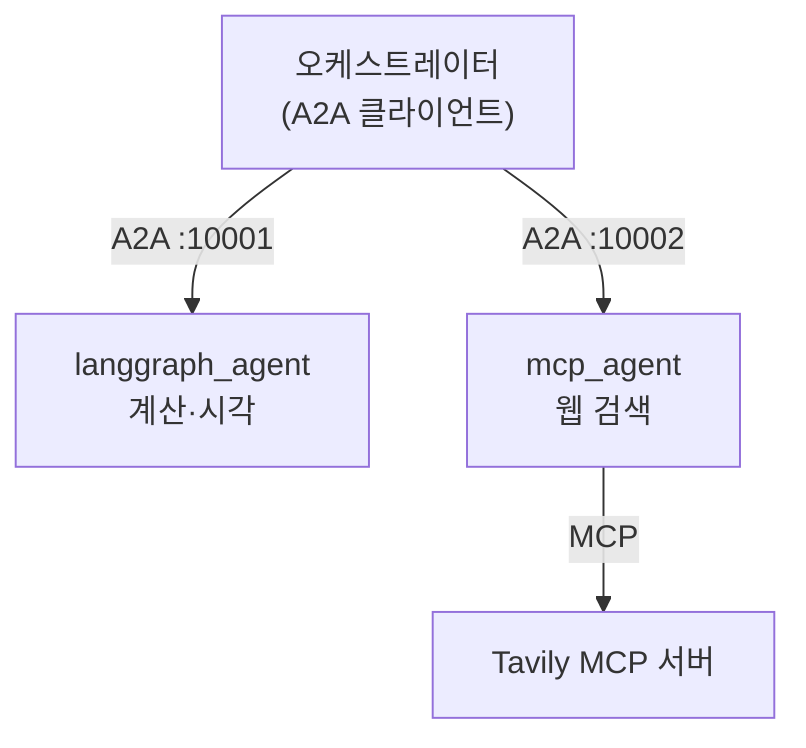
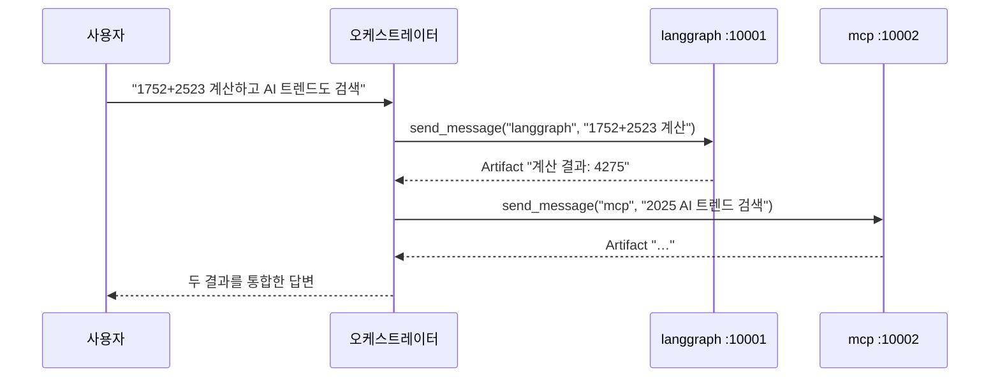

# 10.4 MCP와 A2A를 활용한 멀티 에이전트 구축하기

> **저자 예제** — [`examples/multi_agent/`](examples/multi_agent) (`agent_orchestrator.py` · `langgraph_agent/` · `mcp_agent/` · `README.md`)
> **공식 문서** — [A2A Specification](https://a2a-protocol.org/latest/specification/) · [langchain-mcp-adapters](https://github.com/langchain-ai/langchain-mcp-adapters)

> **여기까지** — A2A 배관을 다 봤습니다([10.3절](10-03_A2A%EC%9D%98%20%EA%B8%B0%EB%B3%B8%20%EC%82%AC%EC%9A%A9%EB%B2%95%20%EC%9D%B4%ED%95%B4%ED%95%98%EA%B8%B0.md)).
> **이 절의 질문** — **MCP(수직)와 A2A(수평)를 한 시스템에** 넣으면?
> **다 읽으면** — [2.4절](../ch02_core-elements/02-04_ReAct%20%EA%B8%B0%EB%B0%98%20LLM%20%EC%97%90%EC%9D%B4%EC%A0%84%ED%8A%B8.md)에서 손으로 짠 **스무 줄짜리 루프가 실제로 쓰이는 장면**을 보게 됩니다.

[10.1.2절](10-01_A2A%EB%9E%80.md)의 그림을 실제로 만듭니다.



**A2A는 수평, MCP는 수직**입니다. 9장과 10장이 여기서 합쳐집니다.

## 10.4.1 [실습] 랭그래프 에이전트: 로직 구현하기

**A2A를 전혀 모르는 평범한 랭그래프 에이전트**입니다([6.4절](../ch06_single-agent/06-04_create_agent%20%EC%83%81%EC%84%B8%20%EA%B5%AC%EC%A1%B0%20%EC%9D%B4%ED%95%B4%ED%95%98%EA%B8%B0.md)).

```python
class LangGraphAgent:
    def __init__(self):
        self.llm = ChatOpenAI(model='gpt-4o')
        self.tools = [calculator, get_current_info]
        self.memory = InMemorySaver()

        self.agent = create_agent(
            self.llm,
            tools=self.tools,
            system_prompt=self.SYSTEM_INSTRUCTION,
            checkpointer=self.memory,
            response_format=ResponseFormat,
        )
```

**[6.4.2절](../ch06_single-agent/06-04_create_agent%20%EC%83%81%EC%84%B8%20%EA%B5%AC%EC%A1%B0%20%EC%9D%B4%ED%95%B4%ED%95%98%EA%B8%B0.md)에서 본 파라미터들이 그대로** 쓰입니다. 새로운 게 없습니다.

### `response_format`이 A2A 상태와 이어집니다

```python
class ResponseFormat(BaseModel):
    status: Literal['input_required', 'completed', 'error'] = 'input_required'
    message: str
```

**[10.2.2절](10-02_A2A%EC%9D%98%20%EA%B5%AC%EC%84%B1%20%EC%9A%94%EC%86%8C%EC%99%80%20%EB%8F%99%EC%9E%91%20%ED%9D%90%EB%A6%84%20%EC%9D%B4%ED%95%B4%ED%95%98%EA%B8%B0.md)의 작업 상태를 모델이 직접 정하게 만든 것**입니다. [6.4.4절](../ch06_single-agent/06-04_create_agent%20%EC%83%81%EC%84%B8%20%EA%B5%AC%EC%A1%B0%20%EC%9D%B4%ED%95%B4%ED%95%98%EA%B8%B0.md)의 구조화 출력을 A2A 프로토콜에 맞춰 쓴 좋은 예입니다.

| `status` | A2A에서 |
| :--- | :--- |
| `completed` | `TaskState.completed` + Artifact |
| `input_required` | `TaskState.input_required` — 되묻기 |
| `error` | 되묻기로 처리 |

**`Literal`로 셋 중 하나로 좁혀 둔 것**이 [1.2절](../ch01_llm-decision/01-02_LLM%EC%9D%84%20%EA%B8%B0%EB%B0%98%EC%9C%BC%EB%A1%9C%20%EC%9D%98%EC%82%AC%EA%B2%B0%EC%A0%95%ED%95%98%EB%8B%A4.md)의 원칙 그대로입니다.

### 진행 상황을 흘려보내는 `stream`

```python
async for item in self.agent.astream(inputs, config, stream_mode='values'):
    message = item['messages'][-1]

    if isinstance(message, AIMessage) and message.tool_calls:
        yield {'is_task_complete': False, 'require_user_input': False,
               'content': '도구를 실행하는 중...'}
    elif isinstance(message, ToolMessage):
        yield {'is_task_complete': False, 'require_user_input': False,
               'content': message.content}

yield self.get_agent_response(config)
```

[6.2.4절](../ch06_single-agent/06-02_%EC%9B%B9%20%EA%B2%80%EC%83%89%20%EC%97%90%EC%9D%B4%EC%A0%84%ED%8A%B8%20%EB%A7%8C%EB%93%A4%EA%B8%B0.md)의 `stream_mode='values'`입니다. **메시지 종류로 진행 단계를 구분**합니다.

| 메시지 | 뜻 |
| :--- | :--- |
| `AIMessage` + `tool_calls` | 도구를 부르려는 중 |
| `ToolMessage` | 도구 결과가 나옴 |

**A2A가 알아야 할 형태(`is_task_complete` 등)로 바꿔서** `yield`합니다. 로직 클래스가 A2A 타입을 직접 쓰지 않으면서도 필요한 정보를 넘기는 방식입니다.

### `get_state`로 구조화 응답을 꺼냅니다

```python
current_state = self.agent.get_state(config)
structured_response = current_state.values.get('structured_response')
```

**[8.3절](../ch08_memory/08-03_%EB%8B%A8%EA%B8%B0%20%EB%A9%94%EB%AA%A8%EB%A6%AC%EB%A5%BC%20%EA%B4%80%EB%A6%AC%ED%95%98%EB%8A%94%20%EB%B0%A9%EB%B2%95.md)의 `get_state`** 가 여기서 쓰입니다. `response_format`으로 만든 결과는 상태의 `structured_response` 키에 들어갑니다.

> **`calculator`가 `eval`을 씁니다.**
> ```python
> result = eval(expression)
> ```
> [6.3절](../ch06_single-agent/06-03_%EC%BD%94%EB%94%A9%20%EC%97%90%EC%9D%B4%EC%A0%84%ED%8A%B8%20%EB%A7%8C%EB%93%A4%EA%B8%B0.md)에서 경고한 것과 같은 문제입니다. 게다가 **이 에이전트는 네트워크에 열린 서버**라 위험이 더 큽니다. 학습용으로만 쓰고, 실제로는 수식 파서를 쓰거나 허용 연산을 제한해야 합니다.

## 10.4.2 [실습] 랭그래프 에이전트: 실행기 구현하기

[10.3.2절](10-03_A2A%EC%9D%98%20%EA%B8%B0%EB%B3%B8%20%EC%82%AC%EC%9A%A9%EB%B2%95%20%EC%9D%B4%ED%95%B4%ED%95%98%EA%B8%B0.md)의 Hello World 실행기보다 훨씬 실전적입니다.

```python
async def execute(self, context: RequestContext, event_queue: EventQueue) -> None:
    query = context.get_user_input()

    task = context.current_task
    if not task:
        task = new_task(context.message)
        await event_queue.enqueue_event(task)

    updater = TaskUpdater(event_queue, task.id, task.context_id)
    session_id = task.context_id
```

### `TaskUpdater`가 상태 관리를 맡습니다

[10.3절](10-03_A2A%EC%9D%98%20%EA%B8%B0%EB%B3%B8%20%EC%82%AC%EC%9A%A9%EB%B2%95%20%EC%9D%B4%ED%95%B4%ED%95%98%EA%B8%B0.md)에서는 `enqueue_event`를 직접 불렀습니다. 상태가 여러 번 바뀌면 `TaskUpdater`가 편합니다.

```python
async for item in self.agent.stream(query, session_id):
    if not is_task_complete and not require_user_input:
        await updater.update_status(TaskState.working, new_agent_text_message(...))
    elif require_user_input:
        await updater.update_status(TaskState.input_required, ..., final=True)
        break
    elif is_task_complete:
        await updater.add_artifact(parts=[Part(root=TextPart(text=content))],
                                   name='agent_result')
        await updater.complete()
        break
```

**[10.2절](10-02_A2A%EC%9D%98%20%EA%B5%AC%EC%84%B1%20%EC%9A%94%EC%86%8C%EC%99%80%20%EB%8F%99%EC%9E%91%20%ED%9D%90%EB%A6%84%20%EC%9D%B4%ED%95%B4%ED%95%98%EA%B8%B0.md)의 상태 표가 코드로 그대로 나타납니다.**

| 상황 | 호출 |
| :--- | :--- |
| 진행 중 | `update_status(TaskState.working, …)` |
| 되묻기 | `update_status(TaskState.input_required, …, final=True)` |
| 완료 | **`add_artifact(...)` → `complete()`** |
| 실패 | `update_status(TaskState.failed, …)` |

**완료할 때만 `add_artifact`를 부릅니다.** 진행 메시지는 상태로, 최종 결과는 결과물로 — [10.2.3절](10-02_A2A%EC%9D%98%20%EA%B5%AC%EC%84%B1%20%EC%9A%94%EC%86%8C%EC%99%80%20%EB%8F%99%EC%9E%91%20%ED%9D%90%EB%A6%84%20%EC%9D%B4%ED%95%B4%ED%95%98%EA%B8%B0.md)에서 본 구분입니다.

### `context_id`가 대화를 잇습니다

```python
session_id = task.context_id
...
config = {'configurable': {'thread_id': session_id}}
```

**A2A의 `context_id`를 랭그래프의 `thread_id`로 씁니다.** [8.2절](../ch08_memory/08-02_%EB%8C%80%ED%99%94%20%EB%A7%A5%EB%9D%BD%EC%9D%84%20%EC%9D%B4%ED%95%B4%ED%95%98%EB%8A%94%20%EC%97%90%EC%9D%B4%EC%A0%84%ED%8A%B8.md)의 체크포인터가 그대로 동작합니다.

**같은 대화 맥락이면 같은 `context_id`가 오므로**, 되묻기(`input_required`)를 하고 답을 받았을 때 앞 내용을 기억합니다. **A2A의 대화 개념과 랭그래프의 대화 개념이 여기서 맞물립니다.**

## 10.4.3 [실습] 랭그래프 에이전트: 서버 구현하기

[10.3.3절](10-03_A2A%EC%9D%98%20%EA%B8%B0%EB%B3%B8%20%EC%82%AC%EC%9A%A9%EB%B2%95%20%EC%9D%B4%ED%95%B4%ED%95%98%EA%B8%B0.md)과 같은 다섯 부품입니다. **포트만 10001**로 바뀝니다.

`AgentCard`의 `description`과 `skills`를 잘 쓰는 게 중요합니다. [10.4.7절](#1047-실습-에이전트-오케스트레이터-구현하기)의 오케스트레이터가 **이 설명을 보고 배분**합니다.

## 10.4.4 ~ 10.4.6 MCP 에이전트

**같은 틀에 MCP를 얹은 것**입니다.

| 층 | 무엇 |
| :--- | :--- |
| 로직 | [9.5절](../ch09_mcp/09-05_%EB%9E%AD%EA%B7%B8%EB%9E%98%ED%94%84%EC%97%90%EC%84%9C%20MCP%20%EA%B8%B0%EB%B0%98%20%EB%A9%80%ED%8B%B0%20%EC%97%90%EC%9D%B4%EC%A0%84%ED%8A%B8%20%EA%B5%AC%ED%98%84%ED%95%98%EA%B8%B0.md)처럼 MCP 도구를 붙인 에이전트 (Tavily) |
| 실행기 | 랭그래프 에이전트와 같은 구조 |
| 서버 | 포트 10002 |

**바깥에서 보면 두 에이전트가 똑같이 생겼습니다.** 하나는 안에서 로컬 도구를, 하나는 MCP 서버를 쓸 뿐입니다.

**이것이 A2A의 값어치입니다.** 오케스트레이터는 상대가 MCP를 쓰는지 모르고, 알 필요도 없습니다.

## 10.4.7 [실습] 에이전트 오케스트레이터 구현하기

### 카드를 모아 프롬프트를 만듭니다

```python
for name, url in self.agent_urls.items():
    card_resolver = A2ACardResolver(httpx_client=self.httpx_client, base_url=url)
    agent_card = await card_resolver.get_agent_card()
    client = A2AClient(httpx_client=self.httpx_client, agent_card=agent_card)
    self.agents[name] = {'card': agent_card, 'client': client, 'url': url}
```

```python
agent_list = []
for name, agent_info in self.agents.items():
    card = agent_info['card']
    agent_list.append(f"- {name}: {card.description}")
agents_desc = "\n".join(agent_list)
```

**카드의 `description`을 모아 시스템 프롬프트에 넣습니다.**

[10.2.3절](10-02_A2A%EC%9D%98%20%EA%B5%AC%EC%84%B1%20%EC%9A%94%EC%86%8C%EC%99%80%20%EB%8F%99%EC%9E%91%20%ED%9D%90%EB%A6%84%20%EC%9D%B4%ED%95%B4%ED%95%98%EA%B8%B0.md)에서 "카드의 설명이 도구 설명과 같은 역할"이라고 한 것이 이 코드입니다. **에이전트를 추가하면 프롬프트가 저절로 늘어납니다.**

### `send_message`를 도구로 만듭니다

```python
send_message_tool = {
    "type": "function",
    "function": {
        "name": "send_message",
        "description": "특정 에이전트에게 작업을 전달합니다. 여러 번 호출 가능합니다.",
        "parameters": {
            "type": "object",
            "properties": {
                "agent_name": {"type": "string", "enum": list(self.agents.keys())},
                "task": {"type": "string", "description": "에이전트에게 전달할 작업 내용"},
            },
            "required": ["agent_name", "task"],
        },
    },
}
```

**[7.5절](../ch07_multi-agent/07-05_%EC%B5%9C%EC%8B%A0%20%EB%AC%B8%EC%84%9C%20%EA%B2%80%EC%83%89%20%2B%20%EB%82%B4%EB%B6%80%20DB%20%EA%B2%80%EC%83%89%20%2B%20%ED%85%9C%ED%94%8C%EB%A6%BF%20%EB%8B%B5%EB%B3%80%203%EC%A4%91%20%EB%A9%80%ED%8B%B0%20%EC%97%90%EC%9D%B4%EC%A0%84%ED%8A%B8%20%23%EC%8A%88%ED%8D%BC%EB%B0%94%EC%9D%B4%EC%A0%80.md)의 핸드오프 도구와 같은 발상**입니다. 거기서는 에이전트마다 도구를 만들었고, 여기서는 **도구 하나에 `agent_name`을 인자로** 받습니다.

`"enum": list(self.agents.keys())`로 **선택지를 좁혀 둔 것**도 같습니다.

### 랭체인 없이 직접 루프를 돕니다

```python
max_iterations = 6
iteration = 0

while iteration < max_iterations:
    iteration += 1
    response = await self.openai_client.chat.completions.create(
        model=os.getenv('OPENAI_MODEL', 'gpt-4o-mini'),
        messages=messages, tools=[send_message_tool],
        tool_choice="auto", temperature=0.1,
    )
    message = response.choices[0].message

    if message.tool_calls:
        messages.append(message)
        for tool_call in message.tool_calls:
            args = json.loads(tool_call.function.arguments)
            result = await self._call_agent(args['agent_name'], args['task'])
            messages.append({"role": "tool", "tool_call_id": tool_call.id, "content": result})
        continue
    elif message.content:
        return message.content
```

**랭체인도 랭그래프도 안 씁니다.** OpenAI SDK를 직접 쓰고 루프를 손으로 돕니다.

**[2.4절](../ch02_core-elements/02-04_ReAct%20%EA%B8%B0%EB%B0%98%20LLM%20%EC%97%90%EC%9D%B4%EC%A0%84%ED%8A%B8.md)에서 손으로 짠 스무 줄짜리 루프가 바로 이것입니다.**

- `max_iterations`로 무한 루프 방지 → [1.3절](../ch01_llm-decision/01-03_LLM%EC%9D%B4%20%EB%8B%A4%EC%9D%8C%20%ED%96%89%EB%8F%99%EC%9D%84%20%EA%B2%B0%EC%A0%95%ED%95%98%EB%8B%A4.md)의 안전장치
- 도구 결과를 `messages`에 붙여 재전송 → Observation
- `tool_calls`가 없으면 종료 → [6.1절](../ch06_single-agent/06-01_%EB%8F%84%EA%B5%AC%EB%A5%BC%20%ED%98%B8%EC%B6%9C%ED%95%98%EB%8A%94%20%EC%97%90%EC%9D%B4%EC%A0%84%ED%8A%B8%20%EC%9D%B4%ED%95%B4%ED%95%98%EA%B8%B0.md)의 종료 조건
- `tool_call_id`로 짝 맞추기 → [6.1절](../ch06_single-agent/06-01_%EB%8F%84%EA%B5%AC%EB%A5%BC%20%ED%98%B8%EC%B6%9C%ED%95%98%EB%8A%94%20%EC%97%90%EC%9D%B4%EC%A0%84%ED%8A%B8%20%EC%9D%B4%ED%95%B4%ED%95%98%EA%B8%B0.md)

> **`temperature=0.1`** 은 [1.1절](../ch01_llm-decision/01-01_AI%20%EC%97%90%EC%9D%B4%EC%A0%84%ED%8A%B8%EC%9D%98%20%EB%91%90%EB%87%8C%2C%20%EA%B1%B0%EB%8C%80%20%EC%96%B8%EC%96%B4%20%EB%AA%A8%EB%8D%B8%EC%9D%98%20%EC%9D%B4%ED%95%B4.md)에서 말한 대로 **배분 판단을 안정시키기 위한** 값입니다.

### 결과는 Artifact에서만 꺼냅니다

```python
result = response.root.result
artifacts = result.artifacts

if artifacts:
    for artifact in artifacts:
        if artifact.parts:
            texts = [p.root.text for p in artifact.parts if hasattr(p.root, 'text')]
            if texts:
                return "\n".join(texts)
return "응답을 받지 못했습니다"
```

**[10.2.3절](10-02_A2A%EC%9D%98%20%EA%B5%AC%EC%84%B1%20%EC%9A%94%EC%86%8C%EC%99%80%20%EB%8F%99%EC%9E%91%20%ED%9D%90%EB%A6%84%20%EC%9D%B4%ED%95%B4%ED%95%98%EA%B8%B0.md)에서 말한 구분이 여기서 쓰입니다.** "도구를 실행하는 중…" 같은 진행 메시지는 무시하고 **결과물만** 가져갑니다.

### 실패를 다루는 규칙이 프롬프트에 있습니다

```
- 각 작업마다 send_message를 1번씩만 호출
- 에이전트 응답에 "에러" 또는 "시간 초과"가 포함되면 재시도하지 말고 바로 최종 답변 생성
- 에러가 발생한 작업은 "해당 정보를 가져올 수 없습니다"로 처리하고 나머지 결과로 답변
```

**서버가 여럿이라 하나가 죽어도 나머지로 답해야 합니다.** [3.2절](../ch03_architecture/03-02_%EB%A9%80%ED%8B%B0%20%EC%97%90%EC%9D%B4%EC%A0%84%ED%8A%B8.md)에서 말한 오류 전파와 별개로, **네트워크 너머의 에이전트는 그냥 응답이 없을 수 있다**는 새로운 실패 유형이 생깁니다.

```python
response = await asyncio.wait_for(client.send_message(request), timeout=60.0)
```

**타임아웃도 걸어 둡니다.** 프로세스 안에서 부르던 [7장](../ch07_multi-agent/07-04_%EC%9B%B9%ED%8E%98%EC%9D%B4%EC%A7%80%EB%A5%BC%20%EC%9A%94%EC%95%BD%ED%95%B4%EC%84%9C%20%EB%8D%B0%EC%9D%B4%ED%84%B0%EB%B2%A0%EC%9D%B4%EC%8A%A4%EC%97%90%20%EC%A0%80%EC%9E%A5%ED%95%98%EB%8A%94%20%EC%97%90%EC%9D%B4%EC%A0%84%ED%8A%B8%20%23%EC%8A%88%ED%8D%BC%EB%B0%94%EC%9D%B4%EC%A0%80.md)과 달리 **네트워크가 끼어들면 반드시 필요한** 방어입니다.

## 10.4.8 [실습] 에이전트 서버 실행하고 다중 질문 응답받기

**터미널 세 개**가 필요합니다.

```powershell
# 터미널 1
cd ch10_a2a\examples\multi_agent\langgraph_agent
python agent_server.py          # :10001
```

```powershell
# 터미널 2
cd ch10_a2a\examples\multi_agent\mcp_agent
python agent_server.py          # :10002
```

```powershell
# 터미널 3
cd ch10_a2a\examples\multi_agent
python agent_orchestrator.py
```

> **서버 둘이 먼저 떠 있어야 합니다.** 오케스트레이터가 시작할 때 카드를 읽으므로, 안 떠 있으면 초기화 단계에서 실패합니다.

### 시험 질문이 단계별로 구성돼 있습니다

```python
test_queries = [
    "안녕하세요!",                                      # 에이전트 호출 없이 바로 답
    "현재 시각은?",                                     # langgraph 하나
    "2025년 AI 에이전트 트렌드는?",                       # mcp 하나
    "1752 + 2523를 계산하고, 2025년 AI 트렌드도 검색해주세요",  # 둘 다
    "현재 시각과 함께, 파이썬 최신 버전도 알려주세요",         # 둘 다
]
```

| 질문 | 확인하는 것 |
| :--- | :--- |
| 1 | **불필요한 호출을 안 하는가** |
| 2·3 | 배분이 맞는가 |
| **4·5** | **두 에이전트 결과를 통합하는가** |



> 실행 결과는 검색 시점과 모델에 따라 달라지므로 이 노트에는 싣지 않았습니다.

### 이 예제가 합치는 것들

| 요소 | 배운 곳 |
| :--- | :--- |
| 손으로 짠 도구 호출 루프 | [2.4절](../ch02_core-elements/02-04_ReAct%20%EA%B8%B0%EB%B0%98%20LLM%20%EC%97%90%EC%9D%B4%EC%A0%84%ED%8A%B8.md) |
| `create_agent` + 구조화 출력 | [6.4절](../ch06_single-agent/06-04_create_agent%20%EC%83%81%EC%84%B8%20%EA%B5%AC%EC%A1%B0%20%EC%9D%B4%ED%95%B4%ED%95%98%EA%B8%B0.md) |
| 도구 하나에 대상 이름 인자 | [7.5절](../ch07_multi-agent/07-05_%EC%B5%9C%EC%8B%A0%20%EB%AC%B8%EC%84%9C%20%EA%B2%80%EC%83%89%20%2B%20%EB%82%B4%EB%B6%80%20DB%20%EA%B2%80%EC%83%89%20%2B%20%ED%85%9C%ED%94%8C%EB%A6%BF%20%EB%8B%B5%EB%B3%80%203%EC%A4%91%20%EB%A9%80%ED%8B%B0%20%EC%97%90%EC%9D%B4%EC%A0%84%ED%8A%B8%20%23%EC%8A%88%ED%8D%BC%EB%B0%94%EC%9D%B4%EC%A0%80.md) |
| 체크포인터 | [8.2절](../ch08_memory/08-02_%EB%8C%80%ED%99%94%20%EB%A7%A5%EB%9D%BD%EC%9D%84%20%EC%9D%B4%ED%95%B4%ED%95%98%EB%8A%94%20%EC%97%90%EC%9D%B4%EC%A0%84%ED%8A%B8.md) |
| MCP 도구 연결 | [9.5절](../ch09_mcp/09-05_%EB%9E%AD%EA%B7%B8%EB%9E%98%ED%94%84%EC%97%90%EC%84%9C%20MCP%20%EA%B8%B0%EB%B0%98%20%EB%A9%80%ED%8B%B0%20%EC%97%90%EC%9D%B4%EC%A0%84%ED%8A%B8%20%EA%B5%AC%ED%98%84%ED%95%98%EA%B8%B0.md) |
| A2A 서버·클라이언트 | 이 장 |

## 요약 및 비유

**여러 협력사를 쓰는 프로젝트**입니다. 각 협력사는 독립 법인(별도 포트 서버)이고, PM(오케스트레이터)은 **회사 소개서를 모아 어디에 무엇을 맡길지** 정합니다. 한 곳이 응답이 없어도 **나머지 결과로 보고서를 씁니다**(에러 내성).

| 개념 | 협력사 프로젝트 비유 | 기술적 의미 |
| :--- | :--- | :--- |
| **A2A (수평)** | 협력사에 발주 | 에이전트 간 통신 |
| **MCP (수직)** | 협력사의 사내 비품 | 에이전트→도구 |
| **`response_format`** | 보고 양식 통일 | 상태를 모델이 결정 |
| **`TaskUpdater`** | 진행 보고 창구 | 상태 갱신 |
| **`context_id` → `thread_id`** | 건별 관리번호 공유 | 대화 맥락 연결 |
| **카드 설명 모아 프롬프트** | 소개서 철을 보고 배분 | 배분 근거 |
| **`send_message` 도구** | 발주서 양식 하나 | 대상 이름을 인자로 |
| **`max_iterations`** | 회의 횟수 제한 | 무한 루프 방지 |
| **타임아웃** | 납기 마감 | `asyncio.wait_for` |
| **에러 내성 프롬프트** | 한 곳이 펑크나도 진행 | 나머지로 답변 |
| **터미널 세 개** | 법인 셋이 각각 운영 | 독립 프로세스 |

## 결론

* 이 예제가 **A2A(수평) + MCP(수직)** 를 한 그림에 담습니다. 오케스트레이터는 상대가 MCP를 쓰는지 모릅니다.
* `response_format`의 `status`로 **A2A 작업 상태를 모델이 직접 정하게** 합니다. 구조화 출력의 좋은 활용입니다.
* **`TaskUpdater`가 상태 전환을 맡습니다.** 진행은 `update_status`, 완료는 `add_artifact` → `complete`.
* **A2A의 `context_id`를 랭그래프 `thread_id`로** 써서 되묻기 후에도 맥락이 이어집니다.
* 오케스트레이터는 **카드의 `description`을 모아 프롬프트에 넣습니다.** 에이전트를 추가하면 프롬프트가 저절로 늘어납니다.
* **랭체인 없이 OpenAI SDK로 루프를 직접 돕니다.** [2.4절](../ch02_core-elements/02-04_ReAct%20%EA%B8%B0%EB%B0%98%20LLM%20%EC%97%90%EC%9D%B4%EC%A0%84%ED%8A%B8.md)에서 짠 스무 줄이 실제로 쓰이는 장면입니다.
* **결과는 Artifact에서만** 꺼냅니다. 진행 메시지와 구분되기 때문에 가능합니다.
* 네트워크 너머라서 **타임아웃과 에러 내성**이 새로 필요합니다. 하나가 죽어도 나머지로 답하도록 프롬프트가 지시합니다.
* `calculator`의 **`eval`은 학습용**입니다. 네트워크에 열린 서버라 위험이 더 큽니다.
* **터미널 세 개**가 필요하고, **서버 둘이 먼저** 떠 있어야 합니다.

---

## 10장을 마치며

네 개 절을 한 줄로 이으면 이렇습니다.

> **A2A가 에이전트끼리 잇는 것임을 알았고(10.1) → 무엇이 오가는지 정리했고(10.2) → 가장 단순한 배관을 만들었고(10.3) → MCP와 합쳐 진짜 시스템을 만들었습니다(10.4).**

**여기까지가 Part 04입니다.** 이제 재료가 전부 모였습니다.

| | 무엇 |
| :--- | :--- |
| **1~3장** | 개념과 설계 기준 |
| **4~6장** | 싱글 에이전트 |
| **7장** | 멀티 에이전트 |
| **8장** | 메모리 |
| **9장** | MCP — 도구를 밖에서 |
| **10장** | A2A — 에이전트를 밖에서 |

**11장은 이 전부를 한 시스템에 넣습니다.** 새 개념은 거의 없습니다. **조합**입니다.

---

[⬅ 10.3](10-03_A2A%EC%9D%98%20%EA%B8%B0%EB%B3%B8%20%EC%82%AC%EC%9A%A9%EB%B2%95%20%EC%9D%B4%ED%95%B4%ED%95%98%EA%B8%B0.md) · [Chapter 10](README.md) · [전체 목차](../STUDY.md)
