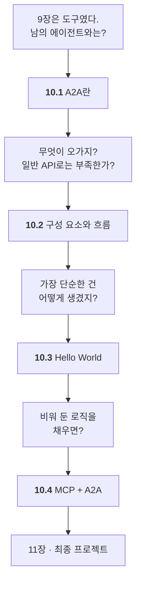

# Chapter 10 · A2A 기반 에이전트 상호운용

> Part 04 | 프로토콜 기반 에이전트 확장 전략

## 학습 목표

- A2A의 개념과 MCP와의 차이를 설명할 수 있다
- Agent Card·Executor·Server·Client 등 구성 요소와 동작 흐름을 이해한다
- A2A 서버로 에이전트를 노출하고 클라이언트로 호출할 수 있다
- MCP와 A2A를 결합한 오케스트레이터 멀티 에이전트를 구축할 수 있다

> **올라마로 어디까지 되나** — **올라마로 10.1~10.3이 됩니다.** 특히 **10.3의 `hello_world`는 LLM조차 필요 없습니다** — A2A 배관만 보는 예제라 그대로 돌아갑니다. **10.4는 Tavily 키가 필요합니다.**
>
> 전체 지도는 [STUDY.md](../STUDY.md#올라마로-어디까지-되나)에 있습니다.

## 이 장의 이해 흐름

9장이 **도구**를 밖에서 가져왔다면, 10장은 **에이전트**를 밖에서 가져옵니다.



| 절 | 이 절의 질문 | 얻는 것 |
| :--- | :--- | :--- |
| **10.1** | 남의 에이전트와 어떻게 붙지? | **MCP는 수직, A2A는 수평** |
| **10.2** | 무엇이 오가지? | AgentCard · Task · **Artifact** |
| **10.3** | 가장 단순한 건? | 로직 없는 **배관만** |
| **10.4** | 로직을 채우면? | MCP와 A2A가 **한 시스템에** |

> **10.2를 건너뛰지 마세요.** 여기서 정리하는 클래스 이름들이 10.3부터 바로 코드로 나옵니다. 모르고 보면 낯섭니다.

### 10장 전체를 한 줄로

> **A2A가 에이전트끼리 잇는 것임을 알았고(10.1) → 무엇이 오가는지 정리했고(10.2) → 가장 단순한 배관을 만들었고(10.3) → MCP와 합쳐 진짜 시스템을 만들었다(10.4).**

## 절별 노트

| 절 | 노트 파일 | 진도 |
| --- | --- | --- |
| 10.1 | [`10-01_A2A란.md`](10-01_A2A%EB%9E%80.md) | ☐ |
| 10.2 | [`10-02_A2A의 구성 요소와 동작 흐름 이해하기.md`](10-02_A2A%EC%9D%98%20%EA%B5%AC%EC%84%B1%20%EC%9A%94%EC%86%8C%EC%99%80%20%EB%8F%99%EC%9E%91%20%ED%9D%90%EB%A6%84%20%EC%9D%B4%ED%95%B4%ED%95%98%EA%B8%B0.md) | ☐ |
| 10.3 | [`10-03_A2A의 기본 사용법 이해하기.md`](10-03_A2A%EC%9D%98%20%EA%B8%B0%EB%B3%B8%20%EC%82%AC%EC%9A%A9%EB%B2%95%20%EC%9D%B4%ED%95%B4%ED%95%98%EA%B8%B0.md) | ☐ |
| 10.4 | [`10-04_MCP와 A2A를 활용한 멀티 에이전트 구축하기.md`](10-04_MCP%EC%99%80%20A2A%EB%A5%BC%20%ED%99%9C%EC%9A%A9%ED%95%9C%20%EB%A9%80%ED%8B%B0%20%EC%97%90%EC%9D%B4%EC%A0%84%ED%8A%B8%20%EA%B5%AC%EC%B6%95%ED%95%98%EA%B8%B0.md) | ☐ |

<details><summary>소절까지 펼쳐보기</summary>

- [ ] **[10.1 A2A란](10-01_A2A%EB%9E%80.md)**
  - [ ] 10.1.1 A2A 개념
  - [ ] 10.1.2 MCP vs A2A
  - [ ] 10.1.3 A2A 파이썬 SDK
- [ ] **[10.2 A2A의 구성 요소와 동작 흐름 이해하기](10-02_A2A%EC%9D%98%20%EA%B5%AC%EC%84%B1%20%EC%9A%94%EC%86%8C%EC%99%80%20%EB%8F%99%EC%9E%91%20%ED%9D%90%EB%A6%84%20%EC%9D%B4%ED%95%B4%ED%95%98%EA%B8%B0.md)**
  - [ ] 10.2.1 A2A의 주요 참여자
  - [ ] 10.2.2 A2A의 동작 방식
  - [ ] 10.2.3 A2A 구성 요소별 특징
- [ ] **[10.3 A2A의 기본 사용법 이해하기](10-03_A2A%EC%9D%98%20%EA%B8%B0%EB%B3%B8%20%EC%82%AC%EC%9A%A9%EB%B2%95%20%EC%9D%B4%ED%95%B4%ED%95%98%EA%B8%B0.md)**
  - [ ] 10.3.1 에이전트 기능 설명하기
  - [ ] 10.3.2 [실습] 에이전트 실행기 구현하기
  - [ ] 10.3.3 [실습] 에이전트 서버 구축하기
  - [ ] 10.3.4 [실습] A2A 클라이언트 구축하기
  - [ ] 10.3.5 [실습] 서버 실행하고 응답받기
- [ ] **[10.4 MCP와 A2A를 활용한 멀티 에이전트 구축하기](10-04_MCP%EC%99%80%20A2A%EB%A5%BC%20%ED%99%9C%EC%9A%A9%ED%95%9C%20%EB%A9%80%ED%8B%B0%20%EC%97%90%EC%9D%B4%EC%A0%84%ED%8A%B8%20%EA%B5%AC%EC%B6%95%ED%95%98%EA%B8%B0.md)**
  - [ ] 10.4.1 [실습] 랭그래프 에이전트: 로직 구현하기
  - [ ] 10.4.2 [실습] 랭그래프 에이전트: 실행기 구현하기
  - [ ] 10.4.3 [실습] 랭그래프 에이전트: 서버 구현하기
  - [ ] 10.4.4 [실습] MCP 에이전트: 로직 구현하기
  - [ ] 10.4.5 [실습] MCP 에이전트: 실행기 구현하기
  - [ ] 10.4.6 [실습] MCP 에이전트: 서버 구현하기
  - [ ] 10.4.7 [실습] 에이전트 오케스트레이터 구현하기
  - [ ] 10.4.8 [실습] 에이전트 서버 실행하고 다중 질문 응답받기

</details>

## 관련 예제 코드

| 내용 | 경로 |
| --- | --- |
| 10.3 A2A 기본 | [`examples/hello_world`](examples/hello_world) |
| 10.4 MCP+A2A 멀티 에이전트 | [`examples/multi_agent`](examples/multi_agent) |

## `.env` 두는 위치

⚠️ **`examples/.env`에 두어야 합니다.** `examples/multi_agent/*/agent.py`가 `dotenv_path="../../.env"`로, `agent_orchestrator.py`가 `"../.env"`로 **고정 경로**를 쓰기 때문에 저장소 루트의 `.env`는 읽히지 않습니다. **이 장만 예외입니다.**

```powershell
# 저장소 루트에서 한 번만
copy .env.example .env
```

## 참고 문서

| 무엇을 볼 때 | 문서 |
| --- | --- |
| 10.1~10.2 A2A 개념·구성 요소 | [A2A Protocol](https://a2a-protocol.org/) |
| 프로토콜 스펙 (AgentCard·Task·Message) | [A2A Specification](https://a2a-protocol.org/latest/specification/) |
| 10.3 파이썬 SDK 사용법 | [Python 튜토리얼](https://a2a-protocol.org/latest/tutorials/python/2-setup/) |
| `AgentExecutor` 등 클래스 레퍼런스 | [a2a-sdk API 문서](https://a2a-protocol.org/latest/sdk/python/api/) |

> **버전 주의** — 이 저장소는 `a2a-sdk` **0.3.x**(프로토콜 스펙 0.3)를 씁니다.
> 사이트의 `latest` 문서는 **스펙 1.0** 기준이라 일부 타입·시그니처가 다릅니다. 문서 상단의 버전 선택기를 확인하세요.

## 이 폴더 구성

- `10-01_…md` ~ `10-04_…md` — 절별 학습 노트
- `notes.md` — 장 전체 요약 (절 노트를 다 쓴 뒤 마지막에 정리)
- `practice/` — 예제를 보지 않고 직접 쳐보는 공간
- `.env` 는 이 폴더에 없습니다 — **저장소 루트의 [`.env.example`](../.env.example) 하나로 관리합니다**

> **메모**  
> 에이전트마다 포트가 다릅니다. 어떤 에이전트가 몇 번 포트를 쓰는지 `notes.md`에 표로 적어두면 디버깅이 훨씬 쉬워집니다.

---

[⬅ 전체 목차로](../STUDY.md)
