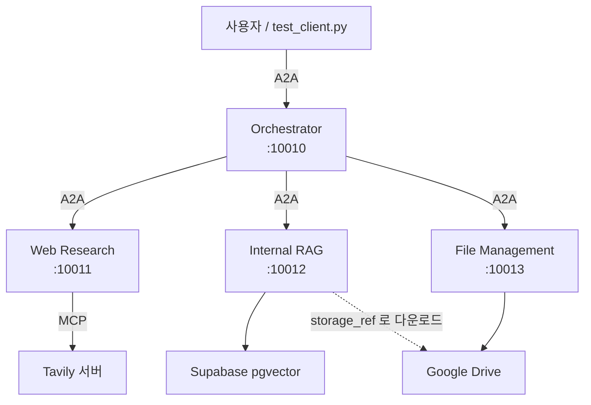
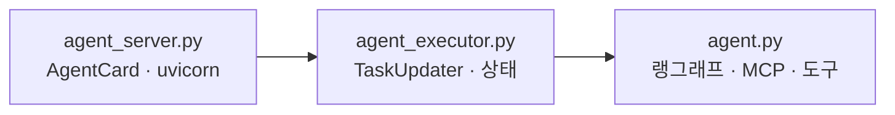

# 11.1 오케스트레이터 기반 멀티 에이전트 설계

> **저자 예제** — [`examples/README.md`](examples/README.md) · [`examples/common/config.py`](examples/common/config.py) · [`examples/common/schemas.py`](examples/common/schemas.py)
> **공식 문서** — [Workflows and agents](https://docs.langchain.com/oss/python/langgraph/workflows-agents) · [LangChain · Subagents](https://docs.langchain.com/oss/python/langchain/multi-agent/subagents)

> **여기까지** — 재료가 전부 모였습니다. 싱글·멀티·메모리·MCP·A2A.
> **이 절의 질문** — 이걸 **어떻게 하나의 시스템으로** 조립하지?
> **다 읽으면** — 11장 전체의 **설계도**를 갖게 됩니다. 11.2~11.6은 이 그림의 부분입니다.

마지막 장입니다. **앞의 열 장을 전부 합칩니다.**

## 11.1.1 범용 에이전트를 위한 멀티 에이전트 설계하기

### 만들 것



**에이전트 넷이 각각 독립 서버**입니다([10장](../ch10_a2a/10-01_A2A%EB%9E%80.md)).

| 에이전트 | 포트 | 담당 | 밑에 무엇이 |
| :--- | :--- | :--- | :--- |
| **Orchestrator** | 10010 | 의도 분석 · 배분 · 통합 | A2A 클라이언트 |
| **Web Research** | 10011 | 외부 웹 검색 | **MCP** (Tavily) — [9장](../ch09_mcp/09-01_MCP%EB%9E%80.md) |
| **Internal RAG** | 10012 | 사내 문서 검색·인덱싱 | **랭그래프 + Supabase** — [6.5절](../ch06_single-agent/06-05_RAG%EB%A5%BC%20%EC%9C%84%ED%95%9C%20%EC%97%90%EC%9D%B4%EC%A0%84%ED%8A%B8%20%EB%A7%8C%EB%93%A4%EA%B8%B0.md) |
| **File Management** | 10013 | 구글 드라이브 파일 관리 | Drive API |

**오케스트레이터도 A2A 서버**라는 점을 놓치기 쉽습니다. 사용자가 A2A로 오케스트레이터를 부르고, 오케스트레이터가 다시 A2A로 나머지를 부릅니다. [10.2.1절](../ch10_a2a/10-02_A2A%EC%9D%98%20%EA%B5%AC%EC%84%B1%20%EC%9A%94%EC%86%8C%EC%99%80%20%EB%8F%99%EC%9E%91%20%ED%9D%90%EB%A6%84%20%EC%9D%B4%ED%95%B4%ED%95%98%EA%B8%B0.md)에서 "역할은 고정이 아니다"라고 한 것이 이 모양입니다.

### 왜 이렇게 나눴나

[3.3절](../ch03_architecture/03-03_%EC%96%B4%EB%96%A4%20%EC%97%90%EC%9D%B4%EC%A0%84%ED%8A%B8%EB%A5%BC%20%EC%84%A4%EA%B3%84%ED%95%B4%EC%95%BC%20%ED%95%A0%EA%B9%8C.md)에서 좋은 분리 기준을 셋 꼽았습니다 — **역할·데이터 출처·권한**. 이 설계는 **데이터 출처**로 나눴습니다.

| 에이전트 | 데이터 출처 |
| :--- | :--- |
| Web Research | **인터넷** |
| Internal RAG | **사내 DB** |
| File Management | **구글 드라이브** |

출처가 다르면 필요한 자격증명도, 도구도, 실패 방식도 다릅니다. 자연스러운 경계입니다.

### 1장의 네 칸으로 보면

[3.3절](../ch03_architecture/03-03_%EC%96%B4%EB%96%A4%20%EC%97%90%EC%9D%B4%EC%A0%84%ED%8A%B8%EB%A5%BC%20%EC%84%A4%EA%B3%84%ED%95%B4%EC%95%BC%20%ED%95%A0%EA%B9%8C.md) 마지막에서 워크플로/자율 축과 싱글/멀티 축을 겹쳐 네 칸을 만들었습니다.

**이 시스템은 그중 한 칸에 딱 들어가지 않습니다.**

| 층 | 성격 |
| :--- | :--- |
| **시스템 전체 구조** | 개발자가 그림 — **워크플로** |
| **어느 에이전트에게 맡길지** | LLM이 판단 — **자율** |
| **각 에이전트 안** | 도구 루프 — **자율** |

[1.4절](../ch01_llm-decision/01-04_LLM%20%EA%B8%B0%EB%B0%98%20%EC%97%90%EC%9D%B4%EC%A0%84%ED%8A%B8%20%EC%8B%9C%EC%8A%A4%ED%85%9C%2C%20%EC%9D%B4%EB%9F%B0%20%EA%B5%AC%EC%A1%B0%EB%A1%9C%20%EC%84%A4%EA%B3%84%EB%90%9C%EB%8B%A4.md)에서 **"실제 시스템은 대개 섞는다"** 고 한 것이 이것입니다. 큰 틀은 고정하고 안쪽만 자율에 맡깁니다.

### 에이전트마다 세 파일로 나뉩니다

**모든 에이전트가 같은 구조**입니다. [10.3.2절](../ch10_a2a/10-03_A2A%EC%9D%98%20%EA%B8%B0%EB%B3%B8%20%EC%82%AC%EC%9A%A9%EB%B2%95%20%EC%9D%B4%ED%95%B4%ED%95%98%EA%B8%B0.md)의 2층 분리를 3층으로 늘린 것입니다.

| 파일 | 역할 | A2A를 아는가 |
| :--- | :--- | :--- |
| `agent.py` | **실제 로직** | ✗ |
| `agent_executor.py` | A2A 접점 | ✓ |
| `agent_server.py` | 카드 + 서버 기동 | ✓ |



**이 규칙이 있어서 에이전트를 추가하기 쉽습니다.** 폴더 하나 만들고 세 파일을 같은 틀로 쓰면 됩니다.

### 공통 모듈을 뽑아 뒀습니다

[`common/`](examples/common) 폴더에 셋이 있습니다.

| 파일 | 담는 것 |
| :--- | :--- |
| [`config.py`](examples/common/config.py) | **에이전트 이름·URL·포트·설명**을 한 곳에 |
| [`schemas.py`](examples/common/schemas.py) | Artifact 생성/추출 헬퍼, 인텐트 열거형 |
| [`a2a_client.py`](examples/common/a2a_client.py) | A2A 클라이언트 래퍼 |

```python
AGENT_CONFIGS: Dict[str, AgentConfig] = {
    "orchestrator": AgentConfig(
        name="Orchestrator Agent",
        url="http://localhost:10010",
        port=10010,
        description="사용자 요청을 분석하고 작업을 조율하는 중앙 오케스트레이터"
    ),
    ...
}
```

**포트와 URL이 한 곳에 모여 있는 것**이 중요합니다. [10.3.1절](../ch10_a2a/10-03_A2A%EC%9D%98%20%EA%B8%B0%EB%B3%B8%20%EC%82%AC%EC%9A%A9%EB%B2%95%20%EC%9D%B4%ED%95%B4%ED%95%98%EA%B8%B0.md)에서 "카드의 `url`이 실제 주소와 달라 실패한다"고 했는데, 한 곳에서 관리하면 어긋날 일이 줄어듭니다.

### Artifact 헬퍼가 세 종류입니다

[10.2.3절](../ch10_a2a/10-02_A2A%EC%9D%98%20%EA%B5%AC%EC%84%B1%20%EC%9A%94%EC%86%8C%EC%99%80%20%EB%8F%99%EC%9E%91%20%ED%9D%90%EB%A6%84%20%EC%9D%B4%ED%95%B4%ED%95%98%EA%B8%B0.md)에서 "Part는 텍스트 말고도 담을 수 있는 구조"라고 했습니다. 여기서 실제로 씁니다.

| 헬퍼 | Part 종류 | 쓰는 곳 |
| :--- | :--- | :--- |
| `create_text_artifact` | `TextPart` | 답변 텍스트 |
| `create_data_artifact` | `DataPart` | **파일 목록 같은 구조화 데이터** |
| `create_file_artifact` | `FilePart` + `FileWithUri` | **파일 참조** (`gdrive://file/{id}`) |
| `create_file_bytes_artifact` | `FilePart` + `FileWithBytes` | 작은 파일 직접 전달 |

**`create_data_artifact`가 핵심입니다.** 파일 목록을 텍스트로 넘기면 다음 에이전트가 다시 파싱해야 합니다. `DataPart`로 넘기면 **구조가 유지됩니다.**

이 헬퍼들은 **외부 서비스가 필요 없어서** 그냥 불러 볼 수 있습니다.

> **실측 (2026-08-31 · a2a-sdk 0.3.26)** — 저자의 `common/schemas.py`를 그대로 임포트해 호출했습니다.

```
text  artifact_id=69bbdff4…  name='요약'      part 종류=TextPart
data  artifact_id=5c1b69a5…  name='검색결과'   part 종류=DataPart
file  artifact_id=bc9d3a93…  name='보고서'    part 종류=FilePart

꺼낼 때:
  get_artifact_text(a_text)     -> 핵심 세 줄입니다.
  get_artifact_data(a_data)     -> {'hits': 3, 'source': 'web'}
  get_artifact_file_uri(a_file) -> gdrive://1a2b3c
```

**`artifact_id`는 매번 새로 생성됩니다**(`uuid4`). 같은 내용을 두 번 만들어도 다른 id입니다.

종류가 안 맞는 꺼내기를 하면 이렇습니다.

```
get_artifact_text(a_data) -> None
```

**예외가 아니라 `None`입니다.** [11.5절](11-05_%EC%98%A4%EC%BC%80%EC%8A%A4%ED%8A%B8%EB%A0%88%EC%9D%B4%ED%84%B0%20%EC%97%90%EC%9D%B4%EC%A0%84%ED%8A%B8.md)에서 "결과를 꺼내는 코드가 방어적"인 이유가 이것입니다. **틀린 종류로 꺼내도 조용히 `None`이 나오므로**, 확인 없이 쓰면 한참 뒤에 터집니다.

> **함수 이름을 확인하고 쓰세요.** `create_file_artifact(name=…, file_uri=…, media_type=…)`입니다. `uri=`나 `mime_type=`으로 부르면 `TypeError`가 납니다(실제로 겪었습니다).

### `storage_ref` — 파일을 넘기는 방법

에이전트가 나뉘면서 새 문제가 생깁니다. **파일 관리 에이전트가 찾은 파일을 RAG 에이전트가 읽어야 합니다.**

세 가지 방법이 있습니다.

| 방법 | 문제 |
| :--- | :--- |
| 파일 내용을 통째로 넘김 | **컨텍스트 폭발** ([2.3절](../ch02_core-elements/02-03_%EC%97%90%EC%9D%B4%EC%A0%84%ED%8A%B8%EC%9D%98%20%EA%B8%B0%EC%96%B5%EB%A0%A5%20-%20%EB%A9%94%EB%AA%A8%EB%A6%AC.md)) |
| 공유 디스크에 저장 | 서버가 분리돼 있어 불가 |
| **참조(URI)만 넘김** | **받는 쪽이 직접 받아야 함** |

이 시스템은 세 번째를 씁니다. **`gdrive://file/{FILE_ID}` 형태의 참조**를 주고받고, RAG 에이전트가 그 참조로 직접 다운로드합니다.

실제로 오가는 것은 이 정도 크기입니다.

> **실측 (2026-08-31 · a2a-sdk 0.3.26)**

```json
{"storage_ref": "gdrive://1a2b3c", "filename": "회의록.pdf", "mime_type": "application/pdf"}
```

**PDF 본문 대신 이 한 줄이 넘어갑니다.** 파일이 10MB든 100MB든 에이전트 사이를 오가는 양은 그대로입니다.

```python
def download_by_storage_ref(storage_ref: str) -> tuple[bytes, str, str]:
```

> **그래서 RAG 에이전트에도 드라이브 읽기 권한이 필요합니다.** 예제에 `_GDriveReadOnlyClient`가 따로 들어 있는 이유입니다. **읽기 전용으로 제한한 것**이 [3.3절](../ch03_architecture/03-03_%EC%96%B4%EB%96%A4%20%EC%97%90%EC%9D%B4%EC%A0%84%ED%8A%B8%EB%A5%BC%20%EC%84%A4%EA%B3%84%ED%95%B4%EC%95%BC%20%ED%95%A0%EA%B9%8C.md)의 권한 분리 원칙에 맞습니다.

### 필요한 외부 서비스

| 서비스 | 쓰는 곳 | 준비 |
| :--- | :--- | :--- |
| OpenAI | 전부 | `OPENAI_API_KEY` |
| Tavily | Web Research | `TAVILY_API_KEY` |
| Supabase | Internal RAG | URL·키 + **pgvector 테이블** |
| Google Drive | File Management · RAG | **OAuth 자격증명 파일** |

> **11장은 준비물이 가장 많습니다.** 특히 구글 드라이브 OAuth는 콘솔에서 프로젝트를 만들고 동의 화면을 설정해야 해서 시간이 걸립니다([11.2.1절](11-02_%ED%8C%8C%EC%9D%BC%20%EA%B4%80%EB%A6%AC%EB%A5%BC%20%EC%9C%84%ED%95%9C%20%EC%97%90%EC%9D%B4%EC%A0%84%ED%8A%B8.md)).
>
> **`credentials.json`과 `token.json`은 절대 커밋하지 마세요**([4.3절](../ch04_dev-env/SETUP.md)). `.gitignore`에 들어 있는지 확인하세요.

## 요약 및 비유

**여러 부서를 둔 회사**입니다. 각 부서는 독립 사무실(포트)에 있고 **자기 거래처**(데이터 출처)를 갖습니다. 본사(오케스트레이터)는 요청을 받아 부서에 배분하고 결과를 합쳐 답합니다. 서류는 **원본을 돌리지 않고 보관 번호**(`storage_ref`)로 주고받습니다.

| 개념 | 회사 비유 | 기술적 의미 |
| :--- | :--- | :--- |
| **에이전트 4종** | 부서 넷 | 독립 A2A 서버 |
| **포트** | 사무실 호수 | 10010~10013 |
| **출처로 분리** | 부서별 거래처 | 웹/사내DB/드라이브 |
| **오케스트레이터도 서버** | 본사도 한 조직 | A2A 서버 겸 클라이언트 |
| **3파일 구조** | 부서마다 같은 조직도 | 로직/접점/서버 |
| **`common/`** | 사내 공통 규정 | 설정·스키마·클라이언트 |
| **`config.py`** | 조직도와 내선번호부 | URL·포트 한 곳 관리 |
| **`DataPart`** | 정해진 서식의 표 | 구조 유지 전달 |
| **`storage_ref`** | 문서 보관 번호 | `gdrive://file/{id}` |
| **읽기 전용 클라이언트** | 열람만 가능한 권한 | 권한 분리 |

## 결론

* 에이전트 넷이 **각각 독립 A2A 서버**이고, **오케스트레이터도 서버**입니다. 사용자→오케스트레이터→나머지가 전부 A2A입니다.
* 분리 기준은 **데이터 출처**입니다 — 인터넷 / 사내 DB / 구글 드라이브. 자격증명도 실패 방식도 다르니 자연스러운 경계입니다.
* **시스템 전체는 워크플로, 배분과 각 에이전트 안은 자율**입니다. [1.4절](../ch01_llm-decision/01-04_LLM%20%EA%B8%B0%EB%B0%98%20%EC%97%90%EC%9D%B4%EC%A0%84%ED%8A%B8%20%EC%8B%9C%EC%8A%A4%ED%85%9C%2C%20%EC%9D%B4%EB%9F%B0%20%EA%B5%AC%EC%A1%B0%EB%A1%9C%20%EC%84%A4%EA%B3%84%EB%90%9C%EB%8B%A4.md)에서 말한 "섞어 쓰기"의 실물입니다.
* 모든 에이전트가 **`agent.py` / `agent_executor.py` / `agent_server.py` 세 파일** 구조입니다. 로직은 A2A를 모릅니다.
* **`common/config.py`가 URL·포트를 한 곳에서** 관리합니다. 카드의 `url`이 어긋나는 사고를 줄입니다.
* Artifact를 **텍스트·데이터·파일 참조** 세 종류로 만듭니다. 파일 목록은 **`DataPart`로 넘겨 구조를 유지**합니다.
* 파일은 내용이 아니라 **`storage_ref`(URI)로 넘깁니다.** 컨텍스트 폭발을 막고, 받는 쪽이 직접 다운로드합니다.
* 그래서 **RAG 에이전트에도 드라이브 읽기 권한**이 필요하고, 예제는 **읽기 전용**으로 제한했습니다.
* 준비물이 가장 많은 장입니다. **`credentials.json`·`token.json`을 커밋하지 마세요.**

---

## 다음 절로

설계도는 나왔습니다. **이제 부품을 하나씩 만듭니다.**

첫 번째는 **파일 관리 에이전트**입니다. 구글 드라이브를 다룹니다. 그런데 남의 계정에 있는 파일을 어떻게 읽죠? → **[11.2절](11-02_%ED%8C%8C%EC%9D%BC%20%EA%B4%80%EB%A6%AC%EB%A5%BC%20%EC%9C%84%ED%95%9C%20%EC%97%90%EC%9D%B4%EC%A0%84%ED%8A%B8.md)**

---

[Chapter 11](README.md) · [11.2 ➡](11-02_%ED%8C%8C%EC%9D%BC%20%EA%B4%80%EB%A6%AC%EB%A5%BC%20%EC%9C%84%ED%95%9C%20%EC%97%90%EC%9D%B4%EC%A0%84%ED%8A%B8.md)
