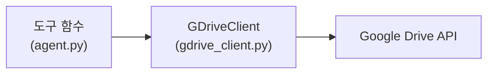
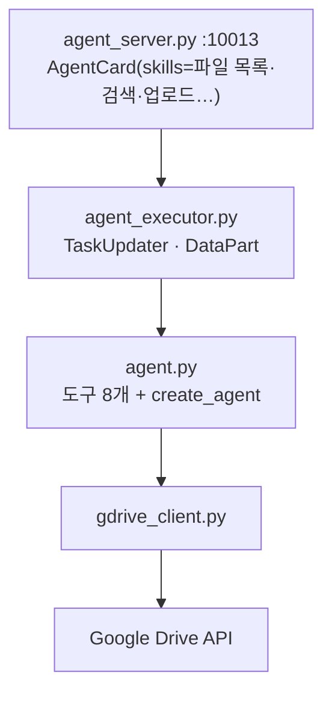

# 11.2 파일 관리를 위한 에이전트

> **저자 예제** — [`examples/file_management_agent/`](examples/file_management_agent) (`gdrive_client.py` · `agent.py` · `agent_executor.py` · `agent_server.py`)
> **공식 문서** — [Google Drive API](https://developers.google.com/workspace/drive/api/guides/about-sdk) · [OAuth 데스크톱 앱](https://developers.google.com/identity/protocols/oauth2/native-app)

> **여기까지** — 시스템 설계도를 봤습니다([11.1절](11-01_%EC%98%A4%EC%BC%80%EC%8A%A4%ED%8A%B8%EB%A0%88%EC%9D%B4%ED%84%B0%20%EA%B8%B0%EB%B0%98%20%EB%A9%80%ED%8B%B0%20%EC%97%90%EC%9D%B4%EC%A0%84%ED%8A%B8%20%EC%84%A4%EA%B3%84.md)).
> **이 절의 질문** — 네 에이전트 중 **첫 번째**를 만들어 봅시다. 구글 드라이브를 다루려면?
> **다 읽으면** — OAuth 인증을 통과하고, **파일을 다루는 도구의 위험**도 알게 됩니다.

포트 **10013**에 뜨는 에이전트입니다. 구글 드라이브의 파일을 다룹니다.

## 11.2.1 [실습] 구글 드라이브 API 사용하기

### 준비가 코드보다 오래 걸립니다

구글 API는 **콘솔 설정**이 먼저입니다.

> **OAuth란** — 비밀번호를 넘기지 않고 권한만 빌려주는 방식입니다. 게임 사이트에서 "구글 계정으로 로그인"을 누르면 구글이 대신 확인해 주고, 게임 사이트는 비밀번호를 모릅니다. 여기서는 **우리 코드가 그 게임 사이트 자리**입니다. 구글이 발급한 **토큰**(임시 출입증)으로 드라이브를 읽습니다.

> **범위(Scope)** 는 그 출입증으로 무엇까지 할 수 있는지입니다. "읽기만"과 "삭제까지"가 다릅니다. 넓게 잡으면 편하지만 사고도 커집니다.

| 단계 | 하는 일 |
| :--- | :--- |
| ① 프로젝트 생성 | Google Cloud Console |
| ② Drive API 사용 설정 | 라이브러리에서 활성화 |
| ③ OAuth 동의 화면 | 앱 이름·범위·테스트 사용자 |
| ④ 사용자 인증 정보 | **데스크톱 앱** 유형으로 생성 |
| ⑤ `credentials.json` 다운로드 | 프로젝트에 배치 |

> **"데스크톱 앱" 유형을 골라야 합니다.** 웹 애플리케이션으로 만들면 리디렉션 URI 설정이 달라 예제가 동작하지 않습니다.
>
> **테스트 사용자에 본인 계정을 추가**하세요. 동의 화면이 "테스트" 상태면 등록된 계정만 인증됩니다.

### 토큰이 두 개입니다

| 파일 | 무엇 | 언제 생김 |
| :--- | :--- | :--- |
| `credentials.json` | **앱의 신원** | 콘솔에서 다운로드 |
| `token.json` | **사용자의 승인** | 첫 실행 때 브라우저 인증 후 자동 생성 |

첫 실행에서 브라우저가 열리고, 승인하면 `token.json`이 만들어집니다. 그다음부터는 브라우저가 안 뜹니다.

> **둘 다 절대 커밋하지 마세요**([4.3절](../ch04_dev-env/04-03_%ED%99%98%EA%B2%BD%EB%B3%80%EC%88%98%20%EC%84%A4%EC%A0%95%ED%95%98%EA%B8%B0.md)). `token.json`은 **내 드라이브에 접근할 수 있는 열쇠**입니다. `.env`보다 더 위험할 수 있습니다.
>
> 인증이 꼬이면 **`token.json`을 지우고 다시 실행**하면 됩니다. 다시 브라우저 인증을 합니다.

### 범위(scope)를 좁게 잡습니다

드라이브 API는 권한 범위를 지정합니다. **필요한 것만** 요청하는 게 원칙입니다.

[11.3절](11-03_%EB%AC%B8%EC%84%9C%20%EC%A0%80%EC%9E%A5%C2%B7%EA%B2%80%EC%83%89%20%EC%97%90%EC%9D%B4%EC%A0%84%ED%8A%B8.md)의 RAG 에이전트가 **읽기 전용 클라이언트**(`_GDriveReadOnlyClient`)를 따로 두는 것이 이 원칙의 예입니다. 인덱싱하려면 읽기만 필요하니 쓰기 권한을 안 줍니다([3.3절](../ch03_architecture/03-03_%EC%96%B4%EB%96%A4%20%EC%97%90%EC%9D%B4%EC%A0%84%ED%8A%B8%EB%A5%BC%20%EC%84%A4%EA%B3%84%ED%95%B4%EC%95%BC%20%ED%95%A0%EA%B9%8C.md)의 권한 분리).

## 11.2.2 [실습] 파일 관리를 위한 구글 드라이브 클라이언트 구현하기

[`gdrive_client.py`](examples/file_management_agent/gdrive_client.py)는 **606줄**로 이 장에서 두 번째로 큰 파일입니다. 하지만 하는 일은 단순합니다.

**구글 API를 감싸서 쓰기 편한 함수로 만드는 것**입니다.



### 왜 한 겹 감싸나

**도구 함수가 API 세부사항을 몰라도 되게** 하려는 것입니다. [6.3절](../ch06_single-agent/06-03_%EC%BD%94%EB%94%A9%20%EC%97%90%EC%9D%B4%EC%A0%84%ED%8A%B8%20%EB%A7%8C%EB%93%A4%EA%B8%B0.md)에서 도구는 **모델이 읽을 설명**과 **간단한 인자**를 가져야 한다고 했습니다. 구글 API의 복잡한 요청 형식을 도구에 그대로 노출하면 그게 안 됩니다.

| 층 | 관심사 |
| :--- | :--- |
| 도구 함수 | 모델이 이해할 이름·설명·인자 |
| 클라이언트 | 인증·요청 형식·페이지네이션·오류 |

이 분리는 [10.3.2절](../ch10_a2a/10-03_A2A%EC%9D%98%20%EA%B8%B0%EB%B3%B8%20%EC%82%AC%EC%9A%A9%EB%B2%95%20%EC%9D%B4%ED%95%B4%ED%95%98%EA%B8%B0.md)의 "로직과 프로토콜 분리"와 같은 발상입니다. **한 파일이 한 가지만 알게** 하는 것입니다.

## 11.2.3 [실습] 파일 관리 에이전트 만들기

도구 여덟 개를 만듭니다. [6.3절](../ch06_single-agent/06-03_%EC%BD%94%EB%94%A9%20%EC%97%90%EC%9D%B4%EC%A0%84%ED%8A%B8%20%EB%A7%8C%EB%93%A4%EA%B8%B0.md)의 `@tool` 그대로입니다.

| 도구 | 하는 일 |
| :--- | :--- |
| `upload_file` | 내용을 파일로 업로드 |
| `download_file_as_base64` | 파일을 base64로 다운로드 |
| `get_file_info` | 파일 메타데이터 |
| **`find_folder_by_name`** | **폴더 이름 → 폴더 ID** |
| `list_files` | 파일 목록 |
| `delete_file` | 삭제 |
| `update_file` | 수정 |
| `create_folder` | 폴더 생성 |

### `find_folder_by_name`이 왜 따로 있나

**구글 드라이브는 폴더를 ID로 다룹니다.** 그런데 사용자는 "보고서 폴더"라고 말합니다.

```
사용자: "보고서 폴더 파일 목록 보여줘"
          ↓
① find_folder_by_name("보고서")  →  folder_id
② list_files(folder_id=...)      →  목록
```

**두 단계가 필요합니다.** 모델이 이 순서를 알아서 밟아야 하므로 도구 설명이 중요합니다([2.2절](../ch02_core-elements/02-02_%EC%97%90%EC%9D%B4%EC%A0%84%ED%8A%B8%EC%9D%98%20%EC%99%B8%EB%B6%80%20%EC%A7%80%EC%8B%9D%20%ED%99%9C%EC%9A%A9%20-%20%EB%8F%84%EA%B5%AC%20%ED%98%B8%EC%B6%9C.md)).

`list_files`가 `folder_name`과 `folder_id`를 **둘 다 인자로 받는 것**도 이 때문입니다. 이름만 알아도 부를 수 있게 열어 둔 것입니다.

```python
def list_files(folder_name: str = "", folder_id: str = "",
               search_query: str = "", max_results: int = 20) -> str:
```

> **`max_results=20`이 [6.2절](../ch06_single-agent/06-02_%EC%9B%B9%20%EA%B2%80%EC%83%89%20%EC%97%90%EC%9D%B4%EC%A0%84%ED%8A%B8%20%EB%A7%8C%EB%93%A4%EA%B8%B0.md)의 컨텍스트 예산**과 같은 역할입니다. 파일이 수백 개인 폴더를 통째로 가져오면 컨텍스트가 찹니다.

### 위험한 도구가 섞여 있습니다

`delete_file`과 `update_file`은 **되돌릴 수 없는 동작**입니다.

```python
def delete_file(file_id: str, permanent: bool = False) -> str:
```

**`permanent=False`가 기본**인 것이 좋은 설계입니다. 기본은 휴지통으로 보내고, 완전 삭제는 명시적으로 요청해야 합니다.

> **실무라면 여기에 사람 승인을 넣어야 합니다.** [1.3절](../ch01_llm-decision/01-03_LLM%EC%9D%B4%20%EB%8B%A4%EC%9D%8C%20%ED%96%89%EB%8F%99%EC%9D%84%20%EA%B2%B0%EC%A0%95%ED%95%98%EB%8B%A4.md)에서 "실행을 애플리케이션이 쥐고 있어야 승인을 넣을 수 있다"고 한 지점입니다. 모델이 파일 ID를 잘못 짚으면 남의 파일이 지워집니다.
>
> **학습 중에는 전용 폴더를 만들어 쓰세요.** 중요한 파일이 있는 드라이브에 바로 붙이지 마세요.

## 11.2.4 [실습] A2A 실행기 만들기

[10.4.2절](../ch10_a2a/10-04_MCP%EC%99%80%20A2A%EB%A5%BC%20%ED%99%9C%EC%9A%A9%ED%95%9C%20%EB%A9%80%ED%8B%B0%20%EC%97%90%EC%9D%B4%EC%A0%84%ED%8A%B8%20%EA%B5%AC%EC%B6%95%ED%95%98%EA%B8%B0.md)의 실행기와 같은 틀입니다.

| 상황 | 호출 |
| :--- | :--- |
| 진행 중 | `update_status(TaskState.working, …)` |
| 완료 | `add_artifact(...)` → `complete()` |
| 실패 | `update_status(TaskState.failed, …)` |

**다만 이 에이전트는 파일 목록을 돌려줍니다.** [11.1절](11-01_%EC%98%A4%EC%BC%80%EC%8A%A4%ED%8A%B8%EB%A0%88%EC%9D%B4%ED%84%B0%20%EA%B8%B0%EB%B0%98%20%EB%A9%80%ED%8B%B0%20%EC%97%90%EC%9D%B4%EC%A0%84%ED%8A%B8%20%EC%84%A4%EA%B3%84.md)에서 본 **`create_data_artifact`** 를 쓸 자리입니다.

```python
create_data_artifact(name=..., data={"files": [...]}, artifact_type=ArtifactType.FILE_LIST)
```

**왜 텍스트가 아니라 데이터인가.** [11.3절](11-03_%EB%AC%B8%EC%84%9C%20%EC%A0%80%EC%9E%A5%C2%B7%EA%B2%80%EC%83%89%20%EC%97%90%EC%9D%B4%EC%A0%84%ED%8A%B8.md)의 RAG 에이전트가 이 목록을 받아 **`storage_ref`로 파일을 다운로드**해야 합니다. 텍스트로 넘기면 다시 파싱해야 하고, 파싱은 깨집니다.

[11.1절](11-01_%EC%98%A4%EC%BC%80%EC%8A%A4%ED%8A%B8%EB%A0%88%EC%9D%B4%ED%84%B0%20%EA%B8%B0%EB%B0%98%20%EB%A9%80%ED%8B%B0%20%EC%97%90%EC%9D%B4%EC%A0%84%ED%8A%B8%20%EC%84%A4%EA%B3%84.md)의 `storage_ref` 이야기가 여기서 시작됩니다.

## 11.2.5 [실습] 파일 관리 에이전트 실행을 위한 A2A 서버 만들기

[10.3.3절](../ch10_a2a/10-03_A2A%EC%9D%98%20%EA%B8%B0%EB%B3%B8%20%EC%82%AC%EC%9A%A9%EB%B2%95%20%EC%9D%B4%ED%95%B4%ED%95%98%EA%B8%B0.md)의 다섯 부품 그대로이고, **포트만 10013**입니다.

`AgentCard`의 `skills`에 **할 수 있는 일을 나열**합니다. [11.5절](11-05_%EC%98%A4%EC%BC%80%EC%8A%A4%ED%8A%B8%EB%A0%88%EC%9D%B4%ED%84%B0%20%EC%97%90%EC%9D%B4%EC%A0%84%ED%8A%B8.md)의 오케스트레이터가 이 설명을 보고 배분하므로, **여기가 부실하면 이 에이전트가 안 불립니다.**



> 실행 방법은 [11.6절](11-06_%EC%98%A4%EC%BC%80%EC%8A%A4%ED%8A%B8%EB%A0%88%EC%9D%B4%ED%84%B0%20%EA%B8%B0%EB%B0%98%20%EB%A9%80%ED%8B%B0%20%EC%97%90%EC%9D%B4%EC%A0%84%ED%8A%B8%20%EC%8B%9C%EC%8A%A4%ED%85%9C%20%EC%84%9C%EB%B2%84%20%EA%B5%AC%EB%8F%99%20%EB%B0%8F%20%EC%9E%91%EC%97%85%20%EC%8B%A4%ED%96%89.md)에서 넷을 한꺼번에 다룹니다.

### 이 에이전트만 먼저 시험해 보세요

넷을 다 띄우기 전에 **이것 하나만 띄우고 [10.3.4절](../ch10_a2a/10-03_A2A%EC%9D%98%20%EA%B8%B0%EB%B3%B8%20%EC%82%AC%EC%9A%A9%EB%B2%95%20%EC%9D%B4%ED%95%B4%ED%95%98%EA%B8%B0.md)의 클라이언트로 불러 보는 것**을 권합니다. OAuth 인증이 되는지, 폴더 조회가 되는지를 여기서 확인하면 나중에 원인을 찾기 쉽습니다.

## 요약 및 비유

**문서 창고 담당자**입니다. 창고 열쇠를 받는 절차(OAuth)가 까다롭고, 서류를 이름이 아니라 **정리번호로 찾습니다**(폴더 ID). 다른 부서에는 서류 원본이 아니라 **보관 번호를 적어 넘깁니다**(`storage_ref`). 폐기 권한도 있어서 조심해야 합니다.

| 개념 | 문서 창고 비유 | 기술적 의미 |
| :--- | :--- | :--- |
| **`credentials.json`** | 회사 출입증 | 앱의 신원 |
| **`token.json`** | 창고 열쇠 | 사용자 승인 — **커밋 금지** |
| **데스크톱 앱 유형** | 현장 출입 방식 | OAuth 클라이언트 종류 |
| **`gdrive_client.py`** | 창고 관리 시스템 | API 래퍼 |
| **도구 함수** | 담당자가 쓰는 요청서 | 모델이 부르는 인터페이스 |
| **`find_folder_by_name`** | 이름 → 정리번호 조회 | 폴더 ID 확보 |
| **`max_results`** | 한 번에 꺼낼 서류 수 | 컨텍스트 예산 |
| **`permanent=False`** | 기본은 폐기함행 | 휴지통 우선 |
| **`DataPart` 목록** | 정해진 서식의 목록표 | 구조 유지 전달 |
| **읽기 전용 권한** | 열람만 가능한 출입증 | 권한 분리 |

## 결론

* 구글 드라이브는 **콘솔 설정이 코드보다 오래 걸립니다.** OAuth 클라이언트는 **"데스크톱 앱" 유형**으로 만들고 테스트 사용자에 본인을 추가하세요.
* **`credentials.json`(앱 신원)과 `token.json`(사용자 승인)** 두 파일입니다. **둘 다 커밋 금지**이고, 인증이 꼬이면 `token.json`을 지우고 다시 실행합니다.
* `gdrive_client.py`가 API를 감싸는 이유는 **도구 함수가 API 세부사항을 몰라도 되게** 하기 위해서입니다.
* **드라이브는 폴더를 ID로 다룹니다.** 사용자는 이름으로 말하므로 `find_folder_by_name` → `list_files` 두 단계가 필요합니다.
* `max_results`는 **컨텍스트 예산**입니다. 파일이 많은 폴더를 통째로 가져오면 안 됩니다.
* **`delete_file`·`update_file`은 되돌릴 수 없습니다.** `permanent=False` 기본값이 안전장치이고, 실무라면 **사람 승인**을 넣어야 합니다. 학습 중에는 **전용 폴더**를 쓰세요.
* 파일 목록은 **`DataPart`로 넘깁니다.** RAG 에이전트가 `storage_ref`로 다운로드해야 하므로 구조가 유지돼야 합니다.
* `AgentCard`의 `skills`가 부실하면 **오케스트레이터가 이 에이전트를 안 부릅니다.**
* 넷을 다 띄우기 전에 **이 에이전트만 먼저 시험**해 OAuth를 확인하세요.

---

## 다음 절로

파일을 **가져올** 수는 있게 됐습니다. **그런데 찾을 수는 없습니다.**

드라이브에 문서가 500개면 "작년 회식비 정산 문서"를 파일 이름만으로 찾을 수 있을까요? **내용으로 찾아야 합니다.** → **[11.3절](11-03_%EB%AC%B8%EC%84%9C%20%EC%A0%80%EC%9E%A5%C2%B7%EA%B2%80%EC%83%89%20%EC%97%90%EC%9D%B4%EC%A0%84%ED%8A%B8.md)**

---

[⬅ 11.1](11-01_%EC%98%A4%EC%BC%80%EC%8A%A4%ED%8A%B8%EB%A0%88%EC%9D%B4%ED%84%B0%20%EA%B8%B0%EB%B0%98%20%EB%A9%80%ED%8B%B0%20%EC%97%90%EC%9D%B4%EC%A0%84%ED%8A%B8%20%EC%84%A4%EA%B3%84.md) · [Chapter 11](README.md) · [11.3 ➡](11-03_%EB%AC%B8%EC%84%9C%20%EC%A0%80%EC%9E%A5%C2%B7%EA%B2%80%EC%83%89%20%EC%97%90%EC%9D%B4%EC%A0%84%ED%8A%B8.md)
