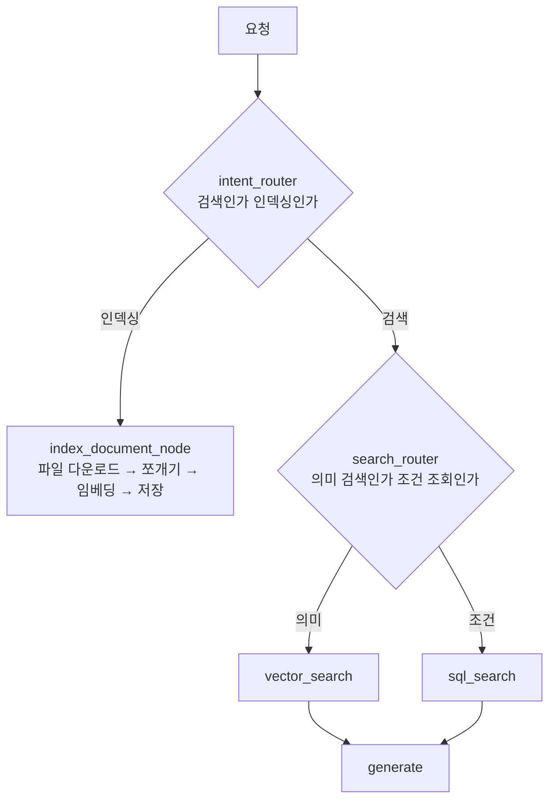
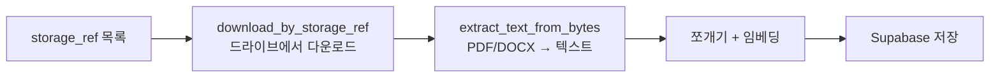

# 11.3 문서 저장·검색 에이전트

> **저자 예제** — [`examples/internal_rag_agent/`](examples/internal_rag_agent) (`agent.py` · `index.sql` · `agent_executor.py` · `agent_server.py` · `test_index.py`)
> **공식 문서** — [Supabase · AI & Vectors](https://supabase.com/docs/guides/ai) · [Build a custom RAG agent](https://docs.langchain.com/oss/python/langgraph/agentic-rag)

포트 **10012**. 이 시스템에서 **가장 큰 에이전트**입니다([`agent.py`](examples/internal_rag_agent/agent.py)가 979줄). [6.5절](../ch06_single-agent/06-05_RAG%EB%A5%BC%20%EC%9C%84%ED%95%9C%20%EC%97%90%EC%9D%B4%EC%A0%84%ED%8A%B8%20%EB%A7%8C%EB%93%A4%EA%B8%B0.md)의 RAG를 실전 규모로 키운 것입니다.

## 11.3.1 [실습] 문서 정보 저장을 위한 수파베이스 구축하기

### Chroma에서 Supabase로

[6.5절](../ch06_single-agent/06-05_RAG%EB%A5%BC%20%EC%9C%84%ED%95%9C%20%EC%97%90%EC%9D%B4%EC%A0%84%ED%8A%B8%20%EB%A7%8C%EB%93%A4%EA%B8%B0.md)에서는 Chroma를 로컬 디렉터리에 두었습니다. 여기서는 **Supabase(PostgreSQL + pgvector)** 를 씁니다.

| | Chroma (6.5절) | Supabase (11장) |
| :--- | :--- | :--- |
| 위치 | 로컬 폴더 | **원격 DB** |
| 여러 서버에서 접근 | 어려움 | **가능** |
| 벡터 외 조회 | 제한적 | **SQL 그대로** |
| 준비 | 없음 | 프로젝트 + 테이블 + 인덱스 |

**에이전트가 별도 서버로 분리됐기 때문에** 로컬 폴더로는 안 됩니다. [11.1절](11-01_%EC%98%A4%EC%BC%80%EC%8A%A4%ED%8A%B8%EB%A0%88%EC%9D%B4%ED%84%B0%20%EA%B8%B0%EB%B0%98%20%EB%A9%80%ED%8B%B0%20%EC%97%90%EC%9D%B4%EC%A0%84%ED%8A%B8%20%EC%84%A4%EA%B3%84.md)의 분리가 저장소 선택까지 바꾼 것입니다.

**두 번째 이유가 더 중요합니다.** SQL을 쓸 수 있으면 **벡터 검색이 아닌 조회**도 됩니다. "오늘 올린 문서 목록"은 의미 검색이 아니라 날짜 조건 조회입니다.

### 테이블과 인덱스

[`index.sql`](examples/internal_rag_agent/index.sql)에 스키마가 들어 있습니다. Supabase 콘솔의 SQL 편집기에서 실행합니다.

> **`pgvector` 확장을 먼저 켜야 합니다.** 벡터 컬럼 타입이 그 확장에서 옵니다.
>
> **임베딩 차원이 맞아야 합니다.** `text-embedding-3-small`은 1536차원입니다([8.4절](../ch08_memory/08-04_%EB%88%84%EC%A0%81%EB%90%9C%20%EC%82%AC%EC%9A%A9%EC%9E%90%20%EB%A9%94%EB%AA%A8%EB%A6%AC%EB%A5%BC%20%EA%B8%B0%EB%B0%98%EC%9C%BC%EB%A1%9C%20%EB%A7%9E%EC%B6%A4%20%EC%A1%B0%EC%96%B8%EC%9D%84%20%EC%A0%9C%EA%B3%B5%ED%95%98%EB%8A%94%20%EC%97%90%EC%9D%B4%EC%A0%84%ED%8A%B8.md)의 `dims=1536`과 같은 값). 모델을 바꾸면 테이블도 다시 만들어야 합니다.

[`test_index.py`](examples/internal_rag_agent/test_index.py)가 11줄짜리 확인용 스크립트입니다. **DB 연결이 되는지 먼저 확인하고** 넘어가세요.

## 11.3.2 [실습] 문서 저장·검색 에이전트 만들기

### 이 에이전트는 두 가지 일을 합니다



**라우터가 둘**입니다. [6.5절](../ch06_single-agent/06-05_RAG%EB%A5%BC%20%EC%9C%84%ED%95%9C%20%EC%97%90%EC%9D%B4%EC%A0%84%ED%8A%B8%20%EB%A7%8C%EB%93%A4%EA%B8%B0.md)의 RAG 그래프보다 한 겹 깊습니다.

| 라우터 | 판단하는 것 |
| :--- | :--- |
| `intent_router` | **검색이냐 인덱싱이냐** |
| `search_router` | **벡터 검색이냐 SQL 조회냐** |

둘 다 [6.4.4절](../ch06_single-agent/06-04_create_agent%20%EC%83%81%EC%84%B8%20%EA%B5%AC%EC%A1%B0%20%EC%9D%B4%ED%95%B4%ED%95%98%EA%B8%B0.md)의 **구조화 출력**으로 판단합니다.

```python
class IntentClassification(BaseModel): ...
class SearchTypeClassification(BaseModel): ...
```

[1.2절](../ch01_llm-decision/01-02_LLM%EC%9D%84%20%EA%B8%B0%EB%B0%98%EC%9C%BC%EB%A1%9C%20%EC%9D%98%EC%82%AC%EA%B2%B0%EC%A0%95%ED%95%98%EB%8B%A4.md)의 "선택지를 좁혀 흔들림을 막는다"가 라우팅에 쓰이는 전형입니다.

### 벡터 검색과 SQL 검색을 나눈 이유

**질문 종류가 다릅니다.**

| 질문 | 필요한 것 | 노드 |
| :--- | :--- | :--- |
| "휴가 규정이 어떻게 되나요?" | 의미가 가까운 문단 | `vector_search` |
| "오늘 올린 문서 목록" | **날짜 조건 조회** | `sql_search` |
| "계약서에 위약금 조항 있어?" | 의미 검색 | `vector_search` |
| "문서 몇 개 저장돼 있어?" | **개수 세기** | `sql_search` |

**벡터 검색으로 "오늘 올린 문서"를 찾을 수 없습니다.** 날짜는 의미가 아니라 조건입니다. [7.4절](../ch07_multi-agent/07-04_%EC%9B%B9%ED%8E%98%EC%9D%B4%EC%A7%80%EB%A5%BC%20%EC%9A%94%EC%95%BD%ED%95%B4%EC%84%9C%20%EB%8D%B0%EC%9D%B4%ED%84%B0%EB%B2%A0%EC%9D%B4%EC%8A%A4%EC%97%90%20%EC%A0%80%EC%9E%A5%ED%95%98%EB%8A%94%20%EC%97%90%EC%9D%B4%EC%A0%84%ED%8A%B8%20%23%EC%8A%88%ED%8D%BC%EB%B0%94%EC%9D%B4%EC%A0%80.md)에서 전문 검색과 벡터 검색을 비교하며 **"용도에 따라 고르는 것"** 이라고 한 이야기의 확장입니다.

```python
def _get_today_iso() -> str:
```

**"오늘"을 계산하는 헬퍼**가 따로 있습니다. LLM은 오늘 날짜를 모릅니다([1.1절](../ch01_llm-decision/01-01_AI%20%EC%97%90%EC%9D%B4%EC%A0%84%ED%8A%B8%EC%9D%98%20%EB%91%90%EB%87%8C%2C%20%EA%B1%B0%EB%8C%80%20%EC%96%B8%EC%96%B4%20%EB%AA%A8%EB%8D%B8%EC%9D%98%20%EC%9D%B4%ED%95%B4.md)의 지식 컷오프). 코드가 계산해서 넣어 줘야 합니다.

### 답변 생성도 두 갈래입니다

```python
def _generate_list_response(search_results, sources): ...
def _generate_content_response(question, search_results, sources): ...
```

| 함수 | 언제 |
| :--- | :--- |
| `_generate_list_response` | **목록**을 물었을 때 |
| `_generate_content_response` | **내용**을 물었을 때 |

"문서 목록 보여줘"에 문단을 요약해 주면 안 되고, "규정이 뭐야"에 파일명만 나열하면 안 됩니다. **질문 유형에 답변 형식을 맞춘 것**입니다.

### 파일에서 텍스트를 뽑는 부분

```python
def extract_text_from_pdf(pdf_bytes: bytes) -> str: ...
def extract_text_from_bytes(file_bytes: bytes, mime_type: str = "") -> str: ...
```

**MIME 타입에 따라 다르게 처리**합니다. PDF는 `pypdf`로, 워드 문서는 `docx2txt`로 — [`pyproject.toml`](../pyproject.toml)에 이 패키지들이 들어 있는 이유입니다.

## 11.3.3 [실습] 에이전트 그래프 최종 형태 만들기

```python
def route_intent(state: RAGState) -> Literal["search_router", "index_document_node"]: ...
def route_search(state: RAGState) -> Literal["vector_search", "sql_search"]: ...

def create_rag_graph(): ...
```

[5.2.5절](../ch05_langgraph-basics/05-02_%EB%9E%AD%EA%B7%B8%EB%9E%98%ED%94%84%20%EA%B8%B0%EB%B3%B8%20%EA%B0%9C%EB%85%90%20%EC%9D%B4%ED%95%B4%ED%95%98%EA%B3%A0%20%EC%A0%81%EC%9A%A9%ED%95%98%EA%B8%B0.md)의 조건부 엣지를 **두 번 겹친 구조**입니다. 반환 타입이 `Literal`이라 갈 곳이 코드에 드러납니다([7.2절](../ch07_multi-agent/07-02_%ED%95%B8%EB%93%9C%EC%98%A4%ED%94%84%EB%A5%BC%20%EC%9C%84%ED%95%9C%20%EA%B8%B0%EB%8A%A5%20%EC%82%B4%ED%8E%B4%EB%B3%B4%EA%B8%B0.md)).

### 인덱싱 흐름

```python
def index_document_node(state: RAGState) -> RAGState: ...
def _index_single_file(sb, storage_ref: str, filename: str) -> dict: ...
```



**[11.1절](11-01_%EC%98%A4%EC%BC%80%EC%8A%A4%ED%8A%B8%EB%A0%88%EC%9D%B4%ED%84%B0%20%EA%B8%B0%EB%B0%98%20%EB%A9%80%ED%8B%B0%20%EC%97%90%EC%9D%B4%EC%A0%84%ED%8A%B8%20%EC%84%A4%EA%B3%84.md)에서 말한 `storage_ref` 방식이 여기서 실현됩니다.** 파일 관리 에이전트가 파일 내용을 넘겨준 게 아니라 **참조만** 넘겼고, 이 에이전트가 직접 받아 옵니다.

```python
class _GDriveReadOnlyClient: ...
def download_by_storage_ref(storage_ref: str) -> tuple[bytes, str, str]: ...
```

> **읽기 전용 클라이언트를 따로 둔 것**을 보세요. 인덱싱에 필요한 건 읽기뿐이고, 쓰기 권한을 주면 이 에이전트가 파일을 지울 수도 있게 됩니다. [3.3절](../ch03_architecture/03-03_%EC%96%B4%EB%96%A4%20%EC%97%90%EC%9D%B4%EC%A0%84%ED%8A%B8%EB%A5%BC%20%EC%84%A4%EA%B3%84%ED%95%B4%EC%95%BC%20%ED%95%A0%EA%B9%8C.md)의 **권한 분리**가 코드로 나타난 좋은 예입니다.
>
> 다만 **파일 관리 에이전트와 드라이브 접근 코드가 두 벌**이 됩니다. 중복이 생겼지만 **권한을 좁히기 위해 감수한 것**입니다. 설계에는 이런 맞바꿈이 늘 있습니다.

## 11.3.4 · 11.3.5 A2A 실행기와 서버

[10.4.2절](../ch10_a2a/10-04_MCP%EC%99%80%20A2A%EB%A5%BC%20%ED%99%9C%EC%9A%A9%ED%95%9C%20%EB%A9%80%ED%8B%B0%20%EC%97%90%EC%9D%B4%EC%A0%84%ED%8A%B8%20%EA%B5%AC%EC%B6%95%ED%95%98%EA%B8%B0.md)·[11.2절](11-02_%ED%8C%8C%EC%9D%BC%20%EA%B4%80%EB%A6%AC%EB%A5%BC%20%EC%9C%84%ED%95%9C%20%EC%97%90%EC%9D%B4%EC%A0%84%ED%8A%B8.md)과 같은 틀이고 **포트만 10012**입니다.

실행기가 82줄로 짧은 것을 보세요. **로직이 전부 `agent.py`에 있어서** 실행기는 A2A 형식 변환만 합니다. [11.1절](11-01_%EC%98%A4%EC%BC%80%EC%8A%A4%ED%8A%B8%EB%A0%88%EC%9D%B4%ED%84%B0%20%EA%B8%B0%EB%B0%98%20%EB%A9%80%ED%8B%B0%20%EC%97%90%EC%9D%B4%EC%A0%84%ED%8A%B8%20%EC%84%A4%EA%B3%84.md)의 3층 구조가 잘 지켜진 결과입니다.

| 파일 | 줄 수 | 무엇이 들었나 |
| :--- | ---: | :--- |
| `agent.py` | 979 | 그래프·노드·검색·인덱싱 |
| `agent_executor.py` | 82 | A2A 변환만 |
| `agent_server.py` | 111 | 카드 + 기동 |

## 요약 및 비유

**사내 자료실**입니다. 자료를 **받아서 색인하는 일**(인덱싱)과 **찾아 주는 일**(검색)을 겸합니다. 찾을 때는 **"비슷한 내용"으로 찾을지**(벡터) **"조건에 맞는 것"으로 찾을지**(SQL) 나눠 판단하고, 답도 **목록이냐 내용이냐**에 따라 다르게 냅니다.

| 개념 | 자료실 비유 | 기술적 의미 |
| :--- | :--- | :--- |
| **Supabase pgvector** | 중앙 서고 | 원격 벡터 DB |
| **로컬 Chroma와 차이** | 부서별 캐비닛 vs 중앙 서고 | 여러 서버 접근 |
| **`intent_router`** | 접수인가 열람인가 | 인덱싱/검색 분기 |
| **`search_router`** | 주제로 찾나 조건으로 찾나 | 벡터/SQL 분기 |
| **벡터 검색** | 내용이 비슷한 자료 | 의미 유사도 |
| **SQL 검색** | "오늘 접수분" 대장 조회 | 조건 질의 |
| **`_get_today_iso`** | 오늘 날짜 도장 | LLM은 오늘을 모름 |
| **답변 2종** | 목록표 vs 요약문 | 질문 유형에 형식 맞춤 |
| **`storage_ref`** | 보관 번호로 원본 청구 | 참조로 다운로드 |
| **읽기 전용 클라이언트** | 열람 전용 출입증 | 권한 분리 |

## 결론

* **Chroma에서 Supabase로 바뀐 이유**는 에이전트가 별도 서버로 분리됐기 때문이고, **SQL을 쓸 수 있다는 이득**도 큽니다.
* **`pgvector` 확장을 켜고 임베딩 차원(1536)을 맞춰야** 합니다. 모델을 바꾸면 테이블도 다시 만듭니다.
* 이 에이전트는 **검색과 인덱싱 두 가지**를 하고, **라우터가 둘** 있습니다.
* **벡터 검색과 SQL 검색을 나눈 것**이 핵심입니다. "오늘 올린 문서"는 의미가 아니라 조건이라 벡터로 못 찾습니다.
* **LLM은 오늘 날짜를 모릅니다.** `_get_today_iso` 같은 헬퍼가 계산해서 넣어 줘야 합니다.
* 답변 생성도 **목록형·내용형** 두 갈래입니다. 질문 유형에 형식을 맞춥니다.
* 인덱싱은 **`storage_ref` → 다운로드 → 텍스트 추출 → 임베딩 → 저장** 순서입니다. 파일 내용을 넘겨받지 않습니다.
* **읽기 전용 드라이브 클라이언트를 따로 둔 것**은 권한 분리입니다. 코드 중복이 생기지만 **권한을 좁히려 감수한 맞바꿈**입니다.
* 실행기가 82줄로 짧은 것은 **3층 구조가 잘 지켜졌다는 신호**입니다.

---

[⬅ 11.2](11-02_%ED%8C%8C%EC%9D%BC%20%EA%B4%80%EB%A6%AC%EB%A5%BC%20%EC%9C%84%ED%95%9C%20%EC%97%90%EC%9D%B4%EC%A0%84%ED%8A%B8.md) · [Chapter 11](README.md) · [11.4 ➡](11-04_%EC%9B%B9%20%EA%B2%80%EC%83%89%20%EC%97%90%EC%9D%B4%EC%A0%84%ED%8A%B8.md)
