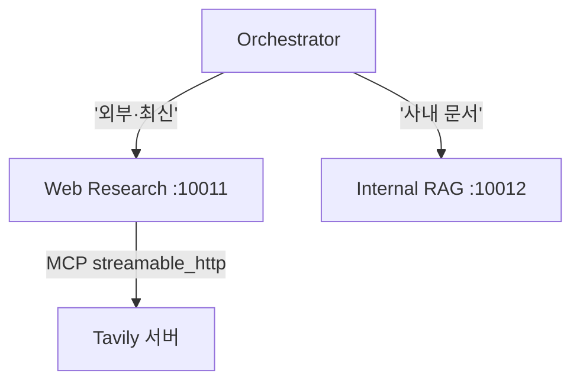

# 11.4 웹 검색 에이전트

> **저자 예제** — [`examples/web_research_agent/`](examples/web_research_agent) (`agent.py` · `agent_executor.py` · `agent_server.py`)
> **공식 문서** — [Tavily 문서](https://docs.tavily.com/) · [langchain-mcp-adapters](https://github.com/langchain-ai/langchain-mcp-adapters)

포트 **10011**. 넷 중 **가장 작은 에이전트**입니다([`agent.py`](examples/web_research_agent/agent.py)가 144줄).

**작은 것이 요점입니다.** [9장](../ch09_mcp/09-01_MCP%EB%9E%80.md)의 MCP와 [10장](../ch10_a2a/10-01_A2A%EB%9E%80.md)의 A2A를 쓰면 이 정도로 줄어듭니다.

## 11.4.1 [실습] 타빌리 MCP 서버 기반 에이전트 만들기

### 도구를 하나도 안 만듭니다

```python
class WebResearchAgent:
    def __init__(self):
        self.model = ChatOpenAI(model="gpt-4o")
        self.mcp_client = None
        self.agent = None
        self.initialized = False

    async def initialize(self) -> None:
        if self.initialized:
            return

        self.mcp_client = MultiServerMCPClient({
            "tavily": {
                "url": f"https://mcp.tavily.com/mcp/?tavilyApiKey={TAVILY_API_KEY}",
                "transport": "streamable_http",
            }
        })

        tools = await self.mcp_client.get_tools(server_name="tavily")
```

**[9.5절](../ch09_mcp/09-05_%EB%9E%AD%EA%B7%B8%EB%9E%98%ED%94%84%EC%97%90%EC%84%9C%20MCP%20%EA%B8%B0%EB%B0%98%20%EB%A9%80%ED%8B%B0%20%EC%97%90%EC%9D%B4%EC%A0%84%ED%8A%B8%20%EA%B5%AC%ED%98%84%ED%95%98%EA%B8%B0.md)과 똑같습니다.** Tavily가 운영하는 MCP 서버에 URL로 붙어 도구를 받아 옵니다.

[6.2절](../ch06_single-agent/06-02_%EC%9B%B9%20%EA%B2%80%EC%83%89%20%EC%97%90%EC%9D%B4%EC%A0%84%ED%8A%B8%20%EB%A7%8C%EB%93%A4%EA%B8%B0.md)에서는 `langchain-tavily` 패키지를 설치해 `TavilySearch`를 썼습니다. 여기서는 **패키지 없이 주소만**입니다.

| | 6.2절 | 11.4절 |
| :--- | :--- | :--- |
| 도구 출처 | `langchain-tavily` 패키지 | **Tavily MCP 서버** |
| 우리가 만든 코드 | 도구 설정 | **없음** |
| 업데이트 | 패키지 재설치 | **서버 쪽에서** |

### 대신 프롬프트가 일합니다

```python
SYSTEM_PROMPT = """당신은 웹 검색 전문가입니다.

tavily_search 도구 사용 시 주의사항:
- topic 파라미터는 반드시 'general', 'news', 'finance' 중 하나만 사용하세요.
- 기술, AI, 프로그래밍 관련 질문도 topic='general'을 사용하세요.
- 최신 뉴스 검색 시에만 topic='news'를 사용하세요.
- 금융/주식 관련 검색 시에만 topic='finance'를 사용하세요.
"""
```

**남이 만든 도구는 설명을 고칠 수 없습니다.**

[2.2절](../ch02_core-elements/02-02_%EC%97%90%EC%9D%B4%EC%A0%84%ED%8A%B8%EC%9D%98%20%EC%99%B8%EB%B6%80%20%EC%A7%80%EC%8B%9D%20%ED%99%9C%EC%9A%A9%20-%20%EB%8F%84%EA%B5%AC%20%ED%98%B8%EC%B6%9C.md)에서 "독스트링은 프롬프트"라고 했는데, MCP 도구의 독스트링은 **서버가 정합니다.** 모델이 `topic`에 엉뚱한 값(예: `'technology'`)을 넣는다면 도구 설명을 고칠 수 없으니 **시스템 프롬프트로 보정**해야 합니다.

> **이것이 MCP를 쓸 때 생기는 새로운 작업**입니다. 도구는 안 만들어도 되지만, **남의 도구를 길들이는 프롬프트**를 써야 합니다.
>
> "기술·AI 질문도 `general`을 쓰라"는 문장은 **실제로 모델이 틀렸기 때문에** 들어간 것으로 보입니다. 남의 도구를 쓸 때는 **잘못 부르는 사례를 모아 프롬프트에 반영**하는 과정이 필요합니다.

### 윈도우 대응이 또 있습니다

```python
if sys.platform.startswith("win"):
    asyncio.set_event_loop_policy(asyncio.WindowsSelectorEventLoopPolicy())
```

[9.5절](../ch09_mcp/09-05_%EB%9E%AD%EA%B7%B8%EB%9E%98%ED%94%84%EC%97%90%EC%84%9C%20MCP%20%EA%B8%B0%EB%B0%98%20%EB%A9%80%ED%8B%B0%20%EC%97%90%EC%9D%B4%EC%A0%84%ED%8A%B8%20%EA%B5%AC%ED%98%84%ED%95%98%EA%B8%B0.md)과 같은 한 줄입니다.

### 지연 초기화

```python
async def initialize(self) -> None:
    if self.initialized:
        return
```

**`__init__`에서 MCP에 붙지 않습니다.** `initialize()`를 따로 두고, 이미 됐으면 건너뜁니다.

이유는 둘입니다.

- MCP 연결이 **비동기**라 `__init__`에서 못 합니다
- 서버가 뜰 때마다 붙는 게 아니라 **첫 요청 때 한 번만** 붙습니다

[10.4절](../ch10_a2a/10-04_MCP%EC%99%80%20A2A%EB%A5%BC%20%ED%99%9C%EC%9A%A9%ED%95%9C%20%EB%A9%80%ED%8B%B0%20%EC%97%90%EC%9D%B4%EC%A0%84%ED%8A%B8%20%EA%B5%AC%EC%B6%95%ED%95%98%EA%B8%B0.md)의 오케스트레이터도 같은 방식(`self.initialized` 플래그)을 씁니다. **비동기 자원을 쓰는 클래스의 흔한 패턴**입니다.

## 11.4.2 [실습] A2A 실행기 만들기

104줄. [11.2절](11-02_%ED%8C%8C%EC%9D%BC%20%EA%B4%80%EB%A6%AC%EB%A5%BC%20%EC%9C%84%ED%95%9C%20%EC%97%90%EC%9D%B4%EC%A0%84%ED%8A%B8.md)·[11.3절](11-03_%EB%AC%B8%EC%84%9C%20%EC%A0%80%EC%9E%A5%C2%B7%EA%B2%80%EC%83%89%20%EC%97%90%EC%9D%B4%EC%A0%84%ED%8A%B8.md)과 같은 틀입니다.

**검색 결과는 텍스트**이므로 [11.1절](11-01_%EC%98%A4%EC%BC%80%EC%8A%A4%ED%8A%B8%EB%A0%88%EC%9D%B4%ED%84%B0%20%EA%B8%B0%EB%B0%98%20%EB%A9%80%ED%8B%B0%20%EC%97%90%EC%9D%B4%EC%A0%84%ED%8A%B8%20%EC%84%A4%EA%B3%84.md)의 `create_text_artifact`를 씁니다. [11.2절](11-02_%ED%8C%8C%EC%9D%BC%20%EA%B4%80%EB%A6%AC%EB%A5%BC%20%EC%9C%84%ED%95%9C%20%EC%97%90%EC%9D%B4%EC%A0%84%ED%8A%B8.md)의 파일 목록이 `DataPart`였던 것과 대조됩니다.

| 에이전트 | Artifact 종류 | 왜 |
| :--- | :--- | :--- |
| File Management | **`DataPart`** | 다음 에이전트가 구조를 써야 함 |
| Web Research | **`TextPart`** | 사람이 읽을 답변 |

**받는 쪽이 무엇을 할지에 따라** 형식을 정하는 것입니다.

## 11.4.3 [실습] 웹 검색 에이전트 실행을 위한 A2A 서버 만들기

포트 **10011**, 나머지는 같습니다.

`AgentCard`의 설명이 중요합니다. [11.5절](11-05_%EC%98%A4%EC%BC%80%EC%8A%A4%ED%8A%B8%EB%A0%88%EC%9D%B4%ED%84%B0%20%EC%97%90%EC%9D%B4%EC%A0%84%ED%8A%B8.md)의 오케스트레이터 프롬프트를 보면 이렇게 적혀 있습니다.

```
- web_research: 외부 웹 검색, 최신 뉴스, 트렌드 정보
```

**"외부"라는 말이 핵심입니다.** [11.3절](11-03_%EB%AC%B8%EC%84%9C%20%EC%A0%80%EC%9E%A5%C2%B7%EA%B2%80%EC%83%89%20%EC%97%90%EC%9D%B4%EC%A0%84%ED%8A%B8.md)의 RAG 에이전트가 "사내 문서"를 맡으므로, **둘의 경계는 "안이냐 밖이냐"** 입니다. 이 구분이 흐릿하면 오케스트레이터가 헷갈립니다.



### 넷 중 제일 작은 이유

| 에이전트 | `agent.py` 줄 수 | 왜 |
| :--- | ---: | :--- |
| Internal RAG | 979 | 그래프·검색 2종·인덱싱을 직접 구현 |
| File Management | 333 | 도구 8개 + 클라이언트 별도 |
| **Web Research** | **144** | **도구를 남이 만들어 줌** |

**차이는 도구를 누가 만들었느냐**입니다. [9.2절](../ch09_mcp/09-02_MCP%20%EA%B8%B0%EB%8A%A5%EC%9D%B4%20%EB%93%A4%EC%96%B4%EA%B0%84%20%EC%97%90%EC%9D%B4%EC%A0%84%ED%8A%B8%20%EC%84%9C%EB%B9%84%EC%8A%A4.md)에서 말한 마켓플레이스의 이득이 이 숫자 차이로 나타납니다.

> **다만 대가도 있습니다.**
> - 도구 설명을 못 고쳐서 **프롬프트로 보정**해야 합니다
> - 서버가 바뀌면 **내 에이전트 동작이 바뀝니다**
> - **API 키가 URL에 들어갑니다**([9.5절](../ch09_mcp/09-05_%EB%9E%AD%EA%B7%B8%EB%9E%98%ED%94%84%EC%97%90%EC%84%9C%20MCP%20%EA%B8%B0%EB%B0%98%20%EB%A9%80%ED%8B%B0%20%EC%97%90%EC%9D%B4%EC%A0%84%ED%8A%B8%20%EA%B5%AC%ED%98%84%ED%95%98%EA%B8%B0.md)) — 로그에 찍히지 않게 주의
> - 원격 서버라 **네트워크 실패**가 새로운 실패 유형으로 추가됩니다

## 요약 및 비유

**외부 조사를 통신사에 맡기는 부서**입니다. 취재 인력을 직접 두지 않고(도구를 안 만듦) 통신사와 계약합니다. 대신 **"이런 식으로 분류해서 보내 달라"는 요청 요령**을 익혀야 합니다(프롬프트 보정).

| 개념 | 통신사 계약 비유 | 기술적 의미 |
| :--- | :--- | :--- |
| **MCP 서버 이용** | 통신사와 계약 | 도구를 안 만듦 |
| **코드가 작아짐** | 인력을 안 뽑음 | 144줄 |
| **도구 설명 못 고침** | 통신사 양식은 그쪽 것 | 서버가 정함 |
| **프롬프트로 보정** | 요청 요령 숙지 | `topic` 값 지정 |
| **지연 초기화** | 첫 발주 때 계약 개시 | `initialize()` + 플래그 |
| **`TextPart` 결과** | 기사 원고 | 사람이 읽을 텍스트 |
| **"외부" 경계** | 국내 취재는 다른 부서 | 사내 RAG와 구분 |
| **서버 변경 위험** | 통신사 정책 변경 | 내 동작이 바뀜 |

## 결론

* 이 에이전트는 **도구를 하나도 만들지 않습니다.** Tavily MCP 서버에 URL로 붙어 받아 옵니다([9.5절](../ch09_mcp/09-05_%EB%9E%AD%EA%B7%B8%EB%9E%98%ED%94%84%EC%97%90%EC%84%9C%20MCP%20%EA%B8%B0%EB%B0%98%20%EB%A9%80%ED%8B%B0%20%EC%97%90%EC%9D%B4%EC%A0%84%ED%8A%B8%20%EA%B5%AC%ED%98%84%ED%95%98%EA%B8%B0.md)).
* 그래서 **넷 중 가장 작습니다**(144줄). 마켓플레이스의 이득이 숫자로 나타납니다.
* **남의 도구는 설명을 못 고칩니다.** 모델이 인자를 잘못 넣으면 **시스템 프롬프트로 보정**해야 합니다 — 이것이 MCP를 쓸 때 생기는 새 작업입니다.
* `topic` 값을 콕 집어 지시한 것은 **실제로 틀린 사례가 있었다는 흔적**입니다. 남의 도구는 오용 사례를 모아 프롬프트에 반영해야 합니다.
* **지연 초기화**(`initialize()` + 플래그)는 비동기 자원을 쓰는 클래스의 흔한 패턴입니다.
* 결과가 사람이 읽을 텍스트라 **`TextPart`** 를 씁니다. 파일 목록이 `DataPart`였던 것과 대조됩니다 — **받는 쪽이 무엇을 할지가 기준**입니다.
* RAG 에이전트와의 경계는 **"안이냐 밖이냐"** 입니다. 이 구분이 흐릿하면 오케스트레이터가 헷갈립니다.
* 대가는 **설명 고정 · 서버 의존 · URL 속 API 키 · 네트워크 실패**입니다.

---

[⬅ 11.3](11-03_%EB%AC%B8%EC%84%9C%20%EC%A0%80%EC%9E%A5%C2%B7%EA%B2%80%EC%83%89%20%EC%97%90%EC%9D%B4%EC%A0%84%ED%8A%B8.md) · [Chapter 11](README.md) · [11.5 ➡](11-05_%EC%98%A4%EC%BC%80%EC%8A%A4%ED%8A%B8%EB%A0%88%EC%9D%B4%ED%84%B0%20%EC%97%90%EC%9D%B4%EC%A0%84%ED%8A%B8.md)
