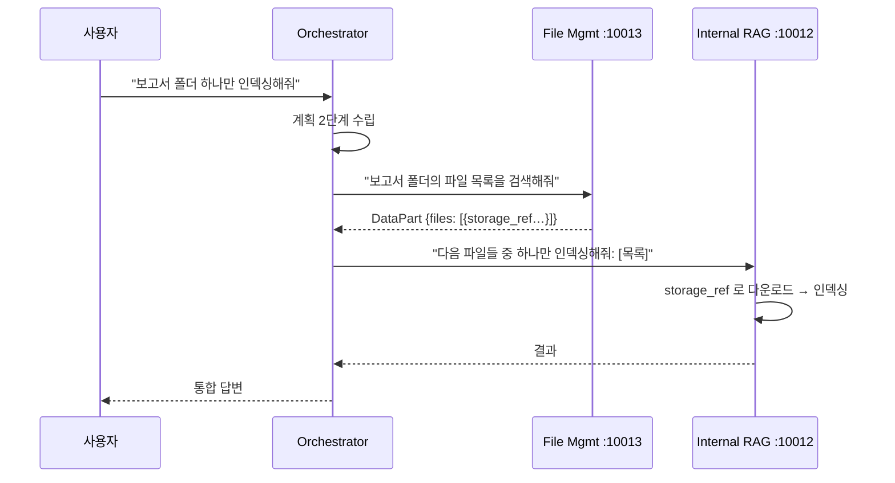
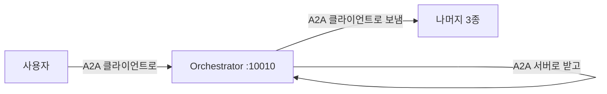

# 11.5 오케스트레이터 에이전트

> **저자 예제** — [`examples/orchestrator_agent/`](examples/orchestrator_agent) (`agent.py` · `agent_executor.py` · `agent_server.py`) · [`examples/common/a2a_client.py`](examples/common/a2a_client.py)
> **공식 문서** — [LangChain · Subagents](https://docs.langchain.com/oss/python/langchain/multi-agent/subagents)

> **여기까지** — 일하는 에이전트 셋을 다 만들었습니다(11.2 · 11.3 · 11.4절).
> **이 절의 질문** — 이제 **누가 이들을 부리지?**
> **다 읽으면** — 7장의 슈퍼바이저가 **A2A 너머로 확장된** 모습을 보게 됩니다. 그리고 **반복해서 나타나는 실패 유형** 하나를 알게 됩니다.

포트 **10010**. 이 시스템의 머리입니다.

## 11.5.1 [실습] 다중 작업을 위임하는 오케스트레이터 에이전트 만들기

### 세 단계로 일합니다


| 단계 | 메서드 | 모델 |
| :--- | :--- | :--- |
| ① 의도 분석·계획 | `analyze_intent` | **`gpt-4o-mini`** |
| ② 원격 호출 | `call_remote_agent` | — (LLM 없음) |
| ③ 결과 통합 | `generate_final_response` | **`gpt-4o`** |

> **모델을 나눠 쓴 것**을 보세요. 분류·계획은 싼 모델로, 최종 문장 생성은 좋은 모델로. [6.4.3절](../ch06_single-agent/06-04_create_agent%20%EC%83%81%EC%84%B8%20%EA%B5%AC%EC%A1%B0%20%EC%9D%B4%ED%95%B4%ED%95%98%EA%B8%B0.md)의 미들웨어가 대화 길이에 따라 모델을 바꾸던 것, [7.4절](../ch07_multi-agent/07-04_%EC%9B%B9%ED%8E%98%EC%9D%B4%EC%A7%80%EB%A5%BC%20%EC%9A%94%EC%95%BD%ED%95%B4%EC%84%9C%20%EB%8D%B0%EC%9D%B4%ED%84%B0%EB%B2%A0%EC%9D%B4%EC%8A%A4%EC%97%90%20%EC%A0%80%EC%9E%A5%ED%95%98%EB%8A%94%20%EC%97%90%EC%9D%B4%EC%A0%84%ED%8A%B8%20%23%EC%8A%88%ED%8D%BC%EB%B0%94%EC%9D%B4%EC%A0%80.md)에서 크롤링 청소에 싼 모델을 쓰던 것과 같은 판단입니다.

### 계획을 JSON으로 받습니다

```python
response = await self.openai_client.chat.completions.create(
    model="gpt-4o-mini",
    messages=[
        {"role": "system", "content": self.SYSTEM_PROMPT},
        {"role": "user", "content": query}
    ],
    response_format={"type": "json_object"}
)
return json.loads(response.choices[0].message.content)
```

`response_format={"type": "json_object"}`로 **JSON을 강제**합니다([1.2절](../ch01_llm-decision/01-02_LLM%EC%9D%84%20%EA%B8%B0%EB%B0%98%EC%9C%BC%EB%A1%9C%20%EC%9D%98%EC%82%AC%EA%B2%B0%EC%A0%95%ED%95%98%EB%8B%A4.md)의 구조화 출력).

받는 형식은 이렇습니다.

```json
{
    "intent": "INTERNAL_SEARCH|WEB_SEARCH|FILE_OPERATION|HYBRID|DIRECT",
    "plan": [
        {"agent": "에이전트명", "query": "사용자 의도를 포함한 자연어 요청"}
    ],
    "direct_answer": "직접 답변 가능한 경우 여기에 작성"
}
```

**`plan`이 목록**인 것이 [7.6절](../ch07_multi-agent/07-06_%EC%9E%90%EB%A3%8C%20%EC%A1%B0%EC%82%AC%20%EC%A0%84%EB%AC%B8%EA%B0%80%20%2B%20%EB%AC%B8%EC%84%9C%20%EC%9E%91%EC%84%B1%20%EC%A0%84%EB%AC%B8%EA%B0%80%20%EC%97%90%EC%9D%B4%EC%A0%84%ED%8A%B8%20%23%ED%94%8C%EB%9E%98%EB%8B%9D%20%EA%B8%B0%EB%B0%98%20%EC%8A%88%ED%8D%BC%EB%B0%94%EC%9D%B4%EC%A0%80.md)의 플래닝과 닮았습니다. 다만 **한 번만 세우고 재계획은 하지 않습니다.** 7.6절보다 단순한 대신 호출이 적습니다.

**`DIRECT` 인텐트가 있는 것**도 중요합니다. "안녕"에 에이전트를 부를 이유가 없습니다. [7.6절](../ch07_multi-agent/07-06_%EC%9E%90%EB%A3%8C%20%EC%A1%B0%EC%82%AC%20%EC%A0%84%EB%AC%B8%EA%B0%80%20%2B%20%EB%AC%B8%EC%84%9C%20%EC%9E%91%EC%84%B1%20%EC%A0%84%EB%AC%B8%EA%B0%80%20%EC%97%90%EC%9D%B4%EC%A0%84%ED%8A%B8%20%23%ED%94%8C%EB%9E%98%EB%8B%9D%20%EA%B8%B0%EB%B0%98%20%EC%8A%88%ED%8D%BC%EB%B0%94%EC%9D%B4%EC%A0%80.md)의 `ConversationalResponse`와 같은 가드입니다.

### 프롬프트의 절반이 "의도를 지켜라"입니다

**이 절에서 가장 배울 것이 많은 부분**입니다.

```
핵심 원칙:
1. 사용자의 **원래 의도**를 그대로 에이전트에게 전달하세요.
2. 에이전트가 스스로 판단할 수 있도록 자연어로 요청하세요.
3. "하나만", "전부", "3개" 같은 조건도 그대로 전달하세요.

잘못된 예 (의도 누락):
사용자: "보고서 폴더 파일 중 하나만 인덱싱해줘"
→ query: "보고서 폴더 파일을 인덱싱해줘"  ("하나만" 누락)

올바른 예 (의도 보존):
→ query: "보고서 폴더 파일 중 하나만 인덱싱해줘"  (원래 의도 유지)
```

**오케스트레이터가 질문을 다시 쓰면서 조건을 잃어버리는 문제**입니다.

[7.5절](../ch07_multi-agent/07-05_%EC%B5%9C%EC%8B%A0%20%EB%AC%B8%EC%84%9C%20%EA%B2%80%EC%83%89%20%2B%20%EB%82%B4%EB%B6%80%20DB%20%EA%B2%80%EC%83%89%20%2B%20%ED%85%9C%ED%94%8C%EB%A6%BF%20%EB%8B%B5%EB%B3%80%203%EC%A4%91%20%EB%A9%80%ED%8B%B0%20%EC%97%90%EC%9D%B4%EC%A0%84%ED%8A%B8%20%23%EC%8A%88%ED%8D%BC%EB%B0%94%EC%9D%B4%EC%A0%80.md)의 핸드오프 도구에도 `(최대한 원본 쿼리를 유지)`라는 괄호가 있었습니다. **같은 문제가 반복해서 나타난다는 뜻**입니다.

> **[3.2절](../ch03_architecture/03-02_%EB%A9%80%ED%8B%B0%20%EC%97%90%EC%9D%B4%EC%A0%84%ED%8A%B8.md)에서 말한 "무엇을 넘길지가 핸드오프 설계의 핵심"** 이 여기서 구체적인 실패로 나타납니다. 너무 많이 넘기면 컨텍스트가 낭비되고, **요약하면 조건이 사라집니다.**
>
> 실무에서는 **원본 질문을 그대로 함께 넘기고** 재작성본은 참고용으로 두는 방법도 씁니다.

### 두 단계 작업을 프롬프트로 가르칩니다

```
=== 파일 인덱싱 워크플로우 (2단계) ===

사용자: "보고서 폴더 파일 중 하나만 DB에 인덱싱해줘"
→ plan: [
    {"agent": "file_management", "query": "보고서 폴더의 파일 목록을 검색해줘"},
    {"agent": "internal_rag", "query": "다음 파일들 중 하나만 인덱싱해줘: [파일 목록]"}
  ]
```

**"인덱싱"이 한 에이전트로 안 되는 이유**를 기억하세요. [11.1절](11-01_%EC%98%A4%EC%BC%80%EC%8A%A4%ED%8A%B8%EB%A0%88%EC%9D%B4%ED%84%B0%20%EA%B8%B0%EB%B0%98%20%EB%A9%80%ED%8B%B0%20%EC%97%90%EC%9D%B4%EC%A0%84%ED%8A%B8%20%EC%84%A4%EA%B3%84.md)의 `storage_ref` 구조 때문입니다.



**계획의 순서가 데이터 흐름을 만듭니다.** 파일 목록을 먼저 받아야 RAG 에이전트에 넘길 수 있습니다.

> **이 순서를 프롬프트의 예시로 가르쳤다**는 점이 중요합니다. 코드가 아니라 예시입니다. [1.4절](../ch01_llm-decision/01-04_LLM%20%EA%B8%B0%EB%B0%98%20%EC%97%90%EC%9D%B4%EC%A0%84%ED%8A%B8%20%EC%8B%9C%EC%8A%A4%ED%85%9C%2C%20%EC%9D%B4%EB%9F%B0%20%EA%B5%AC%EC%A1%B0%EB%A1%9C%20%EC%84%A4%EA%B3%84%EB%90%9C%EB%8B%A4.md)의 기준으로 보면 **자율에 맡긴 부분**입니다. 순서가 늘 같다면 워크플로로 고정하는 편이 안정적입니다 — **직접 만들 때 바꿔 볼 만한 지점**입니다.

### 결과를 꺼내는 코드가 방어적입니다

```python
result = response.root.result if hasattr(response, 'root') else response.result

if hasattr(result, 'artifacts') and result.artifacts:
    for artifact in result.artifacts:
        for part in artifact.parts:
            if hasattr(part, 'root'):
                part_root = part.root
                if hasattr(part_root, 'text'):        # TextPart
                    content = part_root.text
                elif hasattr(part_root, 'data'):      # DataPart
                    artifact_data["data"] = data

# history에서 마지막 agent 메시지 추출 (backup)
if not content and hasattr(result, 'history') and result.history:
    ...
```

**`TextPart`와 `DataPart`를 모두 처리**합니다. [11.2절](11-02_%ED%8C%8C%EC%9D%BC%20%EA%B4%80%EB%A6%AC%EB%A5%BC%20%EC%9C%84%ED%95%9C%20%EC%97%90%EC%9D%B4%EC%A0%84%ED%8A%B8.md)은 데이터를, [11.4절](11-04_%EC%9B%B9%20%EA%B2%80%EC%83%89%20%EC%97%90%EC%9D%B4%EC%A0%84%ED%8A%B8.md)은 텍스트를 보내니 둘 다 받아야 합니다.

**Artifact가 없으면 `history`에서 꺼내는 대비책**까지 있습니다. [10.3.4절](../ch10_a2a/10-03_A2A%EC%9D%98%20%EA%B8%B0%EB%B3%B8%20%EC%82%AC%EC%9A%A9%EB%B2%95%20%EC%9D%B4%ED%95%B4%ED%95%98%EA%B8%B0.md)에서 "응답 구조가 깊어 `hasattr` 검사가 많아진다"고 한 것이 실전 규모로 커진 모습입니다.

로그가 촘촘히 박혀 있는 것도 같은 이유입니다.

```python
logger.info(f"[ORCHESTRATOR] [REMOTE] part.root type: {type(part_root)}")
```

> **저자가 디버깅하며 넣은 흔적**입니다. 여러 서버가 얽히면 **어디서 어긋났는지 찾는 게 제일 어렵습니다.** 로그를 남기는 습관이 여기서 값어치를 합니다.

### `common/a2a_client.py`도 있습니다

같은 일을 하는 래퍼가 [`common/`](examples/common/a2a_client.py)에도 있습니다(254줄). 스트리밍 지원(`send_streaming_message`)까지 들어 있습니다.

**오케스트레이터는 이걸 쓰지 않고 자체 구현**을 씁니다. 재사용 가능한 공통 코드를 뽑아 뒀지만 정작 안 쓴 셈인데, **학습 저장소에서는 흔한 일**입니다. 직접 만들 때는 `common/` 쪽으로 통일하는 게 낫습니다.

## 11.5.2 · 11.5.3 A2A 실행기와 서버

**오케스트레이터도 A2A 서버**입니다([11.1절](11-01_%EC%98%A4%EC%BC%80%EC%8A%A4%ED%8A%B8%EB%A0%88%EC%9D%B4%ED%84%B0%20%EA%B8%B0%EB%B0%98%20%EB%A9%80%ED%8B%B0%20%EC%97%90%EC%9D%B4%EC%A0%84%ED%8A%B8%20%EC%84%A4%EA%B3%84.md)). 실행기·서버 구조가 나머지 셋과 같고 **포트만 10010**입니다.

**클라이언트이자 서버**라는 점이 [10.2.1절](../ch10_a2a/10-02_A2A%EC%9D%98%20%EA%B5%AC%EC%84%B1%20%EC%9A%94%EC%86%8C%EC%99%80%20%EB%8F%99%EC%9E%91%20%ED%9D%90%EB%A6%84%20%EC%9D%B4%ED%95%B4%ED%95%98%EA%B8%B0.md)의 "역할은 고정이 아니다"를 그대로 보여 줍니다.



> **`initialize()`에서 세 에이전트에 붙습니다.** 하나가 안 떠 있으면 그 에이전트만 빠지고 나머지로 동작합니다 — `try/except`로 감싸 뒀습니다. [10.4절](../ch10_a2a/10-04_MCP%EC%99%80%20A2A%EB%A5%BC%20%ED%99%9C%EC%9A%A9%ED%95%9C%20%EB%A9%80%ED%8B%B0%20%EC%97%90%EC%9D%B4%EC%A0%84%ED%8A%B8%20%EA%B5%AC%EC%B6%95%ED%95%98%EA%B8%B0.md)의 에러 내성과 같은 태도입니다.

## 요약 및 비유

**프로젝트 총괄 PM**입니다. 요청을 받아 **작업 순서를 짜고**(계획), 부서에 **원래 요구사항을 그대로 전달하고**(의도 보존), 결과를 모아 **하나의 보고서로** 냅니다. 계획은 싼 인력이, 최종 보고서는 숙련자가 씁니다(모델 분리).

| 개념 | PM 비유 | 기술적 의미 |
| :--- | :--- | :--- |
| **3단계** | 계획 → 발주 → 취합 | analyze / call / generate |
| **모델 분리** | 계획은 주니어, 보고서는 시니어 | mini vs 4o |
| **`json_object`** | 정해진 계획 서식 | 구조화 출력 |
| **`plan` 목록** | 작업 순서표 | 다단계 위임 |
| **`DIRECT`** | 회의 없이 바로 답변 | 불필요한 호출 차단 |
| **의도 보존** | 요구사항을 고쳐 쓰지 않기 | "하나만" 누락 방지 |
| **2단계 인덱싱** | 목록 받고 → 처리 지시 | `storage_ref` 흐름 |
| **Text/Data 모두 처리** | 보고서와 표를 다 받음 | Part 종류별 분기 |
| **`history` 대비책** | 공문이 없으면 회의록 확인 | Artifact 없을 때 |
| **촘촘한 로그** | 진행 기록 남기기 | 다중 서버 디버깅 |
| **클라이언트 겸 서버** | 본사도 상위에 보고 | 역할 이중성 |

## 결론

* 오케스트레이터는 **의도 분석 → 원격 호출 → 결과 통합** 세 단계로 일합니다.
* **모델을 나눠 씁니다** — 계획은 `gpt-4o-mini`, 최종 통합은 `gpt-4o`. 앞 장들에서 반복된 비용 판단입니다.
* 계획은 **`json_object`로 강제**해 받고, `plan`이 목록이라 **다단계 위임**이 가능합니다.
* **`DIRECT` 인텐트**로 "안녕"에 에이전트를 안 부릅니다. [7.6절](../ch07_multi-agent/07-06_%EC%9E%90%EB%A3%8C%20%EC%A1%B0%EC%82%AC%20%EC%A0%84%EB%AC%B8%EA%B0%80%20%2B%20%EB%AC%B8%EC%84%9C%20%EC%9E%91%EC%84%B1%20%EC%A0%84%EB%AC%B8%EA%B0%80%20%EC%97%90%EC%9D%B4%EC%A0%84%ED%8A%B8%20%23%ED%94%8C%EB%9E%98%EB%8B%9D%20%EA%B8%B0%EB%B0%98%20%EC%8A%88%ED%8D%BC%EB%B0%94%EC%9D%B4%EC%A0%80.md)의 가드와 같습니다.
* **프롬프트의 절반이 "의도를 지켜라"** 입니다. 오케스트레이터가 질문을 다시 쓰며 "하나만" 같은 조건을 잃는 문제가 실제로 납니다.
* 같은 경고가 [7.5절](../ch07_multi-agent/07-05_%EC%B5%9C%EC%8B%A0%20%EB%AC%B8%EC%84%9C%20%EA%B2%80%EC%83%89%20%2B%20%EB%82%B4%EB%B6%80%20DB%20%EA%B2%80%EC%83%89%20%2B%20%ED%85%9C%ED%94%8C%EB%A6%BF%20%EB%8B%B5%EB%B3%80%203%EC%A4%91%20%EB%A9%80%ED%8B%B0%20%EC%97%90%EC%9D%B4%EC%A0%84%ED%8A%B8%20%23%EC%8A%88%ED%8D%BC%EB%B0%94%EC%9D%B4%EC%A0%80.md)에도 있었습니다 — **반복되는 실패 유형**입니다.
* 파일 인덱싱이 **2단계인 이유는 `storage_ref` 구조** 때문입니다. 이 순서를 **프롬프트 예시로 가르쳤는데**, 순서가 고정이라면 워크플로로 굳히는 편이 안정적입니다.
* 결과 추출이 방어적입니다 — **`TextPart`와 `DataPart`를 모두**, Artifact가 없으면 **`history`에서**.
* **로그가 촘촘한 것은 다중 서버 디버깅이 어렵기 때문**입니다.
* **오케스트레이터도 A2A 서버**입니다. 클라이언트이자 서버라는 이중 역할이 A2A의 성격을 잘 보여 줍니다.

---

## 다음 절로

**부품은 전부 만들었습니다.** 머리 하나에 손발 셋.

**그런데 아직 한 번도 돌려 보지 않았습니다.** 네 개를 동시에 띄우면 무슨 일이 벌어질까요? → **[11.6절](11-06_%EC%98%A4%EC%BC%80%EC%8A%A4%ED%8A%B8%EB%A0%88%EC%9D%B4%ED%84%B0%20%EA%B8%B0%EB%B0%98%20%EB%A9%80%ED%8B%B0%20%EC%97%90%EC%9D%B4%EC%A0%84%ED%8A%B8%20%EC%8B%9C%EC%8A%A4%ED%85%9C%20%EC%84%9C%EB%B2%84%20%EA%B5%AC%EB%8F%99%20%EB%B0%8F%20%EC%9E%91%EC%97%85%20%EC%8B%A4%ED%96%89.md)**

---

[⬅ 11.4](11-04_%EC%9B%B9%20%EA%B2%80%EC%83%89%20%EC%97%90%EC%9D%B4%EC%A0%84%ED%8A%B8.md) · [Chapter 11](README.md) · [11.6 ➡](11-06_%EC%98%A4%EC%BC%80%EC%8A%A4%ED%8A%B8%EB%A0%88%EC%9D%B4%ED%84%B0%20%EA%B8%B0%EB%B0%98%20%EB%A9%80%ED%8B%B0%20%EC%97%90%EC%9D%B4%EC%A0%84%ED%8A%B8%20%EC%8B%9C%EC%8A%A4%ED%85%9C%20%EC%84%9C%EB%B2%84%20%EA%B5%AC%EB%8F%99%20%EB%B0%8F%20%EC%9E%91%EC%97%85%20%EC%8B%A4%ED%96%89.md)
