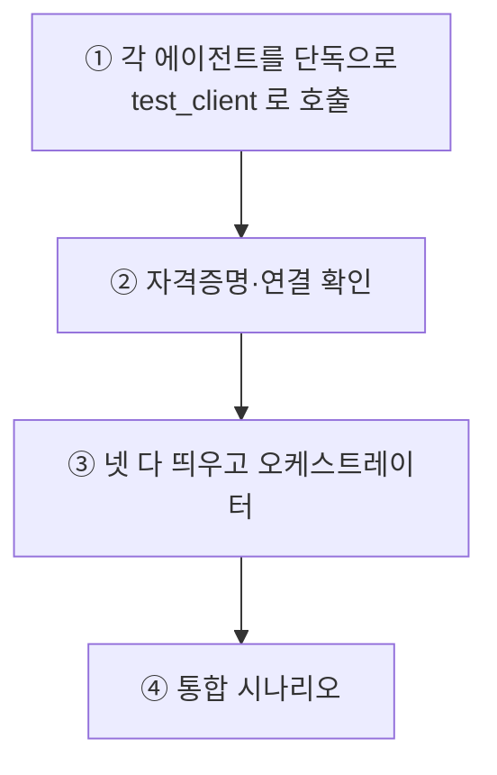
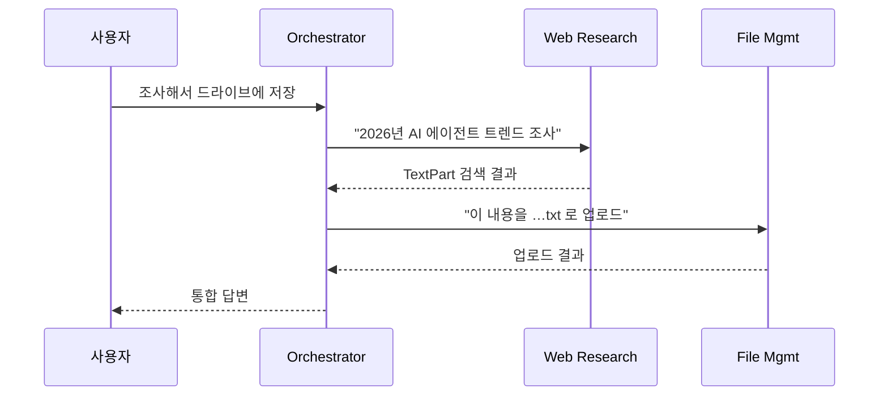

# 11.6 오케스트레이터 기반 멀티 에이전트 시스템 서버 구동 및 작업 실행

> **저자 예제** — [`examples/test_client.py`](examples/test_client.py) · [`examples/README.md`](examples/README.md)
> **공식 문서** — [Application structure](https://docs.langchain.com/oss/python/langgraph/application-structure) · [Run a local server](https://docs.langchain.com/oss/python/langgraph/local-server)

> **여기까지** — 에이전트 넷을 다 만들었습니다(11.2 ~ 11.5절).
> **이 절의 질문** — **전부 띄우고 실제로 돌리면** 어떻게 되지?
> **다 읽으면** — **이 책이 끝납니다.** 그리고 다중 서버를 디버깅하는 법을 알게 됩니다.

만든 것을 전부 띄우고 돌려 봅니다. **이 책의 마지막 실습**입니다.

## 11.6.1 [실습] 4종 에이전트 서버 모두 실행하기

### 터미널 네 개 + 하나

```powershell
# 터미널 1 — Web Research
cd ch11_final-project\examples\web_research_agent
python agent_server.py          # :10011
```

```powershell
# 터미널 2 — Internal RAG
cd ch11_final-project\examples\internal_rag_agent
python agent_server.py          # :10012
```

```powershell
# 터미널 3 — File Management
cd ch11_final-project\examples\file_management_agent
python agent_server.py          # :10013
```

```powershell
# 터미널 4 — Orchestrator (마지막에)
cd ch11_final-project\examples\orchestrator_agent
python agent_server.py          # :10010
```

```powershell
# 터미널 5 — 테스트 클라이언트
cd ch11_final-project\examples
python test_client.py
```

> **순서가 중요합니다.** 오케스트레이터는 시작할 때 나머지 셋의 카드를 읽습니다([11.5절](11-05_%EC%98%A4%EC%BC%80%EC%8A%A4%ED%8A%B8%EB%A0%88%EC%9D%B4%ED%84%B0%20%EC%97%90%EC%9D%B4%EC%A0%84%ED%8A%B8.md)). **셋을 먼저 띄우고 오케스트레이터를 마지막에** 띄우세요.
>
> 다만 `try/except`로 감싸 뒀으니 하나가 빠져도 나머지로 동작은 합니다. 시작 로그에 **연결된 에이전트 수**가 찍히니 확인하세요.
>
> ```
> [ORCHESTRATOR] [INIT] 초기화 완료 (연결된 에이전트: 3개)
> ```

### 뜨기 전에 확인할 것

| 항목 | 없으면 |
| :--- | :--- |
| `.env`의 `OPENAI_API_KEY` | 전부 실패 |
| `TAVILY_API_KEY` | Web Research만 실패 |
| Supabase URL·키 + 테이블 | Internal RAG만 실패 |
| `credentials.json` | File Management·RAG 실패 |
| **포트 10010~10013이 비어 있는지** | 기동 실패 |

**에이전트를 하나씩 따로 시험해 보고 합치는 것**을 권합니다([11.2.5절](11-02_%ED%8C%8C%EC%9D%BC%20%EA%B4%80%EB%A6%AC%EB%A5%BC%20%EC%9C%84%ED%95%9C%20%EC%97%90%EC%9D%B4%EC%A0%84%ED%8A%B8.md)). 넷을 동시에 띄우고 문제를 만나면 원인이 어디인지 찾기 어렵습니다.



## 11.6.2 [실습] 에이전트 테스트를 위한 코드 만들기

[`test_client.py`](examples/test_client.py)는 [10.3.4절](../ch10_a2a/10-03_A2A%EC%9D%98%20%EA%B8%B0%EB%B3%B8%20%EC%82%AC%EC%9A%A9%EB%B2%95%20%EC%9D%B4%ED%95%B4%ED%95%98%EA%B8%B0.md)의 클라이언트와 같은 구조입니다. **오케스트레이터(:10010)만 부릅니다.**

```python
orchestrator_url = "http://localhost:10010"
```

**사용자는 에이전트가 넷인지 모릅니다.** 오케스트레이터 하나만 상대합니다 — [7.4절](../ch07_multi-agent/07-04_%EC%9B%B9%ED%8E%98%EC%9D%B4%EC%A7%80%EB%A5%BC%20%EC%9A%94%EC%95%BD%ED%95%B4%EC%84%9C%20%EB%8D%B0%EC%9D%B4%ED%84%B0%EB%B2%A0%EC%9D%B4%EC%8A%A4%EC%97%90%20%EC%A0%80%EC%9E%A5%ED%95%98%EB%8A%94%20%EC%97%90%EC%9D%B4%EC%A0%84%ED%8A%B8%20%23%EC%8A%88%ED%8D%BC%EB%B0%94%EC%9D%B4%EC%A0%80.md)에서 말한 **"마치 하나가 한 것처럼"** 입니다.

### 타임아웃이 600초입니다

```python
async with httpx.AsyncClient(timeout=600.0) as client:  # 10분 타임아웃
```

**10분입니다.** [10.4절](../ch10_a2a/10-04_MCP%EC%99%80%20A2A%EB%A5%BC%20%ED%99%9C%EC%9A%A9%ED%95%9C%20%EB%A9%80%ED%8B%B0%20%EC%97%90%EC%9D%B4%EC%A0%84%ED%8A%B8%20%EA%B5%AC%EC%B6%95%ED%95%98%EA%B8%B0.md)의 60초보다 훨씬 깁니다.

왜냐하면 **한 요청에 이만큼 일어납니다.**

```
오케스트레이터 LLM (계획)
  → 파일 관리 에이전트 (LLM + Drive API 여러 번)
  → RAG 에이전트 (다운로드 + 텍스트 추출 + 임베딩 + 저장)
  → 오케스트레이터 LLM (통합)
```

**멀티 에이전트의 대가가 지연으로 나타나는 지점**입니다([3.2절](../ch03_architecture/03-02_%EB%A9%80%ED%8B%B0%20%EC%97%90%EC%9D%B4%EC%A0%84%ED%8A%B8.md)). 파일 여러 개를 인덱싱하면 몇 분이 걸립니다.

> **타임아웃이 세 군데에 있습니다** — 테스트 클라이언트(600초), 오케스트레이터의 `httpx`(120초), `common/a2a_client.py`(120초). **바깥이 더 길어야** 합니다. 안쪽이 더 길면 바깥이 먼저 끊깁니다.

### 응답 추출도 방어적입니다

```python
# 1. artifacts에서 응답 찾기 (최우선)
if hasattr(result, 'artifacts') and result.artifacts:
    ...
```

[11.5절](11-05_%EC%98%A4%EC%BC%80%EC%8A%A4%ED%8A%B8%EB%A0%88%EC%9D%B4%ED%84%B0%20%EC%97%90%EC%9D%B4%EC%A0%84%ED%8A%B8.md)의 오케스트레이터와 같은 패턴입니다. **Artifact 우선, 없으면 대비책**([10.2.3절](../ch10_a2a/10-02_A2A%EC%9D%98%20%EA%B5%AC%EC%84%B1%20%EC%9A%94%EC%86%8C%EC%99%80%20%EB%8F%99%EC%9E%91%20%ED%9D%90%EB%A6%84%20%EC%9D%B4%ED%95%B4%ED%95%98%EA%B8%B0.md)).

## 11.6.3 [실습] 다중 작업 요청하고 결과물 확인하기

저자가 준비한 세 시나리오가 **난이도 순**입니다.

### ① 웹 검색 → 파일 저장

```
"2026년 AI 에이전트 트렌드를 조사해서 'AI_에이전트_트렌드_2026.txt' 이름으로
 드라이브에 저장해줘"
```



**두 에이전트를 순서대로** 씁니다. 앞의 결과가 뒤의 입력이 됩니다.

**확인할 것** — 파일명 `AI_에이전트_트렌드_2026.txt`가 **그대로 지켜졌는가**. [11.5절](11-05_%EC%98%A4%EC%BC%80%EC%8A%A4%ED%8A%B8%EB%A0%88%EC%9D%B4%ED%84%B0%20%EC%97%90%EC%9D%B4%EC%A0%84%ED%8A%B8.md)의 "의도 보존" 문제가 여기서 드러납니다. 오케스트레이터가 파일명을 바꿔 버리면 실패입니다.

### ② 파일 인덱싱 워크플로우

```
"보고서 폴더에 있는 파일들 중 하나만 DB에 인덱싱해줘"
```

**[11.5절](11-05_%EC%98%A4%EC%BC%80%EC%8A%A4%ED%8A%B8%EB%A0%88%EC%9D%B4%ED%84%B0%20%EC%97%90%EC%9D%B4%EC%A0%84%ED%8A%B8.md)의 2단계 워크플로**입니다. 파일 목록을 받아 `storage_ref`로 넘깁니다.

**확인할 것** — **"하나만"이 지켜졌는가.** 이 조건이 사라지면 폴더 전체가 인덱싱됩니다. 프롬프트가 그렇게 강조한 이유를 여기서 눈으로 봅니다.

> **미리 준비가 필요합니다.** 드라이브에 "보고서" 폴더를 만들고 PDF나 워드 파일을 몇 개 올려 두세요.

### ③ RAG 검색 + 출처

```
"인덱싱된 문서에서 AI 에이전트의 주요 트렌드에 대해 뭐라고 언급하고 있나요?
 원본 파일 위치도 알려주세요."
```

**②를 먼저 해야 결과가 나옵니다.** 인덱싱된 게 없으면 검색할 것도 없습니다.

**확인할 것** — **"원본 파일 위치"** 를 함께 답하는가. [6.5절](../ch06_single-agent/06-05_RAG%EB%A5%BC%20%EC%9C%84%ED%95%9C%20%EC%97%90%EC%9D%B4%EC%A0%84%ED%8A%B8%20%EB%A7%8C%EB%93%A4%EA%B8%B0.md)에서 "출처(페이지 번호)를 반드시 명시"하라고 한 것과 같은 요구입니다. **RAG의 신뢰는 출처에서 나옵니다.**

> 실행 결과는 검색 시점·드라이브 상태·모델에 따라 매번 달라지므로 이 노트에는 싣지 않았습니다. **직접 돌려 보고 [`practice/`](practice)에 기록**하세요.

### 잘 안 될 때 보는 곳

| 증상 | 어디를 보나 |
| :--- | :--- |
| 오케스트레이터가 엉뚱한 에이전트를 부름 | **AgentCard의 `description`**([11.5절](11-05_%EC%98%A4%EC%BC%80%EC%8A%A4%ED%8A%B8%EB%A0%88%EC%9D%B4%ED%84%B0%20%EC%97%90%EC%9D%B4%EC%A0%84%ED%8A%B8.md)) |
| "하나만" 같은 조건이 사라짐 | 오케스트레이터 프롬프트의 의도 보존 규칙 |
| 인덱싱이 안 됨 | `storage_ref`가 넘어갔는지 — **`DataPart`인지 확인** |
| 응답이 비어 있음 | Artifact를 넣었는지(`add_artifact` → `complete`) |
| 어디서 끊겼는지 모르겠음 | **각 서버 터미널의 로그** |

**마지막이 실질적입니다.** 서버 넷의 로그를 나란히 놓고 보면 **어느 단계에서 멈췄는지** 보입니다. [11.5절](11-05_%EC%98%A4%EC%BC%80%EC%8A%A4%ED%8A%B8%EB%A0%88%EC%9D%B4%ED%84%B0%20%EC%97%90%EC%9D%B4%EC%A0%84%ED%8A%B8.md)에서 로그가 촘촘한 이유입니다.

## 여기까지 온 길

이 시스템 하나에 열한 장이 전부 들어 있습니다.

| 장 | 이 프로젝트에서 |
| :--- | :--- |
| [1장](../ch01_llm-decision/01-04_LLM%20%EA%B8%B0%EB%B0%98%20%EC%97%90%EC%9D%B4%EC%A0%84%ED%8A%B8%20%EC%8B%9C%EC%8A%A4%ED%85%9C%2C%20%EC%9D%B4%EB%9F%B0%20%EA%B5%AC%EC%A1%B0%EB%A1%9C%20%EC%84%A4%EA%B3%84%EB%90%9C%EB%8B%A4.md) | 워크플로와 자율을 섞은 구조 |
| [2장](../ch02_core-elements/02-04_ReAct%20%EA%B8%B0%EB%B0%98%20LLM%20%EC%97%90%EC%9D%B4%EC%A0%84%ED%8A%B8.md) | 추론·도구·메모리 |
| [3장](../ch03_architecture/03-03_%EC%96%B4%EB%96%A4%20%EC%97%90%EC%9D%B4%EC%A0%84%ED%8A%B8%EB%A5%BC%20%EC%84%A4%EA%B3%84%ED%95%B4%EC%95%BC%20%ED%95%A0%EA%B9%8C.md) | 출처·권한으로 나눈 분리 기준 |
| [4장](../ch04_dev-env/04-03_%ED%99%98%EA%B2%BD%EB%B3%80%EC%88%98%20%EC%84%A4%EC%A0%95%ED%95%98%EA%B8%B0.md) | `.env`와 자격증명 관리 |
| [5장](../ch05_langgraph-basics/05-02_%EB%9E%AD%EA%B7%B8%EB%9E%98%ED%94%84%20%EA%B8%B0%EB%B3%B8%20%EA%B0%9C%EB%85%90%20%EC%9D%B4%ED%95%B4%ED%95%98%EA%B3%A0%20%EC%A0%81%EC%9A%A9%ED%95%98%EA%B8%B0.md) | RAG 에이전트의 그래프·조건부 엣지 |
| [6장](../ch06_single-agent/06-04_create_agent%20%EC%83%81%EC%84%B8%20%EA%B5%AC%EC%A1%B0%20%EC%9D%B4%ED%95%B4%ED%95%98%EA%B8%B0.md) | `create_agent`·도구·구조화 출력·RAG |
| [7장](../ch07_multi-agent/07-06_%EC%9E%90%EB%A3%8C%20%EC%A1%B0%EC%82%AC%20%EC%A0%84%EB%AC%B8%EA%B0%80%20%2B%20%EB%AC%B8%EC%84%9C%20%EC%9E%91%EC%84%B1%20%EC%A0%84%EB%AC%B8%EA%B0%80%20%EC%97%90%EC%9D%B4%EC%A0%84%ED%8A%B8%20%23%ED%94%8C%EB%9E%98%EB%8B%9D%20%EA%B8%B0%EB%B0%98%20%EC%8A%88%ED%8D%BC%EB%B0%94%EC%9D%B4%EC%A0%80.md) | 오케스트레이터의 계획·배분·통합 |
| [8장](../ch08_memory/08-02_%EB%8C%80%ED%99%94%20%EB%A7%A5%EB%9D%BD%EC%9D%84%20%EC%9D%B4%ED%95%B4%ED%95%98%EB%8A%94%20%EC%97%90%EC%9D%B4%EC%A0%84%ED%8A%B8.md) | 체크포인터·벡터 저장소 |
| [9장](../ch09_mcp/09-05_%EB%9E%AD%EA%B7%B8%EB%9E%98%ED%94%84%EC%97%90%EC%84%9C%20MCP%20%EA%B8%B0%EB%B0%98%20%EB%A9%80%ED%8B%B0%20%EC%97%90%EC%9D%B4%EC%A0%84%ED%8A%B8%20%EA%B5%AC%ED%98%84%ED%95%98%EA%B8%B0.md) | Web Research의 Tavily MCP |
| [10장](../ch10_a2a/10-04_MCP%EC%99%80%20A2A%EB%A5%BC%20%ED%99%9C%EC%9A%A9%ED%95%9C%20%EB%A9%80%ED%8B%B0%20%EC%97%90%EC%9D%B4%EC%A0%84%ED%8A%B8%20%EA%B5%AC%EC%B6%95%ED%95%98%EA%B8%B0.md) | 에이전트 간 A2A 통신 |

**다음에 무엇을 할까요.** [`practice/`](practice)에 직접 만들어 볼 것을 하나 정해 보세요. 에이전트를 하나 더 붙이는 것(예: 캘린더, 슬랙)이 좋은 연습입니다. **`common/config.py`에 한 줄, 폴더 하나에 세 파일** — 이 구조가 왜 그렇게 생겼는지 그때 알게 됩니다.

## 요약 및 비유

**개통식**입니다. 부서 넷이 각자 사무실을 열고(서버 기동), 본사가 연결을 확인하고(카드 조회), 실제 업무를 흘려 봅니다(통합 시나리오). 문제가 나면 **각 사무실 일지**(로그)를 나란히 놓고 어디서 멈췄는지 찾습니다.

| 개념 | 개통식 비유 | 기술적 의미 |
| :--- | :--- | :--- |
| **터미널 5개** | 사무실 넷 + 민원인 | 독립 프로세스 |
| **기동 순서** | 부서 먼저, 본사 나중 | 카드 조회 시점 |
| **연결 수 로그** | 개통 확인서 | 초기화 결과 |
| **단독 시험 먼저** | 부서별 시운전 | 원인 분리 |
| **600초 타임아웃** | 긴 결재 기간 | 다단계 지연 |
| **타임아웃 계층** | 바깥이 더 길게 | 안쪽이 먼저 끊기면 안 됨 |
| **오케스트레이터만 호출** | 민원인은 본사만 | "하나가 한 것처럼" |
| **시나리오 3종** | 난이도별 시운전 | 단일→2단계→의존 |
| **"하나만" 확인** | 요구사항 준수 점검 | 의도 보존 검증 |
| **출처 확인** | 근거 자료 첨부 | RAG 신뢰성 |

## 결론

* **터미널이 다섯 개** 필요합니다. 작업 에이전트 셋을 먼저 띄우고 **오케스트레이터를 마지막에** 띄웁니다.
* 시작 로그의 **연결된 에이전트 수**로 확인하세요. 하나가 빠져도 나머지로 동작합니다.
* **에이전트를 하나씩 단독으로 시험한 뒤 합치세요.** 넷을 동시에 띄우고 문제를 만나면 원인 찾기가 어렵습니다.
* 사용자는 **오케스트레이터 하나만** 상대합니다. 에이전트가 넷인지 모릅니다.
* 타임아웃이 **600초**인 이유는 한 요청에 LLM 호출과 API 호출이 여러 번 일어나기 때문입니다. **바깥 타임아웃이 안쪽보다 길어야** 합니다.
* 시나리오 세 개는 난이도 순입니다 — **순차 2단계 → `storage_ref` 워크플로 → 앞 결과 의존**.
* 확인 포인트는 **파일명이 지켜졌는가 · "하나만"이 지켜졌는가 · 출처를 밝혔는가** 셋입니다. 전부 앞 절들에서 강조한 것입니다.
* 문제가 나면 **서버 넷의 로그를 나란히** 보세요. 다중 에이전트에서 가장 어려운 것이 "어디서 멈췄는가"입니다.
* 다음 연습으로 **에이전트를 하나 더 붙여 보세요.** `config.py` 한 줄 + 세 파일이면 되는 구조의 값어치를 그때 알게 됩니다.

---

## 11장을 마치며

여섯 개 절을 한 줄로 이으면 이렇습니다.

> **시스템을 설계했고(11.1) → 파일·문서·웹 에이전트를 만들었고(11.2~11.4) → 이들을 부리는 머리를 얹었고(11.5) → 전부 띄워 실제로 돌렸습니다(11.6).**

### 그리고 책 전체를 한 줄로

> **LLM이 결정을 대신할 수 있음을 알았고(1장) → 도구·상태·루프라는 부품을 익혔고(2장) → 어떤 구조를 고를지 기준을 세웠고(3장) → 싱글(4~6장) · 멀티(7장) · 메모리(8장)를 만들었고 → 도구(9장)와 에이전트(10장)를 밖에서 가져와 → 전부 합쳐 하나의 시스템을 만들었습니다(11장).**

**11장에 새로 나온 개념은 거의 없습니다.** 전부 앞에서 나온 것의 조합입니다. 그게 이 장의 요점입니다.

| 11장에서 쓴 것 | 배운 곳 |
| :--- | :--- |
| `create_agent` · 도구 | 4 · 5장 |
| RAG · 벡터 검색 | 6.5절 |
| 슈퍼바이저 · 위임 | 7장 |
| 체크포인터 · `thread_id` | 8장 |
| MCP 도구 | 9장 |
| A2A · AgentCard | 10장 |

### 여기서 멈추지 않으려면

책은 끝났지만 시스템은 **덜 자란 상태**입니다. 다음 세 가지가 자연스러운 연습입니다.

- **에이전트를 하나 더 붙이기** — `config.py` 한 줄과 세 파일. 11.6절 마지막에서 말한 그 연습입니다
- **실패를 만들어 보기** — 에이전트 하나를 일부러 죽이고 오케스트레이터가 어떻게 반응하는지 보세요
- **직접 만든 도구를 MCP 서버로 빼기** — 9장의 방식으로. 다른 에이전트도 그 도구를 쓸 수 있게 됩니다

> **읽은 것과 만든 것은 다릅니다.** 이 저장소의 `practice/` 폴더는 그래서 있습니다. 노트를 덮고 빈 파일에서 다시 짜 보는 게 마지막 단계입니다.

---

[⬅ 11.5](11-05_%EC%98%A4%EC%BC%80%EC%8A%A4%ED%8A%B8%EB%A0%88%EC%9D%B4%ED%84%B0%20%EC%97%90%EC%9D%B4%EC%A0%84%ED%8A%B8.md) · [Chapter 11](README.md) · [전체 목차](../STUDY.md)
