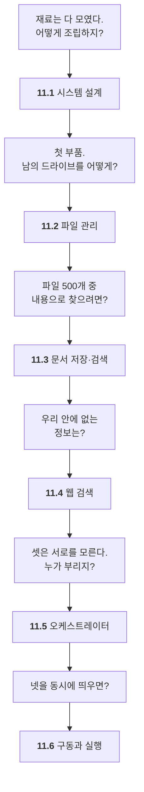

# Chapter 11 · 웹 검색 · RAG · 파일 관리 범용 멀티 에이전트

> Part 05 | 멀티 에이전트 실전 프로젝트

## 학습 목표

- 오케스트레이터 기반 범용 멀티 에이전트 시스템을 설계할 수 있다
- 구글 드라이브 API로 파일 관리 에이전트를 만들 수 있다
- 수파베이스 벡터 스토어로 문서 저장·검색 에이전트를 만들 수 있다
- 타빌리 MCP 기반 웹 검색 에이전트를 만들 수 있다
- 4종 에이전트 서버를 동시에 띄우고 다중 작업을 요청해 결과를 받을 수 있다

## 이 장의 이해 흐름

**새 개념은 거의 없습니다.** 앞 열 장에서 만든 부품을 하나의 시스템으로 조립하는 장입니다.



| 절 | 이 절의 질문 | 얻는 것 |
| :--- | :--- | :--- |
| **11.1** | 어떻게 조립하지? | 시스템 **설계도** — 나머지 절의 지도 |
| **11.2** | 남의 드라이브를? | **OAuth** · 파일 도구의 위험 |
| **11.3** | 내용으로 찾으려면? | **벡터 vs SQL** 검색 판단 (가장 큰 코드) |
| **11.4** | 밖의 정보는? | **MCP를 쓰면 코드가 줄어든다** (가장 작은 코드) |
| **11.5** | 누가 부리지? | 슈퍼바이저가 **A2A 너머로** |
| **11.6** | 동시에 띄우면? | 다중 서버 **디버깅** · 책의 마지막 실습 |

> **11.1을 먼저 읽으세요.** 11.2~11.6은 이 설계도의 부분입니다. 전체 그림 없이 부품부터 보면 왜 이렇게 나눴는지 알 수 없습니다.

> **11.3과 11.4를 나란히 보세요.** 979줄과 144줄입니다. **직접 만들 것과 가져다 쓸 것**을 어떻게 가르는지가 이 대비에 들어 있습니다.

### 11장 전체를 한 줄로

> **시스템을 설계했고(11.1) → 파일·문서·웹 에이전트를 만들었고(11.2~11.4) → 이들을 부리는 머리를 얹었고(11.5) → 전부 띄워 실제로 돌렸다(11.6).**

## 절별 노트

| 절 | 노트 파일 | 진도 |
| --- | --- | --- |
| 11.1 | [`11-01_오케스트레이터 기반 멀티 에이전트 설계.md`](11-01_%EC%98%A4%EC%BC%80%EC%8A%A4%ED%8A%B8%EB%A0%88%EC%9D%B4%ED%84%B0%20%EA%B8%B0%EB%B0%98%20%EB%A9%80%ED%8B%B0%20%EC%97%90%EC%9D%B4%EC%A0%84%ED%8A%B8%20%EC%84%A4%EA%B3%84.md) | ☐ |
| 11.2 | [`11-02_파일 관리를 위한 에이전트.md`](11-02_%ED%8C%8C%EC%9D%BC%20%EA%B4%80%EB%A6%AC%EB%A5%BC%20%EC%9C%84%ED%95%9C%20%EC%97%90%EC%9D%B4%EC%A0%84%ED%8A%B8.md) | ☐ |
| 11.3 | [`11-03_문서 저장·검색 에이전트.md`](11-03_%EB%AC%B8%EC%84%9C%20%EC%A0%80%EC%9E%A5%C2%B7%EA%B2%80%EC%83%89%20%EC%97%90%EC%9D%B4%EC%A0%84%ED%8A%B8.md) | ☐ |
| 11.4 | [`11-04_웹 검색 에이전트.md`](11-04_%EC%9B%B9%20%EA%B2%80%EC%83%89%20%EC%97%90%EC%9D%B4%EC%A0%84%ED%8A%B8.md) | ☐ |
| 11.5 | [`11-05_오케스트레이터 에이전트.md`](11-05_%EC%98%A4%EC%BC%80%EC%8A%A4%ED%8A%B8%EB%A0%88%EC%9D%B4%ED%84%B0%20%EC%97%90%EC%9D%B4%EC%A0%84%ED%8A%B8.md) | ☐ |
| 11.6 | [`11-06_오케스트레이터 기반 멀티 에이전트 시스템 서버 구동 및 작업 실행.md`](11-06_%EC%98%A4%EC%BC%80%EC%8A%A4%ED%8A%B8%EB%A0%88%EC%9D%B4%ED%84%B0%20%EA%B8%B0%EB%B0%98%20%EB%A9%80%ED%8B%B0%20%EC%97%90%EC%9D%B4%EC%A0%84%ED%8A%B8%20%EC%8B%9C%EC%8A%A4%ED%85%9C%20%EC%84%9C%EB%B2%84%20%EA%B5%AC%EB%8F%99%20%EB%B0%8F%20%EC%9E%91%EC%97%85%20%EC%8B%A4%ED%96%89.md) | ☐ |

<details><summary>소절까지 펼쳐보기</summary>

- [ ] **[11.1 오케스트레이터 기반 멀티 에이전트 설계](11-01_%EC%98%A4%EC%BC%80%EC%8A%A4%ED%8A%B8%EB%A0%88%EC%9D%B4%ED%84%B0%20%EA%B8%B0%EB%B0%98%20%EB%A9%80%ED%8B%B0%20%EC%97%90%EC%9D%B4%EC%A0%84%ED%8A%B8%20%EC%84%A4%EA%B3%84.md)**
  - [ ] 11.1.1 범용 에이전트를 위한 멀티 에이전트 설계하기
- [ ] **[11.2 파일 관리를 위한 에이전트](11-02_%ED%8C%8C%EC%9D%BC%20%EA%B4%80%EB%A6%AC%EB%A5%BC%20%EC%9C%84%ED%95%9C%20%EC%97%90%EC%9D%B4%EC%A0%84%ED%8A%B8.md)**
  - [ ] 11.2.1 [실습] 구글 드라이브 API 사용하기
  - [ ] 11.2.2 [실습] 파일 관리를 위한 구글 드라이브 클라이언트 구현하기
  - [ ] 11.2.3 [실습] 파일 관리 에이전트 만들기
  - [ ] 11.2.4 [실습] A2A 실행기 만들기
  - [ ] 11.2.5 [실습] 파일 관리 에이전트 실행을 위한 A2A 서버 만들기
- [ ] **[11.3 문서 저장·검색 에이전트](11-03_%EB%AC%B8%EC%84%9C%20%EC%A0%80%EC%9E%A5%C2%B7%EA%B2%80%EC%83%89%20%EC%97%90%EC%9D%B4%EC%A0%84%ED%8A%B8.md)**
  - [ ] 11.3.1 [실습] 문서 정보 저장을 위한 수파베이스 구축하기
  - [ ] 11.3.2 [실습] 문서 저장·검색 에이전트 만들기
  - [ ] 11.3.3 [실습] 에이전트 그래프 최종 형태 만들기
  - [ ] 11.3.4 [실습] A2A 실행기 만들기
  - [ ] 11.3.5 [실습] 문서 저장·검색 에이전트 실행을 위한 A2A 서버 만들기
- [ ] **[11.4 웹 검색 에이전트](11-04_%EC%9B%B9%20%EA%B2%80%EC%83%89%20%EC%97%90%EC%9D%B4%EC%A0%84%ED%8A%B8.md)**
  - [ ] 11.4.1 [실습] 타빌리 MCP 서버 기반 에이전트 만들기
  - [ ] 11.4.2 [실습] A2A 실행기 만들기
  - [ ] 11.4.3 [실습] 웹 검색 에이전트 실행을 위한 A2A 서버 만들기
- [ ] **[11.5 오케스트레이터 에이전트](11-05_%EC%98%A4%EC%BC%80%EC%8A%A4%ED%8A%B8%EB%A0%88%EC%9D%B4%ED%84%B0%20%EC%97%90%EC%9D%B4%EC%A0%84%ED%8A%B8.md)**
  - [ ] 11.5.1 [실습] 다중 작업을 위임하는 오케스트레이터 에이전트 만들기
  - [ ] 11.5.2 [실습] A2A 실행기 만들기
  - [ ] 11.5.3 [실습] 오케스트레이터 에이전트 실행을 위한 A2A 서버 만들기
- [ ] **[11.6 오케스트레이터 기반 멀티 에이전트 시스템 서버 구동 및 작업 실행](11-06_%EC%98%A4%EC%BC%80%EC%8A%A4%ED%8A%B8%EB%A0%88%EC%9D%B4%ED%84%B0%20%EA%B8%B0%EB%B0%98%20%EB%A9%80%ED%8B%B0%20%EC%97%90%EC%9D%B4%EC%A0%84%ED%8A%B8%20%EC%8B%9C%EC%8A%A4%ED%85%9C%20%EC%84%9C%EB%B2%84%20%EA%B5%AC%EB%8F%99%20%EB%B0%8F%20%EC%9E%91%EC%97%85%20%EC%8B%A4%ED%96%89.md)**
  - [ ] 11.6.1 [실습] 4종 에이전트 서버 모두 실행하기
  - [ ] 11.6.2 [실습] 에이전트 테스트를 위한 코드 만들기
  - [ ] 11.6.3 [실습] 다중 작업 요청하고 결과물 확인하기

</details>

## 관련 예제 코드

| 내용 | 경로 |
| --- | --- |
| 프로젝트 전체 안내 | [`examples/README.md`](examples/README.md) |
| 11.2 파일 관리 에이전트 | [`examples/file_management_agent`](examples/file_management_agent) |
| 11.3 문서 저장·검색(RAG) 에이전트 | [`examples/internal_rag_agent`](examples/internal_rag_agent) |
| 11.4 웹 검색 에이전트 | [`examples/web_research_agent`](examples/web_research_agent) |
| 11.5 오케스트레이터 에이전트 | [`examples/orchestrator_agent`](examples/orchestrator_agent) |
| 공통 모듈 | [`examples/common`](examples/common) |
| 11.6 테스트 클라이언트 | [`examples/test_client.py`](examples/test_client.py) |

## `.env` 두는 위치

장 폴더에 `.env`를 두면 됩니다. 구글 드라이브 `credentials.json`은 `examples/` 안, 실행하는 위치에 두세요.

```powershell
copy .env.example .env
```

## 참고 문서

| 무엇을 볼 때 | 문서 |
| --- | --- |
| 11.1 / 11.5 오케스트레이터 설계 | [Workflows and agents](https://docs.langchain.com/oss/python/langgraph/workflows-agents) · [Subagents](https://docs.langchain.com/oss/python/langchain/multi-agent/subagents) |
| 11.2 구글 드라이브 연동 | [Google Drive API](https://developers.google.com/workspace/drive/api/guides/about-sdk) · [OAuth 데스크톱 앱](https://developers.google.com/identity/protocols/oauth2/native-app) |
| 11.3 문서 저장·검색 (Supabase) | [Supabase · AI & Vectors](https://supabase.com/docs/guides/ai) |
| 11.4 웹 검색 | [Tavily 문서](https://docs.tavily.com/) |
| 11.6 서버 여러 개 띄우기 | [Application structure](https://docs.langchain.com/oss/python/langgraph/application-structure) · [Run a local server](https://docs.langchain.com/oss/python/langgraph/local-server) |
| 에이전트 간 통신 (A2A) | [A2A Specification](https://a2a-protocol.org/latest/specification/) |
| 전체 흐름 추적 | [LangSmith Observability](https://docs.langchain.com/oss/python/langgraph/observability) |

> 새 개념보다 6~10장의 조합입니다. 막히면 해당 장 노트로 돌아가는 게 빠릅니다.

## 이 폴더 구성

- `11-01_…md` ~ `11-06_…md` — 절별 학습 노트
- `notes.md` — 장 전체 요약 (절 노트를 다 쓴 뒤 마지막에 정리)
- `practice/` — 예제를 보지 않고 직접 쳐보는 공간
- `.env.example` — 이 장에 필요한 API 키. `copy .env.example .env` 후 값을 채우세요

> **메모**  
> 구글 드라이브 OAuth 자격증명(`credentials.json`)과 수파베이스 프로젝트가 모두 필요합니다. 11장 시작 전에 준비해두세요. 자격증명 파일은 절대 깃에 커밋하지 마세요.

---

[⬅ 전체 목차로](../STUDY.md)
