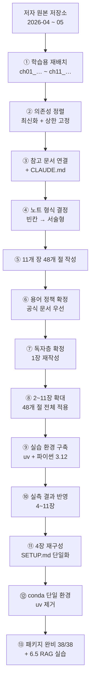

# 변경 이력

이 저장소가 **왜 지금 이 모양인지**를 남겨 둔 문서입니다.

커밋 메시지가 "무엇을 바꿨는가"라면, 여기는 **"왜 그렇게 정했는가"** 입니다. 특히 **하지 않기로 한 것들**이 나중에 다시 꺼내기 쉬우므로 아래쪽에 따로 모아 뒀습니다.

- 작업 규칙과 현재 진행 상태 → [CLAUDE.md](CLAUDE.md)
- 목차와 진도표 → [STUDY.md](STUDY.md)

---

## 한눈에 보기



| 단계 | 언제 | 무엇 |
| :--- | :--- | :--- |
| **원본** | 2026-04-06 ~ 05-01 | 저자(공원나연)의 실습 코드 저장소 |
| **①** | 2026-08-31 | 장별 폴더로 재배치, 커밋 작성자 교체 |
| **②** | 2026-08-31 | 의존성 최신화 + `mcp`·`a2a-sdk` 상한 고정 |
| **③** | 2026-08-31 | 장별 참고 문서·예제 포인터, `CLAUDE.md` |
| **④** | 2026-08-31 | 빈칸 템플릿 → 서술형 학습 자료로 전환 |
| **⑤** | 2026-08-31 | 절 노트 48개 작성 (약 6,500줄 → 이후 증가) |
| **⑥** | 2026-08-31 | 공식 문서 용어 우선 정책, OpenAI 문서 도메인 이전 대응 |
| **⑦** | 2026-08-31 | 독자를 IT 특성화고 학생으로 확정, 1장 재작성 |
| **⑧** | 2026-08-31 | 2~11장 확대 — **48개 절 전체**에 이해 흐름·용어 풀이 적용 |
| **⑨** | 2026-08-31 | 실습 환경 구축 — uv + 파이썬 3.12, `uv.lock` 갱신, 예제 import 38종 검증 |
| **⑩** | 2026-08-31 | 4~11장에 **실측 실행 결과** 반영, 교재 서술 2건 정정 |
| **⑪** | 2026-09-03 | 4장을 `SETUP.md` 하나로 재구성 — 절 노트 4개·`examples/` 삭제, 외부 링크 33건 복구 |
| **⑫** | 2026-09-03 | **uv 제거, conda(미니포지) 단일 환경으로 전환.** 전체 초기화 후 `SETUP.md` 재현 검증, 문서 결함 5건 수정 |
| **⑬** | 2026-09-04 | **11장까지 패키지 완비 — import 검사 38/38.** 로컬 LLM만으로 6.5절 RAG 완주, 4B 이하 모델 6종 비교 |

---

## ⓪ 출발점 — 저자 원본

『만들면서 배우는 AI 에이전트 개발 입문+실전』(박나연 / 한빛미디어)의 **실습 코드 저장소**를 포크했습니다.

> upstream: <https://github.com/gongwon-nayeon/hanbit-aiagent> · 이 저장소: `ff-1204/ai-agent`

원본 구조는 이랬습니다.

```
PART2/  CHAP6_single-agent/  CHAP7_multi-agent/  …  CHAP11_final-project/
```

**코드만 있고 학습 노트를 둘 자리가 없었습니다.** 장별로 폴더 이름 규칙도 달랐고(`PART2` vs `CHAP6_…`), 예제와 내가 쓸 코드를 구분할 곳도 없었습니다.

## ① 학습용 재배치

**장 하나 = 폴더 하나**로 다시 묶었습니다.

```
ch06_single-agent/
├── README.md          # 장 개요 · 절 색인
├── 06-01_….md ~ 06-05_….md   # 절 노트
├── notes.md           # 장 요약 (직접 쓰는 칸)
├── examples/          # 저자 원본 — 읽기 전용
└── practice/          # 직접 쳐보는 공간
```

**결정한 것**

- **`examples/`와 `practice/`를 분리** — 저자 코드를 고쳐 쓰다 보면 원본이 뭐였는지 잃습니다
- **폴더명은 ASCII** (`ch06_single-agent`) — 한글·공백이 섞이면 GitHub에서 상대 경로 링크가 깨집니다
- 원본 README는 **지우지 않고** 이동 대응표만 위에 붙였습니다

**함께 처리한 것** — 이 커밋이 회사 계정으로 작성돼 있어 개인 계정으로 교체했습니다. 아직 푸시 전이라 강제 푸시 없이 `--amend`로 해결했습니다. 이후 커밋도 같은 계정으로 남도록 **저장소 로컬 `user.name`/`user.email`을 고정**했습니다(전역 설정은 회사 계정 그대로).

## ② 의존성 정렬 — 최신화하되 둘은 묶어 뒀습니다

`pyproject.toml`의 버전을 최신 안정 버전에 맞췄습니다. **다만 전부는 아닙니다.**

| 패키지 | 최신 | 어떻게 | 왜 |
| :--- | :--- | :--- | :--- |
| `langchain` 계열 | 1.3~1.6 | **올림** (`<2` 상한) | 같은 v1 메이저라 예제가 그대로 동작 |
| **`mcp`** | 2.1 | **1.x 로 고정** | v2는 `mcp.server.fastmcp` → `mcp.server` 로 API 변경 → **9장 예제 5개 파일이 깨짐** |
| **`a2a-sdk`** | 1.1 | **0.3.x 로 고정** | 1.x는 프로토콜 스펙 1.0 → **10·11장 예제 21개 파일이 깨짐** |

> **교재 예제가 도는 것이 최신 버전보다 우선**이라고 판단했습니다. 공부하는 중에 예제가 안 돌면 무의미하니까요.
>
> 상한을 왜 걸었는지는 `pyproject.toml` 주석과 [CLAUDE.md](CLAUDE.md) §6에 남겨 뒀습니다. **나중에 "왜 최신으로 안 올렸지?" 하고 푸는 사고를 막기 위해서**입니다.

**함께 발견해 고친 것** — 예제 17곳이 `from langchain.agents import create_agent`로 직접 import하는데 **`langchain`이 의존성 목록에 없었습니다.** 전이 의존성으로만 딸려오고 있었습니다. `mcp`도 같은 상태였습니다. 둘 다 직접 의존성으로 추가했습니다.

**`uv.lock`은 갱신하지 못했습니다.** 이 PC에 uv·conda가 없고 `python`이 Microsoft Store 스텁입니다. `uv sync --upgrade`를 실행해야 실제 반영됩니다.

## ③ 참고 문서 연결

"막혔을 때 어디를 봐야 하는가"를 미리 붙여 뒀습니다.

- 장별 `README.md`에 **`## 참고 문서`** 표 — 절 번호와 공식 문서를 직접 매핑 (링크 58개)
- 절 노트 48개 헤더 아래에 **저자 예제 경로 + 공식 문서 링크**

**예제 코드 본문은 넣지 않았습니다.** 노트를 열 때마다 정답이 먼저 보이면 `practice/`에 직접 쳐볼 이유가 사라집니다.

이때 **`CLAUDE.md`를 처음 작성**했습니다. 다음 세션이 같은 규칙으로 이어갈 수 있게 하는 인수인계서입니다.

## ④ 노트 형식 결정 — 빈칸 템플릿에서 서술형으로

**이 저장소의 성격이 바뀐 지점입니다.**

처음 만든 절 노트 48개는 **빈칸 채우기 템플릿**이었습니다. `한 일 / 코드 / 결과·막힌 점` 칸이 잡혀 있고 공부하면서 채우는 형태였습니다.

그런데 선행 저장소(`Kubernetes-in-Action`)를 보니 성격이 전혀 달랐습니다.

| | 빈칸 템플릿 | 선행 저장소 |
| :--- | :--- | :--- |
| 노트 | 채워 넣을 빈칸 | **완성된 서술형 교재** |
| 구성 | 한 일 / 코드 / 막힌 점 | 문제 제기 → 개념 전개 → 다이어그램 → 요약 및 비유 → 결론 |
| 다이어그램 | 없음 | **mermaid 필수, ASCII 금지** |
| 실행 결과 | — | **실측만, 지어내지 않음** |

**서술형으로 전환하기로 결정**했습니다. 기존 템플릿은 전부 공란이라 잃는 내용이 없었습니다.

> **단, 템플릿의 소절 목차는 보존했습니다.** `6.2.1 [실습] 타빌리 서치 사용법 익히기` 같은 것은 **교재를 봐야만 알 수 있는 정보**이고 저장소에 다른 사본이 없습니다. 서술형으로 바꿀 때 소절 구성과 번호를 그대로 승계했습니다.

## ⑤ 11개 장 48개 절 작성

장 단위로 작성 → 검증 → 커밋을 반복했습니다.

**작성 원칙 세 가지**

1. **저자 예제를 전부 읽고 인용** — 노트북은 셀 단위로 파싱해 소절과 대응시켰고, `.py`는 전문을 읽었습니다. 인용할 때 경로를 함께 적었습니다
2. **실행 출력은 한 줄도 넣지 않음** — 이 PC에 파이썬 환경이 없어 실측할 수 없습니다. 지어내는 것은 규칙 위반입니다
3. **절끼리 앞뒤로 물리게** — 1.3의 루프가 2.1에서 ReAct라는 이름을 얻고, 2.4의 "for 루프는 멈추면 처음부터"가 5.1에서 그래프의 존재 이유로 회수되는 식

**저자 코드를 그대로 옮기지 않은 곳**도 있습니다. 학습용 편의나 위험한 코드는 **왜 그런지와 대안**을 함께 적었습니다.

| 어디 | 무엇 | 어떻게 적었나 |
| :--- | :--- | :--- |
| 7.3 | `"최종 답변"` 문자열로 종료 판단 | 왜 깨지기 쉬운지 + 구조화 출력이 나은 이유 |
| 7.4 | 크롤링 결과를 전역 변수로 전달 | `State`에 담아야 하는 이유 |
| 6.3 · 10.4 | `exec` · `eval` | 네트워크에 열린 서버에서 특히 위험 |
| 11.2 | `delete_file` | 실무라면 사람 승인이 필요한 자리 |

## ⑥ 용어 정책 — 공식 문서 우선

교재와 공식 문서의 용어가 달라 정리가 필요했습니다.

**처음 판단이 틀렸습니다.** 교재의 "라우터 기반 에이전트"와 공식 문서의 "워크플로"를 **대립하는 용어로 봤는데**, 확인해 보니 **라우팅(Routing)은 공식 문서가 정리한 워크플로 패턴 다섯 개 중 하나**였습니다. 같은 것을 가리키고 있었습니다.

**정한 규칙**

- **공식 문서 용어로 서술**합니다 — 막혔을 때 찾아볼 곳이 공식 문서이므로 노트의 말과 문서의 말이 같아야 합니다
- **교재 용어는 지우지 않고 병기**합니다 — 책을 보며 노트를 읽을 때 대응이 안 되면 곤란합니다

**함께 대응한 것** — 링크를 확인하다 **OpenAI 문서 도메인이 이전된 것**을 발견했습니다.

```
platform.openai.com/docs/…  →  developers.openai.com/api/docs/…  (301)
```

리다이렉트가 걸려 있어 당장 깨지진 않지만 노트 6개 파일의 링크 8개를 새 주소로 갱신했습니다. 콘솔(`api-keys`)은 이전되지 않아 그대로 뒀습니다.

이때 모델 문서를 열어보니 **최신 모델 계열이 교재의 `gpt-4o`와 이미 달랐습니다.** 노트에 모델 이름을 적지 않은 판단이 맞았다는 근거라 [CLAUDE.md](CLAUDE.md) §6에 기록했습니다.

## ⑦ 독자층 확정 — IT 특성화고 학생

**처음 48개 절을 쓸 때는 독자를 정하지 않았습니다.** 그래서 `인공신경망 아키텍처`, `스키마`, `파싱`, `base64` 같은 말이 설명 없이 지나갔습니다.

**독자를 IT 특성화고 학생으로 확정**하고 1장 네 절을 다시 썼습니다(685 → 1,046줄).

**적용한 것**

- 처음 나오는 용어는 그 자리에서 한 줄로 풀어 씀
- **몰라도 되는 것은 몰라도 된다고 명시** — *"트랜스포머 내부 수식을 몰라도 에이전트는 만들 수 있습니다"*
- 설명보다 **코드·예시를 먼저** — 안 되는 코드를 써 보고 왜 안 되는지
- 이미 아는 것에 빗대기 — 프롬프트 인젝션↔SQL 인젝션, LLM 라우터↔네트워크 라우터
- **유치하게 쓰지 않기** — 코드를 짜는 학생이므로 기술 내용은 정확하게

**함께 만든 것 — 절 사이의 이해 흐름**

각 절 맨 앞에 `여기까지 / 이 절의 질문 / 다 읽으면`, 맨 뒤에 `다음 절로`를 넣었습니다. **`다음 절로`가 답이 아니라 문제를 던지고 끝나서** 다음 절 도입부와 이어집니다.

> **1.1 끝** — "분류는 되는데 답이 자연어로 옵니다. 이걸 `if`에 어떻게 넣죠?"
> **1.2 시작** — "미뤄 둔 문제로 돌아옵니다"

장 README에는 **질문이 꼬리를 무는 흐름도**를 넣었습니다.

**규칙은 [CLAUDE.md](CLAUDE.md) §3에 있습니다. 다른 장으로 넓힐 때 같은 틀을 쓰세요.**

---

## ⑧ 2~11장 확대 — 48개 절 전체에 적용

⑦에서 1장에만 적용했던 틀을 **나머지 열 장으로 넓혔습니다.** 이제 48개 절 전부가 같은 구조입니다.

### 장마다 손댄 정도를 달리했습니다

전부를 똑같이 다시 쓰지 않았습니다. **개념 장일수록 표현이 문제였고, 실습 장일수록 코드가 이미 설명 역할을 하고 있었습니다.**

| 장 | 방식 | 왜 |
| :--- | :--- | :--- |
| **1 ~ 3장** | **전면 재작성** | 개념만 있는 장. 추상어가 가장 많고 막히면 진도가 멈춥니다 |
| **4 ~ 11장** | **부분 수정** | 코드와 실행 절차가 뼈대라 이미 구체적입니다. **흐름 틀 + 용어 풀이**만 얹었습니다 |

> **1장을 먼저 쓰고 피드백을 받은 뒤 나머지로 넓혔습니다.** 48개를 한 번에 고쳤다면 기준이 어긋난 채 전부 다시 손봐야 했을 겁니다.

### 부분 수정에서 실제로 한 것

- 절 맨 앞 `여기까지 / 이 절의 질문 / 다 읽으면`
- 절 맨 뒤 `다음 절로` — **답이 아니라 다음 문제를 던지고 끝냅니다**
- 각 장 마지막 절에 `N장을 마치며`
- 각 장 README에 `이 장의 이해 흐름` — 질문 연쇄 mermaid + 절별 질문표
- **CLAUDE.md §3의 "모른다고 가정" 목록에 걸리는 용어를 그 자리에서 풀이** — 비동기(`async`), OAuth, 벡터·임베딩 차원, `TypedDict`, SDK, 하드코딩, `pgvector` 확장

### 여기서 배운 것

**앵커를 잡아 문장 중간에 블록을 넣는 방식이 한 번 사고를 냈습니다.** 7.6절에서 도입 블록이 `[7.4절](…)` 링크와 `·[7.5절](…)` 사이로 들어가 한 문장이 둘로 쪼개졌습니다. 커버리지 검사(`^> **여기까지**`가 줄 맨 앞에 있는가)를 돌려서 잡았습니다.

> **일괄 편집 뒤에는 반드시 검사를 돌리세요.** 48개 파일을 눈으로 다 보는 것은 불가능합니다. 검사 항목은 [CLAUDE.md](CLAUDE.md)와 이 문서 아래 "이어서 쓰는 법"에 있습니다.

---

## ⑨ 실습 환경 구축 — 회사 노트북, 관리자 권한 없음

**⑧까지 노트를 다 썼지만 코드를 한 줄도 돌려 보지 못했습니다.** 이 PC에 파이썬이 없었기 때문입니다. ②에서 의존성을 정리하고도 `uv.lock`을 갱신하지 못한 것도 같은 이유였습니다.

### 제약이 방법을 정했습니다

회사 노트북이라 **계정에 관리자 권한이 없습니다.** 그래서 선택지가 줄었습니다.

| | 왜 안 되나 / 되나 |
| :--- | :--- |
| 시스템 파이썬 설치 | ❌ 관리자 권한 필요 |
| 아나콘다 (교재 4.2절) | ❌ 설치 권한 · 회사 정책상 상용 라이선스 문제 |
| Microsoft Store 파이썬 | ❌ 이미 스텁만 있고, 저장소 위치를 통제하기 어려움 |
| **uv (사용자 범위)** | ✅ **관리자 권한 불필요.** `~\.local\bin`과 사용자 프로필에만 씀 |

`winget install --id=astral-sh.uv -e --scope user` 로 설치했고, 파이썬도 **uv가 관리하는 3.12.14**를 받았습니다. 시스템에는 아무것도 건드리지 않았습니다.

> **교재 4.2절은 아나콘다를 씁니다. 따르지 않았습니다.** 권한 문제도 있지만, 이 저장소는 이미 `pyproject.toml` + `uv.lock` 기준으로 의존성을 관리하고 있습니다(②). 두 방식을 섞으면 **어느 쪽이 기준인지 알 수 없게 됩니다.**
>
> 4.2절 노트는 **교재 내용대로 두었습니다.** 교재를 따라 읽을 때 대응이 안 되면 곤란하니까요. 대신 [CLAUDE.md](CLAUDE.md) §5에 실제 환경을 적어 뒀습니다.

### 파이썬은 3.13이 아니라 3.12를 골랐습니다

`requires-python = ">=3.11"` 이라 셋 다 됩니다. **3.12를 고른 이유는 휠(wheel) 때문입니다.** 컴파일이 필요한 패키지에 최신 버전용 미리 빌드된 휠이 없으면 소스에서 빌드를 시도하는데, **그러려면 MSVC 빌드 도구가 필요하고 그건 관리자 권한입니다.** 3.12가 휠 지원 범위가 가장 넓습니다.

`.python-version`에 `3.12`를 고정했습니다.

### 검증 — 이 저장소의 첫 실측

②에서 걸어 둔 상한이 **실제로 지켜지는지, 그리고 교재 예제가 정말 도는지**를 처음 확인했습니다.

`examples/` 아래 `.py` 전부에서 import 문을 뽑아 그대로 시험했습니다.

```
import 검사: 통과 38 / 실패 0
그래프 컴파일·실행: 통과 (체크포인터에 메시지 4개 누적)
```

| 확인한 것 | 결과 |
| :--- | :--- |
| `from mcp.server.fastmcp import FastMCP` | ✅ mcp **1.29.1** (`<2` 유지) |
| `from a2a.types import AgentCard, …` | ✅ a2a-sdk **0.3.26** (`<1` 유지) |
| `from langchain.agents import create_agent` | ✅ langchain **1.3.18** |
| `StateGraph` 컴파일 + `InMemorySaver` 누적 | ✅ API 키 없이 동작 |

> **②의 판단이 맞았다는 근거가 처음 생겼습니다.** 그전까지는 "올리면 깨질 것이다"라는 문서 기반 추론이었고, 이제는 "이 조합에서 38종이 통과한다"는 실측입니다.

### 함께 고친 것 — `.gitignore` 구멍

`.gitignore`에 `.env`는 있었지만 **`credentials.json`·`token.json`이 없었습니다.** 11장 구글 드라이브 OAuth를 돌리면 이 두 파일이 생기고, **그대로 커밋될 수 있었습니다.** 토큰이 든 파일입니다.

`.venv/`·`.ipynb_checkpoints/`와 함께 추가하고 `git check-ignore -v`로 확인했습니다.

### 남은 것

**API 키는 채우지 않았습니다.** 장별 `.env`를 빈 값으로 만들어 두기만 했습니다. **키 입력은 직접 하셔야 합니다.**

---

## ⑩ 실측 결과 반영 — 4~11장

⑨에서 환경이 갖춰지자 **⑤에서 "환경이 없어 못 넣는다"고 비워 둔 자리**를 채울 수 있게 됐습니다.

### 원칙 — 키가 없어도 절반은 돌아갑니다

`.env`가 비어 있으니 LLM은 못 부릅니다. 그런데 **에이전트 프레임워크의 상당 부분은 LLM과 무관**했습니다.

| 키 없이 되는 것 | 키가 필요한 것 |
| :--- | :--- |
| 그래프 구성·컴파일·순환·리듀서 | 노드 안의 LLM 호출 |
| 도구 정의와 스키마 생성, 직접 호출 | 모델이 도구를 **고르는** 부분 |
| 체크포인터·스토어·트리밍 | 요약 노드 |
| **MCP 서버·클라이언트 전 과정** | 에이전트가 MCP 도구를 쓰는 부분 |
| **A2A 서버·카드·메시지 왕복** | LLM이 든 A2A 에이전트 |

**9·10장은 서버를 실제로 띄웠습니다.** 특히 10장은 저자의 `hello_world` 예제가 LLM을 안 쓰기 때문에 **교재 실습을 그대로 재현**할 수 있었습니다.

### 측정하다 교재 서술 2건을 정정했습니다

둘 다 4.3절(환경변수)입니다. **읽고 판단한 것이 아니라 돌려 보고 알았습니다.**

| 원래 서술 | 실제 | 왜 중요한가 |
| :--- | :--- | :--- |
| "줄 끝 공백이 값에 딸려 들어가 인증 실패" | python-dotenv는 **따옴표가 없으면 잘라 냅니다.** 오히려 **따옴표로 감싸야 남습니다** | 조언이 정반대였습니다. 따옴표를 두르라고 하면 오히려 사고가 납니다 |
| "`is not None`이면 로드된 것" | 값이 빈 `.env`는 `''`로 로드돼 **`True`가 나옵니다** | `.env.example`을 복사만 한 상태가 정확히 이것입니다. 가장 흔한 초기 실패 |

> **문서만 보고 쓴 노트는 이런 것을 못 잡습니다.** ⑤에서 실행 없이 쓴 부분에 비슷한 오류가 더 있을 수 있다고 봐야 합니다.

### 그 밖에 실측으로만 드러난 것들

- **`Command`의 타입 힌트를 지우면** 랭그래프가 그 노드를 종점으로 오인해 `__end__` 엣지를 붙입니다. 실행은 되는데 **그림이 거짓말**을 합니다
- **`Command.PARENT`에서는 반대로 힌트를 달면 안 됩니다.** 자식 그래프가 부모 노드를 모르니 `ValueError`로 컴파일이 막힙니다
- **`load_mcp_prompt`는 `arguments=`를 키워드로만** 받습니다
- **`A2AClient`에 `DeprecationWarning`** 이 붙어 있습니다 (`ClientFactory` 권장). `a2a-sdk<1` 상한 안에서는 계속 동작하므로 그대로 뒀습니다
- **`create_file_artifact`의 인자는 `file_uri`·`media_type`** 입니다. `uri`·`mime_type`으로 부르면 `TypeError`

### 11장은 대부분 비워 뒀습니다

네 에이전트 전부가 외부 서비스를 요구합니다. **`common/` 모듈만 실측했고**, 나머지는 **왜 못 넣었는지를 장 README와 절에 명시**했습니다. 지어내지 않는 것이 이 저장소의 첫 번째 규칙입니다([CLAUDE.md](CLAUDE.md) §3).

장별 실측 범위는 **[CLAUDE.md](CLAUDE.md) §3의 "실측 현황" 표**에 있습니다. 키를 채운 뒤 이어서 할 곳도 거기 적혀 있습니다.

---

## ⑪ 4장 재구성 — SETUP.md 하나로

**④에서 "`SETUP.md` 분리는 하지 않는다"고 정했던 것을 뒤집었습니다.** 교재 목차를 따르는 것이 원칙이었지만, 4.1~4.3은 **한 번 하고 끝나는 설치 절차**라 절로 쪼개져 있으면 따라 하기가 오히려 어려웠습니다.

절 노트 4개 · `examples/` · `notes.md` · `practice/` 를 지우고 [ch04_dev-env/SETUP.md](ch04_dev-env/SETUP.md) 하나로 합쳤습니다.

### 지우면서 걸린 것 — 링크 60건

5·6·7·9·11장에서 4장 절 노트를 가리키는 링크가 **60건** 있었습니다. 그중 **33건이 바깥**(나머지는 지워질 파일 안)이라 전부 `SETUP.md`로 다시 이었습니다.

- 표시 텍스트가 `[4.N절]` 형태로 일정해 경로만 기계적으로 바꿀 수 있었습니다
- `README.md`만 절 색인이라 손으로 다시 썼습니다 — **교재 소절 구성(4.1.1, 4.1.2 …)은 저장소에 다른 사본이 없어** 접기 블록으로 보존했습니다(④의 판단과 같은 이유)

> **`4.4절` 링크 12건은 내용이 비어 보일 수 있습니다.** 4.4(OpenAI로 LLM 호출)에 해당하는 내용이 `SETUP.md`에는 올라마 기준으로만 있습니다. 살아 있는 문서 중 가장 가까운 곳으로 연결했지만, 따라온 독자에게는 어긋날 수 있습니다.

---

## ⑫ conda 단일 환경 — uv 제거

⑨에서 uv로 환경을 만들었는데, 4장을 다시 쓰면서 **conda(미니포지)를 함께 깔게 됐습니다.** 두 환경을 병행하면 **어느 쪽이 기준인지 알 수 없어져** 하나로 정리했습니다.

### 왜 아나콘다가 아니라 미니포지인가

문제는 `conda`라는 **도구**가 아니라 패키지를 받아오는 **채널**입니다.

| 대상 | 상업적 사용 |
| :--- | :--- |
| `conda` 도구 · 미니콘다 설치 프로그램 | 자유 |
| **`defaults` 채널** (`repo.anaconda.com`) | **직원 200명 이상 조직은 유료** |
| `conda-forge` 채널 | 자유 |

**미니콘다는 기본 채널이 `defaults`** 라 설치 직후 `conda install`을 치는 순간 유료 대상 저장소를 씁니다. 미니포지는 기본이 `conda-forge`라 그 저장소에 접속하지 않습니다.

### 전체를 지우고 문서만 보고 다시 깔았습니다

`SETUP.md`가 맞는지 확인하려고 **미니포지·올라마·모델·uv를 전부 지운 뒤** 문서만 따라 재설치했습니다. **결함 다섯 개가 나왔습니다.**

| 결함 | 무엇이 문제였나 |
| :--- | :--- |
| `conda activate` | PATH에 안 넣었으니 그냥은 안 됩니다. 그런데 코드 블록은 전부 ```powershell 이었습니다 |
| `conda run` | 우회책으로 썼더니 **한글 출력이 cp949에서 깨지고 죽습니다** |
| 올라마 완료 판정 | "파일 존재로 판정"이라 적었는데 파일은 10초, **서버는 154초 뒤**에 뜹니다 |
| 의존성 버전표 | 재현되지 않습니다. `openai`가 3.7.0 → 2.53.0으로 바뀌었습니다 |
| `.condarc` 표 | 문서를 따라가면 `%USERPROFILE%\.condarc`는 **생기지 않습니다** |

> **문서를 쓴 사람이 이미 환경을 갖춘 상태로 검토하면 이런 것을 못 잡습니다.** 지우고 다시 해 보는 것 말고는 방법이 없었습니다.

### 함께 정리한 것 — `.env` 통합

장별 `.env` 8개와 `.env.example` 7개를 **저장소 루트 하나**로 합쳤습니다. 예제 89개 중 30개가 `load_dotenv()`를 인자 없이 부르고, python-dotenv가 위로 찾아 올라가므로 어느 장에서 실행해도 루트 것이 잡힙니다.

**10장만 예외입니다.** `examples/multi_agent`의 저자 코드가 `dotenv_path`를 박아 두어 `ch10_a2a/examples/.env`가 따로 필요합니다.

---

## ⑬ 패키지 완비와 첫 실습 — 38/38

⑫에서 conda 환경을 4장 범위로만 채워 두었습니다. 장을 따라가며 **필요한 것을 그때그때 추가**해 11장까지 전부 깔았습니다. `scripts/check-env.py`가 **38/38 통과**합니다.

### 장에 갈 때 그 장 것만 넣었습니다

한 번에 다 넣지 않은 이유는 **무엇이 왜 필요한지 알 수 있어서**입니다. 실제로 장마다 다른 문제가 나왔습니다.

| 장 | 넣은 것 | 그때 알게 된 것 |
| :--- | :--- | :--- |
| 5·8 | `jupyterlab`·`ipython` | **예제가 노트북입니다.** 이게 없으면 열리지도 않습니다 |
| 6 | `langchain-chroma`·`text-splitters`·`community`·`tavily` | `rag_agent`는 **import만 해도** 키 없이 죽습니다 |
| 9 | `mcp<2`·`langchain-mcp-adapters` | 걱정과 달리 **conda-forge에 있었습니다** |
| 10 | `a2a-sdk<1`·`uvicorn` | conda-forge에 1.1.2까지 있어 **상한을 안 걸면 스펙 1.0을 받습니다** |
| 7·11 | `supabase` (**pip**) | 아래 |

### supabase만 pip로 갔습니다 — conda-forge 쪽 문제

```
supabase 2.31.0 → postgrest 2.31.0 → httpx >=0.26,<0.28
                                      ↕ 충돌
a2a-sdk 0.3.26  → httpx >=0.28.1
```

**7장과 10장이 같은 환경에서 부딪힙니다.** 그런데 **업스트림에는 그 제약이 없습니다** — PyPI의 `postgrest 2.31.0`은 `httpx<0.29`입니다. conda-forge 레시피가 좁게 잡힌 것이라 supabase 계열 9개만 pip로 넣었습니다.

> **`websockets`는 pip가 아니라 conda로 먼저 내렸습니다**(16.1.1 → 15.0.1). `realtime`이 `<16`을 요구하는데, **pip가 conda 관리 패키지를 덮어쓰면 메타데이터가 어긋납니다.** 결과적으로 `httpx 0.28.1`도 그대로 남았고 `a2a`와 `supabase`가 한 프로세스에서 함께 import 됩니다.

### 로컬 LLM으로 6.5절 RAG를 완주했습니다

올라마 `qwen3.5:2b` + 임베딩 `bge-m3`만으로 **API 키 없이** 6.5절 그래프를 끝까지 돌렸습니다. 코드는 [ch06 practice/rag_agent](ch06_single-agent/practice/rag_agent)에 있고, 기록은 [ch06 notes.md](ch06_single-agent/notes.md)에 있습니다.

**교재 PDF가 저장소에 없어 지식 문서를 바꿨습니다.** `한글맞춤법 표준어규정 해설.pdf`(264쪽)는 저작권 자료라 저자가 뺐습니다. 대신 **이 저장소의 5·6장 학습 노트**를 넣었습니다. 파이프라인은 교재와 같습니다.

### 모델을 고르며 알게 된 것

4B 이하 6종을 같은 검사로 돌렸습니다([scripts/check-parallel-tools.py](scripts/check-parallel-tools.py)).

- **크기가 능력을 정하지 않습니다.** 0.9B는 도구 호출·선택·병렬 호출이 다 되고 3.8B(Phi-4 Mini)는 하나도 안 됩니다
- **`ollama show`의 `capabilities: tools`를 믿으면 안 됩니다.** 6종 전부가 선언하는데 둘은 형식을 못 지켜 **본문에 텍스트로 뱉습니다**
- **구조화 출력의 `method`가 모델마다 다릅니다.** 로컬 2b는 `json_schema`, 사내 9B는 `function_calling`. 기본값으로 두면 판정 노드가 `AttributeError`로 죽습니다

> **⑩에서 "사내 서버 9B는 `function_calling`이 필요하다"고 적은 것을 보편 규칙으로 오해하기 쉽습니다.** 모델마다 다르다는 것이 이번에 드러났습니다.

---

## 하지 않기로 한 것들

**나중에 다시 꺼내기 쉬운 것들**이라 이유와 함께 남겨 둡니다.

| 안 한 것 | 왜 |
| :--- | :--- |
| **폴더명을 선행 저장소식(`06장. …`)으로 통일** | 한글·공백이 섞이면 GitHub에서 상대 경로가 깨집니다. 선행 저장소가 겪은 문제라 이미지를 루트로 몰아야 했습니다. **ASCII 폴더명이 이 저장소의 장점**입니다 |
| **`mcp` 2.x · `a2a-sdk` 1.x 업그레이드** | 교재 예제 26개 파일이 한꺼번에 깨집니다. **예제가 도는 것이 우선** |
| ~~**`SETUP.md` 분리**~~ | ~~4.1~4.3이 환경 구축이라 뺄 수도 있었지만, **교재 목차를 따르기로** 했습니다~~ → **⑪에서 뒤집었습니다.** 4장은 `SETUP.md` 하나로 합쳤습니다 |
| **uv와 conda 병행** | 두 환경을 다 두면 **어느 쪽이 기준인지 알 수 없게 됩니다.** ⑫에서 conda 하나로 정리했습니다 |
| **`conda run` 을 실행 방법으로 쓰기** | 셸 초기화가 필요 없어 편하지만, conda가 자식 출력을 cp949로 다시 찍어 **한글이 깨지고 죽습니다.** 이 저장소 스크립트는 한국어를 출력합니다. 환경 `python.exe` 를 직접 부릅니다 |
| **`OLLAMA_IGPU_ENABLE=1` 로 내장 GPU 켜기** | 올라마가 Intel Arc를 일부러 버리고 CPU로 갑니다. 켤 수는 있지만 **더 빠른지 안 재봤고**, CPU만으로 쓸 만합니다. 필요해지면 그때 |
| **저장소 전체 의존성을 conda 환경에 한 번에 넣기** | 장에 갈 때 그 장 것만 추가하는 쪽을 택했습니다. 지금까지 4~6장 + 9장을 넣었고 **전부 conda-forge에 있어 pip를 섞지 않았습니다**(당초 걱정과 달리 `mcp`도 conda-forge에 있었습니다) |
| **supabase 를 conda로 깔기** | 깔 수 없었습니다. conda-forge의 `postgrest 2.31.0` 레시피가 `httpx<0.28` 을 요구하는데 `a2a-sdk` 는 `httpx>=0.28.1` 이라 **7장과 10장이 같은 환경에서 충돌**합니다. **업스트림(PyPI)에는 그 제약이 없어**(`httpx<0.29`) supabase 계열만 pip로 넣었습니다. conda-forge 레시피가 좁게 잡힌 쪽이 원인입니다 |
| **`websockets` 를 pip가 내리게 두기** | `realtime` 이 `<16` 을 요구해 pip가 16.1.1 → 15.0.1 로 내리려 했습니다. **pip가 conda 관리 패키지를 덮어쓰면 메타데이터가 어긋납니다.** conda로 먼저 15.0.1을 깔아 소유권을 유지한 뒤 pip를 돌렸습니다. 결과적으로 `httpx 0.28.1` 도 그대로 남았습니다 |
| **`langchain-mcp-adapters` 를 pip로 0.3.2 이상으로 올리기** | `pyproject.toml`은 `>=0.3.2`인데 conda-forge 최신이 **0.3.1**입니다. 한 패치 차이로 pip를 섞으면 **"conda-forge에 있으면 conda로"라는 규칙이 깨집니다.** 서버를 띄워 확인해 보니 **9장 예제에 필요한 API는 0.3.1로 전부 동작**해 올릴 근거가 없었습니다. 9장에서 이상한 동작이 나오면 그때 의심할 지점으로 [CLAUDE.md](CLAUDE.md) §5에 적어 두었습니다 |
| **`question/` 폴더 (면접 질문 세트)** | 선행 저장소에는 있지만 **규칙을 아직 안 정했습니다.** 노트가 쌓인 뒤에 정합니다 |
| **`notes.md`를 대신 채우기** | 장 요약과 "막혔던 에러 모음"은 **직접 공부하면서 쓰는 칸**입니다. 절 노트(교재 역할)와 성격이 다릅니다 |
| **실행 결과를 노트에 넣기** | 이 PC에 파이썬 환경이 없어 실측할 수 없습니다. **지어내는 것은 이 저장소에서 가장 하면 안 되는 일** |
| **모델 이름·가격을 노트에 적기** | 확인 시점에 이미 교재의 `gpt-4o`와 최신 계열이 달랐습니다. **공식 문서로 넘기는 것이 맞습니다** |
| **`requirements.txt` 핀을 손으로 수정** | 저자의 `pip freeze` 스냅숏입니다. 리졸버 없이 고치면 전이 의존성이 안 맞는 **깨진 파일**이 됩니다. 재생성 명령만 주석으로 남겼습니다 |

---

## 다음에 이어서 할 것

| 할 일 | 상태 | 비고 |
| :--- | :--- | :--- |
| **~~2~11장을 특성화고 눈높이로~~** | ✅ | ⑧에서 완료. 48개 절 전체 |
| **~~절 사이 이해 흐름 확대~~** | ✅ | ⑧에서 완료. 11개 장 README 전부 |
| **읽어 보고 걸리는 표현 피드백** | ⬜ | **다음 차례.** 실제로 읽어야 기준이 맞는지 알 수 있습니다 |
| **~~실행 환경 구축~~** | ✅ | ⑨에서 uv로 완료 → **⑫에서 conda(미니포지)로 교체** |
| **~~`uv.lock` 갱신~~** | ✅ | ⑨에서 완료. **⑫ 이후 재현 기준이 아닙니다** — 상한 근거로만 봅니다 |
| **~~6장 이후 패키지를 conda 환경에 추가~~** | ✅ | ⑬에서 완료. **11장까지 전부, `check-env.py` 38/38.** `supabase` 계열만 pip (사유는 ⑬) |
| **`.env`에 API 키 채우기** | ⬜ | **직접 하셔야 합니다.** 빈 파일은 만들어 뒀습니다 |
| **~~실측 출력 보강 (키 불필요 부분)~~** | ✅ | ⑩에서 완료. 4~11장. 범위는 [CLAUDE.md](CLAUDE.md) §3 표 |
| **실측 출력 보강 (키 필요 부분)** | ⬜ | 4.4 `invoke()` → 6·7·8장 에이전트 실행 → 10.4 → 11장 전체 |
| **⑤에서 쓴 서술 재검증** | ⬜ | ⑩에서 4.3절 서술 2건이 실제와 달랐습니다. **다른 곳도 의심** |
| **`question/` 규칙 정하고 작성** | ⬜ | 노트가 더 쌓인 뒤 |
| **`notes.md` (장 요약)** | 진행 중 | **직접 쓰는 칸.** 1·2·3·5장 작성됨. 6장은 **실습 기록과 에러 모음만** 채워져 있고 요약 칸은 비어 있습니다 |
| **6장 이후를 로컬 LLM으로 실습** | 진행 중 | ⑬에서 6.5 RAG · 9장 MCP · 10장 A2A 를 돌려 봤습니다. 나머지는 아직 |

> **이제 실제로 읽어 볼 차례입니다.** 표현 기준은 1장에서 세우고 48개 절에 적용했지만, **한 번도 학습자 입장에서 통독하지 않았습니다.** 걸리는 표현이 나오면 그때 고치는 편이 낫습니다. 지금 더 다듬는 것은 근거 없는 손질입니다.

---

## 이 문서를 이어서 쓰는 법

**두 부분으로 나뉩니다.**

| 부분 | 누가 | 어떻게 |
| :--- | :--- | :--- |
| **판단 이력** (위쪽 본문) | **손으로** | 자동 생성이 불가능한 부분. 이 문서의 값어치 |
| **커밋 이력** (아래 부록) | **스크립트** | `pwsh scripts/update-history.ps1` |

```powershell
pwsh scripts/update-history.ps1           # 갱신
pwsh scripts/update-history.ps1 -Check    # 갱신이 필요한지만 확인
```

**언제 본문에 항목을 더하나** — 아래 중 하나라도 해당하면 남깁니다.

- 구조를 바꿨다 (폴더 구성, 파일 규칙)
- 규칙을 정했거나 바꿨다 (`CLAUDE.md` 변경)
- 의존성 버전 정책을 건드렸다
- **무언가를 하지 않기로 정했다** ← 가장 중요. "하지 않기로 한 것들" 표에 추가
- 앞선 판단이 틀렸음을 알게 됐다 ← 성공만 남기면 같은 실수를 반복합니다

**훅으로 알림을 받을 수 있습니다.**

```powershell
git config core.hooksPath scripts/hooks
```

커밋 후 갱신 명령을 띄우고, 판단이 담겼을 법한 커밋이면 본문에도 남기라고 알려 줍니다. **파일을 고치지는 않습니다** — 커밋 직후 작업 트리를 더럽히지 않기 위해서입니다.

---

## 부록 · 커밋 이력

<!-- AUTO:COMMITS:START -->
<!-- 이 절은 scripts/update-history.ps1 이 만듭니다. 직접 고치지 마세요. -->

전체 커밋 88개. 판단의 배경은 위쪽 본문에 있습니다.

### 2026-04-06  ·  1개  ·  Nayeon Park

| 커밋 | 제목 |
| :--- | :--- |
| `beca5a5` | Initial commit |

### 2026-04-14  ·  19개  ·  Nayeon Park

| 커밋 | 제목 |
| :--- | :--- |
| `a51b732` | feat: add PART2 & CHAP6_single-agent |
| `54477b8` | docs: update README.md |
| `dc3758e` | feat: add .gitignore |
| `16a4303` | feat: add .env.example |
| `d8a282f` | chore: delete CHAP6_single-agent/coding_agent/fibonacci.py |
| `a677f80` | chore: delete CHAP6_single-agent/fibonacci.py |
| `f79c97e` | feat: add .env.example |
| `6f1edce` | feat: CHAP7_multi-agent network & outputs |
| `b0fecbf` | feat: add .env.example |
| `9280f47` | feat: supervisor_agent_web supervisor_agent_triple |
| `a7a56e7` | feat: supervisor_planning_agent |
| `499386d` | feat: CHAP8_memory & CHAP9_MCP |
| `5b4f2a5` | feat: add .env.example |
| `9844425` | feat: add .env.example |
| `1a45dfc` | feat: add .env.example |
| `8d4d6f0` | feat: CHAP10_A2A |
| `d4a235b` | feat: add .env.example |
| `1a93891` | feat: CHAP11_final-project |
| `2251a23` | feat: add .env.example |

### 2026-05-01  ·  1개  ·  Nayeon Park

| 커밋 | 제목 |
| :--- | :--- |
| `105d778` | fix: update README.md |

### 2026-08-31  ·  34개  ·  ff-1204

| 커밋 | 제목 |
| :--- | :--- |
| `a605286` | docs: 학습을 위한 폴더 및 파일 구조 변경 |
| `11d848d` | chore(deps): 의존성을 최신 안정 버전으로 정렬하고 상한 고정 |
| `5f402ef` | docs: 장별 참고 문서와 절 노트 포인터 추가, CLAUDE.md 작성 |
| `fe7d239` | docs(ch01): 1장 절 노트를 서술형 학습 자료로 작성 |
| `f63ad69` | docs(ch02-03): 2·3장 절 노트를 서술형 학습 자료로 작성 |
| `733b57a` | docs(ch04-05): 4·5장 절 노트를 서술형 학습 자료로 작성 |
| `6095a89` | docs(ch06): 6장 절 노트를 서술형 학습 자료로 작성 |
| `ef9a9b9` | docs(ch07): 7장 절 노트를 서술형 학습 자료로 작성 |
| `6de8425` | docs(ch08): 8장 절 노트를 서술형 학습 자료로 작성 |
| `c83c37e` | docs(ch09): 9장 절 노트를 서술형 학습 자료로 작성 |
| `f01e5d0` | docs(ch10): 10장 절 노트를 서술형 학습 자료로 작성 |
| `5589164` | docs(ch11): 11장 절 노트를 서술형 학습 자료로 작성 (전 장 완료) |
| `250cdf8` | docs: 용어를 공식 문서 기준으로 통일하고 1장 필기 정리 |
| `deab18f` | docs(ch01): 필기에서 정리한 내용을 절 노트에 반영 |
| `92f23d8` | docs(ch01): IT 특성화고 눈높이로 다시 쓰고 4개 절의 이해 흐름 연결 |
| `7e27140` | docs: 독자층을 CLAUDE.md에 명시하고 변경 이력 문서 추가 |
| `19adff8` | chore: history.md 커밋 이력 자동 생성 스크립트와 알림 훅 추가 |
| `ea9f186` | fix(scripts): update-history.ps1 의 줄바꿈과 콘솔 인코딩 수정 |
| `6ecd501` | docs(ch02): 2장을 특성화고 눈높이로 다시 쓰고 이해 흐름 연결 |
| `0ef8c81` | docs(ch03): 3장을 특성화고 눈높이로 다시 쓰고 이해 흐름 연결 |
| `9c92114` | docs(ch04-05): 4·5장에 이해 흐름 연결과 용어 보충 |
| `f4be851` | docs(ch06-07): 6·7장에 이해 흐름 연결 |
| `00b668b` | docs(ch08-09): 8·9장에 이해 흐름 연결 |
| `1de2105` | docs(ch10-11): 10·11장 특성화고 눈높이 적용 + 7.6 삽입 오류 수정 |
| `f41fe51` | docs: 이해 흐름 확대 이력(⑧) 기록 + 검사 절차 문서화 |
| `5fbe4cb` | build: 실습 환경 구축 (uv + 파이썬 3.12) 및 예제 import 검증 |
| `4c61f85` | docs: 커밋 이력 부록 갱신 |
| `9386af7` | docs(ch04): 4장에 실측 실행 결과 반영 및 서술 2건 정정 |
| `a6b0c06` | docs: 커밋 이력 부록 갱신 |
| `1d5dff7` | docs(ch05-06): 5·6장에 실측 실행 결과 반영 |
| `940e2f8` | docs(ch07-08): 7·8장에 실측 실행 결과 반영 |
| `af2800f` | docs(ch09-10): 9·10장에 실제 서버를 띄운 실측 결과 반영 |
| `51b77f3` | docs(ch11): 11장 실측 가능한 부분 반영 + 실측 현황 정리 |
| `1fed125` | docs: 커밋 이력 부록 갱신 |

### 2026-09-01  ·  15개  ·  ff-1204

| 커밋 | 제목 |
| :--- | :--- |
| `a59d7d6` | docs(ch01): 1.1 토큰 설명을 실측으로 다시 씀 (서술 1건 정정) |
| `b949cdd` | docs: 커밋 이력 부록 갱신 |
| `a446f6a` | docs(ch01): 1.1 토큰 설명을 개념 이해에 필요한 만큼으로 줄임 |
| `d9cff60` | docs(ch01): 1.1 멀티모달 절에서 앞질러 나가는 부분 제거 |
| `d80314f` | docs(ch01): 1.3 에 도구 설명이 모델에게 가는 경로 한 줄 추가 |
| `17ef994` | docs(ch01): 1.3 "설명" 절을 코드 -> JSON 실측으로 다시 씀 |
| `2e072f8` | docs(ch02): notes.md 필기 정리 (1장 필기와 같은 형식) |
| `72adc8e` | docs(ch02): notes.md "아직 열린 것" 세 항목에 답 추가 |
| `b2b78ed` | docs(ch02): notes.md 를 공식 문서 용어 기준으로 정리 |
| `0e1971b` | docs(ch02): notes.md 정리 내용을 절 노트에서 학습할 수 있게 반영 |
| `e9f74eb` | docs(ch02): 최근 추가분의 용어를 특성화고 눈높이로 풀이 |
| `1122b34` | docs(ch01-02): 뒤 장을 미리 언급하는 장식성 문장 제거 |
| `30d42f2` | docs: 뒤 장을 미리 언급하는 장식성 문장 제거 (1~11장) |
| `f41df1a` | docs(ch01): 1.3 "설명" 절을 mermaid 로 시각화 |
| `92e7455` | feat(ollama): 4·5·6·8장에 올라마 대안 추가 |

### 2026-09-02  ·  11개  ·  ff-1204

| 커밋 | 제목 |
| :--- | :--- |
| `db73e83` | docs(ch02): 2.2 에 MCP 핵심 개념 보강 |
| `3491a8d` | docs(ch02): 2.2 MCP 에 "발견 + 실행" 한 줄 추가 |
| `24dccbb` | docs(ch01-02): 개념 위주로 정리 — 중복 제거와 용어 순서 교정 |
| `4237f71` | docs(ch07): README 에 워크플로 패턴 다섯 개 정리 |
| `f8cf857` | docs: 3장 필기 시작, 1.3 실측 주석 제거 |
| `c10a9c2` | docs(ch03): 공식 문서 용어 병기와 용어 풀이 |
| `4b1923c` | docs(ch03): notes.md 필기 정리 (1·2장 필기와 같은 형식) |
| `69d3f5a` | docs(ch03): notes.md 정리 내용을 절 노트에서 학습할 수 있게 반영 |
| `bf366f5` | docs(ch03): 앞 커밋에서 끼워 넣은 절들의 위치 교정 |
| `fe1a709` | feat(ollama): 실제 올라마 서버로 검증, 필요한 설정 둘 문서화 |
| `37df4d3` | docs: 올라마 기반 실습 지도 (4~11장) + 임베딩 모델 실측 |

### 2026-09-03  ·  4개  ·  ff-1204

| 커밋 | 제목 |
| :--- | :--- |
| `a804f09` | build: conda 단일 환경 전환 및 4장을 SETUP.md 하나로 재구성 |
| `24ce3be` | docs: 커밋 이력 부록 갱신 |
| `12616d0` | docs(ch06): 6.5 RAG 를 올라마로 실습하고 notes.md 에 기록 |
| `699e0fd` | docs: 커밋 이력 부록 갱신 |

### 2026-09-04  ·  3개  ·  ff-1204

| 커밋 | 제목 |
| :--- | :--- |
| `7c22d97` | docs: 9장 MCP 패키지 설치 반영 (import 검사 21 -> 29/38) |
| `afc70f2` | docs: 9장 패키지 판단 이력 기록 + 커밋 이력 부록 갱신 |
| `2eaa096` | build: supabase 설치로 import 검사 38/38 통과 |

<!-- AUTO:COMMITS:END -->

---

[⬅ CLAUDE.md](CLAUDE.md) · [전체 목차](STUDY.md)
